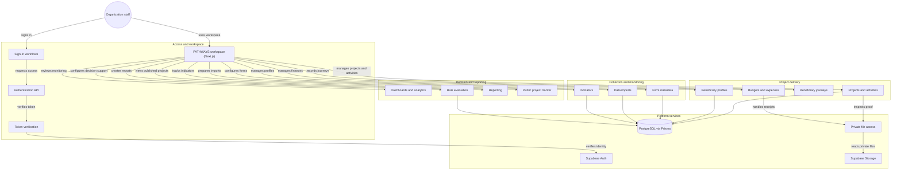

# PATHWAYS

**PATHWAYS** is a metadata-driven project information management platform with deterministic, rule-based decision support for humanitarian and development organizations.

It removes the repeated export, import, verification and mapping that field data need after collection. Project, activity, Beneficiary, indicator, monitoring and reporting information live in one governed workspace, with descriptive dashboards (including SADDD: sex, age and disability disaggregated data), explainable rule-based alerts and predefined recommendation prompts that people review. There is no autonomous AI decision making. PATHWAYS sits beside collection tools such as KOBO and does not replace them.

Do not infer feature completion from documentation alone. The current repository and executed tests are the implementation authority.

## Features

Core (Must-Have):

1. Role-Based Access Control and Workspace Management
2. Project Profile and Activity Tracking
3. Centralized Beneficiary Profile
4. Beneficiary Journey Tracking
5. Digital Data Collection and Preparation
6. Metadata-Driven Data Integration
7. Project Indicator and Monitoring
8. Aggregated Monitoring Dashboard with SADDD Analysis

Supporting: descriptive analytics, rule-based alerts, human-reviewed decision support, reporting and visualization, and a controlled public project tracker.

Six canonical roles apply, including Grant Manager. Frontend visibility is not authorization: every request is checked on the server against the role, permissions, organization and project assignment. Program Manager and Grant Manager see aggregate Beneficiary information only.

## Architecture

Domain modules live in `apps/api/src/modules`. The browser reaches domain data only through the API and Prisma. See `docs/sdd-pathways.md` for the full design.

## Tech Stack

| Layer | Technology |
|---|---|
| Runtime and tooling | Node 22, pnpm 11, TypeScript 5 |
| Web | Next.js 15 (App Router), React 19, Tailwind CSS 3, TanStack Query, ECharts |
| API | NestJS 10, Zod, nestjs-pino, helmet, pdfkit |
| Data | PostgreSQL 17 with row-level security, Prisma 6 |
| Identity and files | Supabase Auth (including TOTP) and Supabase Storage |
| Hosting and monitoring | Vercel, Sentry |
| Tests | Vitest, Playwright |

Exact versions are in `docs/sdd-pathways.md` section 2.4 and the `package.json` files.

## Quick Start

- Environment setup: [README-setup.md](README-setup.md)
- Local development commands and rules: [docs/runbook-local-dev.md](docs/runbook-local-dev.md)
- Validate documentation: `pnpm docs:check`; regenerate `AGENTS.md`, `BRAND.md` and `DESIGN.md` with `pnpm docs:materialize` (never hand-edit them).

## Documentation Map

The full manifest, statuses, traceability, Change Log and Health Check are in [docs/index.md](docs/index.md). Start there, then read [AGENTS.md](AGENTS.md) for agent build rules and the relevant PRD, SDD, DSD, QAD or RFC for the task.

Branches: `dev` for development, `origin/master` for deployment. SSO and AWS hosting are deferred and need explicit authorization (see `docs/rfc-pathways-aws-hosting-migration.md`, a Draft strategy only).
