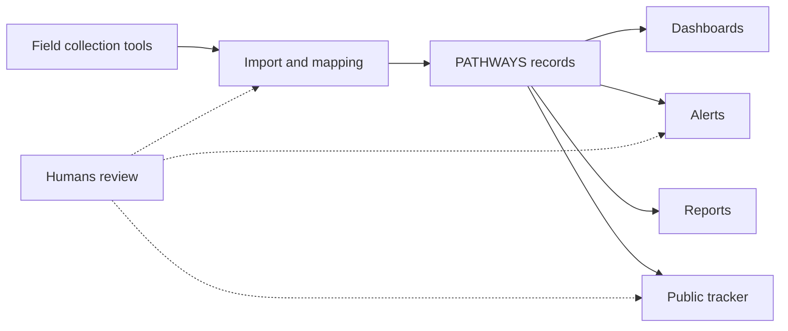

# Idea Brief (IDEA)

**Status:** Locked
**Version:** 2.0
**Last reconciled:** 2026-10-01
**Owner:** PATHWAYS capstone team

Full detail lives in the root [IDEA.md](../IDEA.md); this brief holds the six load-bearing lines and the cut line only.

**One-line pitch:** PATHWAYS is a metadata-driven project information management system with rule-based decision support that turns collected field data into ready-to-use monitoring information for humanitarian and development organizations.

**Problem:** Field data move through separate collection, monitoring and reporting tools and need repeated export, import, verification, mapping and consolidation before anyone can evaluate a project, trace beneficiary progress or act on it.

**Insight (why us, why now):** Field data are already collected digitally, so the gap is the post-collection step; a thin interoperable layer that prepares, links and explains that data, rather than a replacement for KOBO, YES!ME or PMERL, closes the gap, and the pilot organization workflow gives the team a concrete setting to build and test against.

**Primary user (named, specific):** The Monitoring and Evaluation Officer on a humanitarian project team, who reviews collected datasets, verifies them, configures indicators and dashboards, and prepares monitoring outputs for project and program managers.

**Their moment of pain:** At the close of each reporting cycle the officer exports, re-imports, aligns and consolidates datasets across several tools before any dashboard or report is usable, which the manuscript estimates at about forty cumulative working hours per cycle.

**If we only ship one thing:** Metadata-driven import and mapping that turns an uploaded field dataset into validated, centralized project and beneficiary records that feed indicators and dashboards without rework (PRD-F5 and PRD-F6 feeding PRD-F7 and PRD-F8).

## 1. The Spark

PATHWAYS exists because project information stays fragmented after field collection. Data need export, verification, re-alignment, mapping, spreadsheet consolidation and manual preparation before they are usable for monitoring and management review. The manuscript estimates that preparation at about forty working hours per reporting cycle; that figure is an estimate, not a measured result.

PATHWAYS brings that post-collection workflow into one governed environment and sits beside KOBO, YES!ME and PMERL instead of replacing them. See [IDEA.md](../IDEA.md) sections 1 to 3.

## 2. Who It's For

Internal roles:

- System Administrator
- Program Manager
- Grant Manager
- Project Manager
- Monitoring and Evaluation Officer
- Project Officer

External: stakeholders who read approved public project information through the Public Project Tracker only.

Beneficiaries are records, not system users. See [IDEA.md](../IDEA.md) section 5.

## 3. Scope & Cut Line

| Tier | Features |
|---|---|
| Must-have | PRD-F1 to PRD-F8: access and workspaces, project profile and activities, beneficiary profile, journey tracking, data collection and preparation, metadata-driven integration, indicators and monitoring, dashboard with SADDD |
| Supporting | PRD-F9 to PRD-F13: descriptive analytics, rule-based alerts, rule-based recommendations, reporting and visualization, public project tracker |

The cut line is the set of system-wide bounds from the manuscript Scope and Limitations. Anything past it is out of scope:

- no predictive machine learning, advanced artificial intelligence or autonomous decisions;
- no evaluation of individual beneficiaries;
- no beneficiary self-registration, login or submission;
- no full project management platform or ERP;
- no full real-time synchronization or complete API integration with KOBO, YES!ME or PMERL;
- no beneficiary-level or internal financial data on the public tracker;
- deferred and unbuilt items (for example a Project Template Library and an organization Indicator Library) are tracked in the deferred features register, not promised here.

## 4. Success & Judging Criteria

Success means the system meets the manuscript objectives:

- Objectives 1.1 to 1.8: the system is built with its features and bounds;
- Objectives 2.1 to 2.4: metadata-driven preparation, descriptive analytics with SADDD and rule-based alerts work as described;
- Objectives 3.1 to 3.8: role-based UAT rates the eight ISO/IEC 25010 characteristics (Functional Suitability, Performance Efficiency, Compatibility, Usability, Reliability, Security, Maintainability, Portability) on a 5-point Likert scale.

Evaluation thresholds from the manuscript: a mean of 4.21-5.00 reads as Strongly Agree, 3.41-4.20 as Agree, 2.61-3.40 as Neutral, 1.81-2.60 as Disagree and 1.00-1.80 as Strongly Disagree. The manuscript sets no pass threshold beyond this interpretation scale.

Judging criteria: Not established; collected in Task 19.

## 5. Concept Visuals

## 6. Open Questions

Open questions are tracked through change records and the deferred features register, not silently answered.

- Judging criteria for the capstone defense are Not established.
- The number of UAT respondents is Not established in the manuscript.
- Whether the forty-hour preparation estimate holds is evaluation evidence still to be gathered.
- Reusable project structures for recurring project types (requirement R4) need a scheduling or descoping decision.

## Self-Check

- [x] primary identity is project information management
- [x] eight must-have features preserved
- [x] supporting features separated
- [x] AI overclaim avoided
- [x] six load-bearing lines filled
