# PATHWAYS Product Requirements Document

**Status:** Locked
**Version:** 2.0
**Last reconciled:** 2026-10-01
**Owner:** PATHWAYS capstone team

## 1. Product Purpose & Value Proposition

PATHWAYS is a metadata-driven project information management system with rule-based decision support for humanitarian and development organizations. It turns collected field data into ready-to-use monitoring information. The idea baseline is [IDEA.md](../IDEA.md); the business case is [brd-pathways](brd-pathways.md).

**Problem.** Field data move through separate collection, monitoring and reporting tools and need repeated export, import, verification, mapping and consolidation before anyone can evaluate a project, trace beneficiary progress or act on it.

| Problem | Requirement it creates | Features that meet it |
|---|---|---|
| P1 Dependence on technical staff; uneven usability across roles | R1 Structured, usable project information environment | PRD-F1, PRD-F2, PRD-F3 |
| P2 Repeated export-import handling and manual preparation | R2 Organized preparation and integration of field data | PRD-F5, PRD-F6 |
| P3 Manual metadata and dashboard setup | R3 Organized generation of monitoring outputs | PRD-F7, PRD-F8, PRD-F9, PRD-F12 |
| P4 No standard setup for recurring projects | R4 Consistent project setup through reusable structures | PRD-F2, PRD-F7 (indicator definitions delivered; project structure templates a known gap) |
| P5 Records spread across tools and files | R5 Centralized project and beneficiary information | PRD-F2, PRD-F3 |
| P6 Difficulty tracking beneficiary participation | R6 Clearer tracking of participation and progression | PRD-F4 |
| P7 Information not ready for action | R7 Timely summaries, rule-based flags and suggested actions | PRD-F9, PRD-F10, PRD-F11 |
| P8 Limited external visibility of approved information | R8 Controlled stakeholder-facing visibility | PRD-F13 |

**Value.** The primary user, the Monitoring and Evaluation Officer, stops hand-preparing datasets every cycle. Managers see project status directly. Alerts and recommendations are deterministic rules that people review. PATHWAYS is an interoperable layer over KOBO, YES!ME and PMERL, not a replacement for them.

## 2. Target Personas

Six internal roles are defined in `apps/api/src/modules/auth/rbac-contract.json`. Action grants live in [rfc-pathways-auth-rbac-isolation](rfc-pathways-auth-rbac-isolation.md).

| Persona | Primary scope | Main features |
|---|---|---|
| System Administrator | Governs organization-wide accounts, configuration and security administration | PRD-F1 |
| Project Officer | Field data collector and data-entry role for assigned projects; imports collected data and encodes records without form-management rights | PRD-F3, PRD-F5 |
| Monitoring and Evaluation Officer | Primary user; reviews and verifies datasets, configures forms and indicators, prepares monitoring outputs for assigned projects | PRD-F5, PRD-F6, PRD-F7 |
| Project Manager | Oversees status and performance of assigned projects through dashboards and reports | PRD-F8, PRD-F9 |
| Program Manager | Reviews program and portfolio performance across projects; aggregate-only beneficiary information | PRD-F8, PRD-F10, PRD-F11 |
| Grant Manager | Tracks milestones and resource use for explicitly assigned projects; aggregate-only beneficiary information | PRD-F2, PRD-F9 |

- External stakeholders (donors, sponsors, partners) are tracker viewers of approved public information only (PRD-F13). They have no internal account.
- Beneficiaries are data subjects, not personas. They cannot apply, register themselves, log in or submit information; authorized internal users encode, import and review their records.

## 3. Core Features & Priorities

### 3.1 Feature Table

| ID | Feature | Priority | Manuscript ID | Requirement | Objective | Status |
|---|---|---|---|---|---|---|
| PRD-F1 | RBAC and Workspace Management | Must-Have | F1 | R1 | 1.8 | Implemented; G-F1-10 not met (see [deferred features](deferred-features.md)) |
| PRD-F2 | Project Profile and Activity Tracking | Must-Have | F2 | R1, R4, R5 | 1.1, 1.2, 1.5 | Implemented; G-F2-4 not met (see [deferred features](deferred-features.md)) |
| PRD-F3 | Centralized Beneficiary Profile | Must-Have | F3 | R1, R5 | 1.1, 1.3 | Implemented; G-F3-6 partial (see [deferred features](deferred-features.md)) |
| PRD-F4 | Beneficiary Journey Tracking | Must-Have | F4 | R6 | 1.1, 1.3 | Implemented; G-F4-6 not met (see [deferred features](deferred-features.md)) |
| PRD-F5 | Digital Data Collection and Preparation | Must-Have | F5 | R2 | 1.4, 2.1 | Implemented; G-F6-7 on hold (see [deferred features](deferred-features.md)) |
| PRD-F6 | Metadata-Driven Data Integration | Must-Have | F6 | R2 | 1.1, 1.4, 2.1 | Implemented; G-F6-7 on hold (see [deferred features](deferred-features.md)) |
| PRD-F7 | Project Indicator and Monitoring | Must-Have | F7 | R3, R4 | 1.5 | Implemented; G-F7-5 not met, deferred (see [deferred features](deferred-features.md)) |
| PRD-F8 | Aggregated Monitoring Dashboard with SADDD Analysis | Must-Have | F8 | R3 | 1.6, 2.2, 2.3 | Implemented; G-F8-7 Met locally at assumed scale (staging re-measure pending) |
| PRD-F9 | Descriptive Analytics and Project Performance Summaries | Supporting | F9 | R3, R7 | 1.6, 2.2 | Implemented for KPI, participation, survey and timeline views; on-hold items in the deferred register |
| PRD-F10 | Rule-Based Alerts | Supporting | F10 | R7 | 1.7, 2.4 | Local API and initial runtime slice; integration verification pending |
| PRD-F11 | Rule-Based Decision Support and Recommendations | Supporting | F11 | R7 | 1.7, 2.4 | Local human review API; integration verification pending |
| PRD-F12 | Reporting and Data Visualization | Supporting | None | R3 | 1.6 | Local preview and artifact APIs; final verification pending; hosted application deferred |
| PRD-F13 | Public Project Tracker | Supporting | F12 | R8 | 1.8 | Local publication and approved-public APIs; final verification pending; hosted application deferred |

Do not renumber these IDs. Material renumbering requires a Change Record. Status is taken from `docs/index.md` section 6 and [deferred-features](deferred-features.md).

### 3.2 Functional Requirements

Rows follow manuscript Table 5 (Chapter 3, Requirements-Features Matrix) in order. Priority is High for features the manuscript marks High and Medium otherwise; the extracted table does not keep per-row alignment, so it is derived from the feature.

| FR | Requirement | Feature | Priority | Source |
|---|---|---|---|---|
| FR-1 | Users securely log in and access role-based organization workspaces | PRD-F1 | High | Table 5, functional row 1 |
| FR-2 | Users create, manage and monitor project profiles, activities, milestones and implementation status | PRD-F2 | High | Table 5, functional row 2 |
| FR-3 | Users register, organize and maintain centralized beneficiary profiles | PRD-F3 | High | Table 5, functional row 3 |
| FR-4 | Users track beneficiary participation, progression and journey events across project activities | PRD-F4 | High | Table 5, functional row 4 |
| FR-5 | Users encode, import, organize and review beneficiary-related monitoring records (participation, feedback, pre-test and post-test results, outcome survey results, follow-up) as project-level monitoring data | PRD-F3, PRD-F4, PRD-F5 | High | Table 5, functional row 5 |
| FR-6 | Users create and configure digital monitoring forms and monitoring-related fields | PRD-F5 | High | Table 5, functional row 6 |
| FR-7 | Users upload, map, validate and process collected field datasets | PRD-F5, PRD-F6 | High | Table 5, functional row 7 |
| FR-8 | Users centralize manually encoded and imported monitoring records | PRD-F6 | High | Table 5, functional row 8 |
| FR-9 | Users configure project indicators and monitoring parameters | PRD-F7 | High | Table 5, functional row 9 |
| FR-10 | Users generate aggregated monitoring dashboards and SADDD-based summaries | PRD-F8 | High | Table 5, functional row 10 |
| FR-11 | Users generate descriptive analytics, project performance summaries and monitoring outputs | PRD-F9 | Medium | Table 5, functional row 11 |
| FR-12 | The system generates rule-based alerts for delayed timelines, underperforming indicators, budget concerns and beneficiary progress issues | PRD-F10 | Medium | Table 5, functional row 12 |
| FR-13 | Users encode, submit, verify, approve, reject and organize budget expense entries, receipt references, liquidation records and supporting financial evidence | PRD-F2 | High | Table 5, functional row 13 |
| FR-14 | The system provides predefined recommendation prompts and monitoring support guidance based on configured monitoring conditions | PRD-F11 | Medium | Table 5, functional row 14 |
| FR-15 | Authorized users generate monitoring reports and visual outputs | PRD-F12 | High | Table 5, functional row 15 |
| FR-16 | Authorized users publish approved project information through the public project tracker | PRD-F13 | Medium | Table 5, functional row 16 |
| FR-17 | External stakeholders view approved public project summaries and monitoring highlights | PRD-F13 | Medium | Table 5, functional row 17 |

### 3.3 Requirements-Features Matrix

Status comes from the repository, not the manuscript labels "In Progress" and "Planned".

| Req ID | Requirement | Features | Priority | Problem / Requirement | Status |
|---|---|---|---|---|---|
| FR-1 | Secure login and role-based workspaces | PRD-F1 | High | P1 / R1 | Implemented |
| FR-2 | Project, activity, milestone and status management | PRD-F2 | High | P1 / R1, P5 / R5 | Implemented |
| FR-3 | Centralized beneficiary profiles | PRD-F3 | High | P5 / R5 | Implemented |
| FR-4 | Beneficiary participation and journey tracking | PRD-F4 | High | P6 / R6 | Implemented |
| FR-5 | Beneficiary-related monitoring records | PRD-F3, PRD-F4, PRD-F5 | High | P2 / R2, P6 / R6 | Implemented |
| FR-6 | Digital monitoring forms and fields | PRD-F5 | High | P2 / R2 | Implemented |
| FR-7 | Dataset upload, mapping and validation | PRD-F5, PRD-F6 | High | P2 / R2 | Implemented; data-type and value mapping on hold |
| FR-8 | Centralized encoded and imported records | PRD-F6 | High | P5 / R5 | Implemented |
| FR-9 | Indicator and monitoring parameter configuration | PRD-F7 | High | P3 / R3, P4 / R4 | Implemented; reusable indicator definitions through the organization library (cr-pathways-indicator-library); project structure templates not built |
| FR-10 | Aggregated dashboards and SADDD summaries | PRD-F8 | High | P3 / R3 | Implemented |
| FR-11 | Descriptive analytics and performance summaries | PRD-F9 | Medium | P3 / R3, P7 / R7 | Implemented for four views; breakdowns, trends and server budget aggregate on hold |
| FR-12 | Rule-based alerts | PRD-F10 | Medium | P7 / R7 | Local API and runtime slice; integration verification pending |
| FR-13 | Budget expense entries and liquidation evidence | PRD-F2 | High | P5 / R5 | Implemented |
| FR-14 | Predefined recommendation prompts | PRD-F11 | Medium | P7 / R7 | Local human review API; integration verification pending |
| FR-15 | Monitoring reports and visual outputs | PRD-F12 | High | P3 / R3 | Local preview and artifact APIs; CSV generation gap; final verification pending |
| FR-16 | Publish approved project information | PRD-F13 | Medium | P8 / R8 | Local publication API; final verification pending |
| FR-17 | External view of approved summaries | PRD-F13 | Medium | P8 / R8 | Local approved-public API; final verification pending |
| NFR-1 | RBAC and organization workspace isolation | PRD-F1 | High | Objective 3.6 | Implemented |
| NFR-2 | Protection of sensitive beneficiary and project information | PRD-F1, PRD-F3, PRD-F13 | High | Objective 3.6 | Implemented |
| NFR-3 | Responsive dashboards and operations | PRD-F8, PRD-F9 | Medium | Objective 3.2 | Partly implemented; performance scaling steps 3-5 deferred |
| NFR-4 | Centralized, consistent monitoring records | PRD-F2, PRD-F6 | High | Objective 3.5 | Implemented |
| NFR-5 | Metadata-driven configuration | PRD-F5, PRD-F6 | High | Objective 3.7 | Implemented |
| NFR-6 | User-friendly, organized interface | PRD-F1 to PRD-F13 | Medium | Objective 3.4 | Partly implemented; unfinished controls hidden |
| NFR-7 | Operational reliability | PRD-F2, PRD-F8 | High | Objective 3.5 | Not verified |
| NFR-8 | Scalability | PRD-F2, PRD-F3, PRD-F6 | Medium | Objective 3.2 | Partly implemented; performance scaling steps 3-5 deferred |
| NFR-9 | Accurate processing and analytics | PRD-F8, PRD-F9 | High | Objective 3.1 | Implemented |
| NFR-10 | Dataset validation | PRD-F5, PRD-F6 | High | Objective 3.5 | Implemented |
| NFR-11 | Browser and device accessibility | PRD-F1 to PRD-F13 | Medium | Objective 3.8 | Not verified |
| NFR-12 | Auditability and traceability | PRD-F1, PRD-F2 | High | Objective 3.6 | Implemented |
| NFR-13 | Compatibility with existing tools and file exchange | PRD-F5, PRD-F6, PRD-F12 | Not established | Objective 3.3 | Implemented for CSV, XLS, XLSX and PDF import |
| NFR-14 | Maintainable, modular and documented code | PRD-F1 to PRD-F13 | Not established | Objective 3.7 | Implemented |
| NFR-15 | Recoverability from errors and interruptions | PRD-F1 to PRD-F13 | Not established | Objective 3.5 | Not verified; backup runbook exists |

Thresholds for these requirements are in section 5.7.

The Problem / Requirement mapping is derived from the requirement text and objective wording, not from a manuscript column.

### 3.4 Manuscript Feature ID Mapping

| Manuscript ID | PRD ID | Note |
|---|---|---|
| F1 to F11 | PRD-F1 to PRD-F11 | Same number |
| F12 (Public Project Tracker) | PRD-F13 | Renumbered because PRD-F12 is taken |
| None | PRD-F12 (Reporting and Data Visualization) | In the PRD and code; the manuscript has the reports requirement (FR-15) but no separate feature column for it |

## 4. Feature Charters, Use Cases & Gate Criteria

### PRD-F1 RBAC and Workspace Management

**Purpose:** Let each internal user sign in, resolve a trusted organization, role and project scope, and manage accounts, own profile and audit visibility within that scope. (R1; objective 1.8)
**Why it helps:** Removes uneven access and dependence on technical staff to grant, limit or review who can see what (P1; System Administrator, Program Manager, Project Manager).
**Bounds (in):**
- Sign-in through the identity provider, workspace selection and role-based redirect to the dashboard.
- Password recovery and own-profile view and update.
- Authorizing existing identity accounts, changing role and status, and assigning projects within the actor's management scope.
- Server-side permission, organization and project-assignment checks on every route; revoked grants and inactive accounts deny the next request.
- Audit log viewing with filters for actors holding `audit.read`.
**Bounds (out):**
- In-app account creation with emailed credentials: accounts are authorized from existing identity accounts (Scope and Limitations / cr-pathways-revised-rbac-baseline).
- Backup and restore as an in-app workflow: the `backups.*` permissions have no API handler, and recovery follows the operational runbook (Scope and Limitations / cr-pathways-rbac-audit-closure).
- Beneficiary identity step-up: governed by PRD-F3 (cr-pathways-beneficiary-step-up).
- Self-registration, external login and beneficiary login: beneficiaries and external stakeholders have no account (Scope and Limitations).
**Lock:** Locked. Adding a gate or widening a bound requires an approved `cr-pathways-*`; anything outside these bounds is out of scope by default. System-wide bounds: section 6.1.

#### Gate Criteria

| Gate | Condition | Status | QAD |
|---|---|---|---|
| G-F1-1 | An active user resolves trusted organization, role, permissions and project scope and lands on the role dashboard | Met | QAD-T01 |
| G-F1-2 | A suspended, deactivated or archived account is denied | Met | QAD-T20 |
| G-F1-3 | Forged organization, role or actor fields in a request are ignored or rejected | Met | QAD-A05 |
| G-F1-4 | A guessed or unassigned project identifier is denied on the API | Met | QAD-A01, QAD-A02 |
| G-F1-5 | Role and assignment escalation is denied; each manager authorizes only the roles in their scope | Met | QAD-A06, QAD-R03 |
| G-F1-6 | A revoked grant, inactive role, ended assignment or deactivated account denies the next request | Met | QAD-R05 |
| G-F1-7 | An actor with `audit.read` lists audit events in their scope with filters; others are denied | Met | QAD-T36 |
| G-F1-8 | A user views and updates only their own profile | Met | QAD-T37 |
| G-F1-9 | A user requests a password reset from the sign-in page and sets a new password through the recovery link | Met | QAD-T38 |
| G-F1-10 | The app locks sign-in for 15 minutes after 5 failed attempts within 15 minutes, with a uniform response for known and unknown accounts, reset on success and an audit event | Met | QAD-T39 |

#### Use Cases

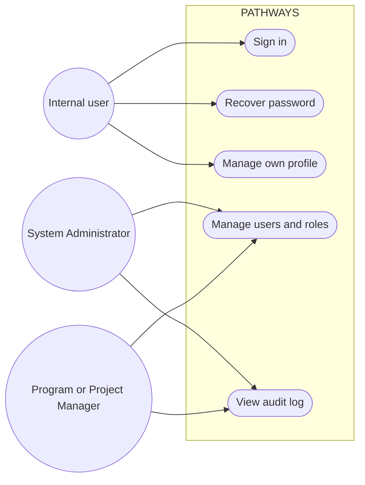
```mermaid
flowchart LR
  any((Internal user))
  adm((System Administrator))
  mgr((Program or Project Manager))
  subgraph PATHWAYS
    uc1([Sign in])
    uc2([Recover password])
    uc3([Manage own profile])
    uc4([Manage users and roles])
    uc5([View audit log])
  end
  any --> uc1
  any --> uc2
  any --> uc3
  adm --> uc4
  mgr --> uc4
  adm --> uc5
  mgr --> uc5
```

##### UC-F1-1 Sign in

| Field | Value |
|---|---|
| Actor | Any internal user |
| Permission | `profile.manage` (sign-in itself needs no permission; it applies to the post-login profile step) |
| Trigger | The user opens the sign-in page |
| Preconditions | The account is active and belongs to an organization |
| Main flow | 1. The user signs in through the identity provider (route `/login`). 2. The API resolves organization, role, permissions and assignments from the verified identity (route `GET /auth/me`). 3. When the user has more than one workspace, the user selects one (route `/workspace`). 4. The user is redirected to the role dashboard (route `/dashboard`). |
| Alternate / exception | Inactive, suspended or deactivated account: access is denied (route `/auth/access-unavailable`); a missing second factor sends the user to `/auth/mfa`; connection failure: the page shows an error and offers retry; after 5 failed attempts the API refuses sign-in for 15 minutes and the page shows the lockout message |
| Postconditions | An authenticated session exists; no client-supplied role or organization is trusted |
| Gates | G-F1-1, G-F1-2, G-F1-3, G-F1-10 |

##### UC-F1-2 Recover password

| Field | Value |
|---|---|
| Actor | Any internal user |
| Permission | `profile.manage` |
| Trigger | The user selects the forgot-password link |
| Preconditions | The account exists and the user can read the registered email |
| Main flow | 1. The user enters the registered email (route `/staff/forgot-password`). 2. The identity provider sends a reset link. 3. The user opens the link and sets a new password (route `/auth/update-password`). 4. The user signs in again (route `/login`). |
| Alternate / exception | Expired or invalid link: the user lands on `/auth/recovery/error` and requests a new link; unknown email: the response does not disclose whether the account exists |
| Postconditions | The password is changed and the link cannot be reused |
| Gates | G-F1-9 |

##### UC-F1-3 Manage own profile

| Field | Value |
|---|---|
| Actor | Any internal user |
| Permission | `profile.manage` |
| Trigger | The user opens profile settings |
| Preconditions | The user is authenticated |
| Main flow | 1. The user opens profile settings (route `/settings/profile`). 2. The API returns the user's own profile (route `GET /profile`). 3. The user edits permitted fields and saves (route `PATCH /profile`). |
| Alternate / exception | Invalid input: the save is rejected with a field message; any other user's profile is never returned |
| Postconditions | The own profile is updated and the change is audited |
| Gates | G-F1-8 |

##### UC-F1-4 Manage users and roles

| Field | Value |
|---|---|
| Actor | System Administrator, Program Manager, Project Manager |
| Permission | `users.authorize` |
| Trigger | The actor opens user management |
| Preconditions | The actor holds `users.authorize`; the target identity account already exists |
| Main flow | 1. The actor opens user management (route `/settings/users`). 2. The API lists accounts inside the actor's management scope (route `GET /users`). 3. The actor authorizes an existing account for an allowed role (route `POST /users/authorize-existing`). 4. The actor changes role, status or project assignment (route `PATCH /users/:userId`; assignments need `assignments.manage`). |
| Alternate / exception | Role outside the actor's scope, cross-scope target or the last active administrator: denied; permission missing: 403 |
| Postconditions | The change applies on the next request and is audited |
| Gates | G-F1-4, G-F1-5, G-F1-6 |

##### UC-F1-5 View audit log

| Field | Value |
|---|---|
| Actor | System Administrator, Program Manager, Project Manager |
| Permission | `audit.read` |
| Trigger | The actor opens the audit page |
| Preconditions | The actor holds `audit.read` |
| Main flow | 1. The actor opens the audit page (route `/settings/audit`). 2. The API returns audit events in the actor's scope with the requested filters (route `GET /audit`). |
| Alternate / exception | No match: the page shows an empty result; permission missing: 403 |
| Postconditions | Audit rows are read only and unchanged |
| Gates | G-F1-7 |

### PRD-F2 Project Profile and Activity Tracking

**Purpose:** Keep one record of each project, its activities, milestones, budget and expense evidence, with reviewed proof of progress. (R1, R4, R5; objectives 1.1, 1.2, 1.5)
**Why it helps:** Replaces records scattered across tools and files with a single project record that officers update and managers review (P1, P4, P5; Project Officer, Project Manager, Program Manager, Grant Manager).
**Bounds (in):**
- Project profile create and update, with structured implementing partners and an opening budget record.
- Activity create, update, status transition, progress update and proof submission with review.
- Private proof inspection before approval, and overdue explanations.
- Milestone create and update.
- Budget records and expense entries with a private receipt, verification, approval, rejection and final sign-off.
**Bounds (out):**
- Project archive: `POST /projects/:projectId/archive` is guarded by `projects.archive`; archived projects leave the default list and there is no unarchive.
- Reusable project structures (activity and monitoring templates): not built; stays a known gap for R4 (Scope and Limitations). Reusable indicator definitions are delivered by PRD-F7.
- Project target goal: retired (cr-pathways-retire-project-target-goal).
- Free-text implementing partners: writes are rejected (cr-pathways-project-rbac-ui-and-partners).
- Request-an-extension and Media proof tab controls: hidden, see the deferred register (cr-pathways-frontend-usability).
**Lock:** Locked. Adding a gate or widening a bound requires an approved `cr-pathways-*`; anything outside these bounds is out of scope by default. System-wide bounds: section 6.1.

#### Gate Criteria

| Gate | Condition | Status | QAD |
|---|---|---|---|
| G-F2-1 | A Project Manager creates a project with target beneficiaries, an opening budget and automatic self-assignment, audited | Met | QAD-R08 |
| G-F2-2 | Project list and detail show only scoped projects and the tabs the role may read | Met | QAD-R02 |
| G-F2-3 | Locked fields stay disabled and unsubmitted; a write carrying free-text implementing partners is rejected | Met | QAD-RBP-06, QAD-RBP-07 |
| G-F2-4 | A project can be archived by a role holding `projects.archive` | Met | QAD-P10, QAD-T40 |
| G-F2-5 | Authorized activity create and update persist; dates outside the project timeline need a justification | Met | QAD-T02 |
| G-F2-6 | A progress update or proof submission enters review, and only one update awaits review per activity | Met | QAD-T02 |
| G-F2-7 | A reviewer other than the submitter approves or returns an update, and only approval moves activity progress | Met | QAD-T41 |
| G-F2-8 | Private proof inspection succeeds only for a pending update and fails with a conflict when revisions changed | Met | QAD-A22 |
| G-F2-9 | A reviewer records an overdue explanation for an activity | Met | QAD-T42 |
| G-F2-10 | Milestones are created and updated only with `milestones.manage` | Met | QAD-T43 |
| G-F2-11 | Each role sees only the actions its permissions allow; a forged capability flag still returns 403 | Met | QAD-RBP-01, QAD-RBP-05 |
| G-F2-12 | The assignable-officer read lists only active Project Officers with access, and denies other roles | Met | QAD-RBP-02, QAD-RBP-08 |
| G-F2-13 | An out-of-scope project or activity is denied before any write | Met | QAD-A02, QAD-P09 |
| G-F2-14 | A budget record is created or replaced with a stale-revision check | Met | QAD-T44 |
| G-F2-15 | An expense is submitted against a budget reference; a retry with the same client request id does not duplicate it | Met | QAD-T45, QAD-T84 |
| G-F2-16 | A private receipt is attached to a pending expense, and verification or approval needs it | Met | QAD-T46 |
| G-F2-17 | An expense is verified, then approved by a distinct reviewer; rejection requires a reason | Met | QAD-T47 |
| G-F2-18 | Final sign-off is recorded once per expense by a holder of `expenses.signoff` | Met | QAD-T48, QAD-T85 |
| G-F2-19 | Overview metrics derive budget utilization and timeline deterministically and deny out-of-scope projects | Met | QAD-P03, QAD-P08 |

#### Use Cases

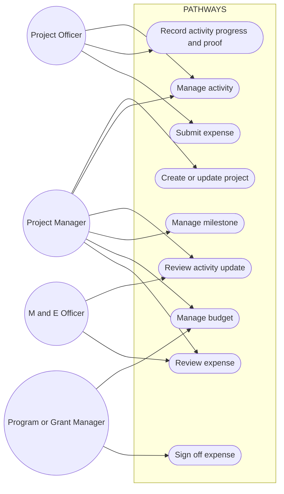
```mermaid
flowchart LR
  pm((Project Manager))
  po((Project Officer))
  me((M and E Officer))
  gm((Program or Grant Manager))
  subgraph PATHWAYS
    uc1([Create or update project])
    uc2([Manage activity])
    uc3([Record activity progress and proof])
    uc4([Review activity update])
    uc5([Manage milestone])
    uc6([Manage budget])
    uc7([Submit expense])
    uc8([Review expense])
    uc9([Sign off expense])
  end
  pm --> uc1
  pm --> uc2
  po --> uc2
  po --> uc3
  po --> uc7
  pm --> uc4
  me --> uc4
  pm --> uc5
  pm --> uc6
  gm --> uc6
  me --> uc8
  pm --> uc8
  gm --> uc9
```

##### UC-F2-1 Create or update project

| Field | Value |
|---|---|
| Actor | Project Manager |
| Permission | `projects.create` |
| Trigger | The manager starts a new project or edits one |
| Preconditions | The manager holds `projects.create`; updating needs `projects.update` and assignment to the project |
| Main flow | 1. The manager opens the form (route `/projects/new`). 2. The manager enters profile details, structured implementing partners and the opening budget. 3. The API creates the project, the budget record and the self-assignment (route `POST /projects`). 4. To edit, the manager saves changes (route `PATCH /projects/:projectId`). 5. A holder of `projects.archive` confirms the archive on the project overview (route `POST /projects/:projectId/archive`). |
| Alternate / exception | Missing required field or invalid value: the save is rejected; locked field: shown disabled and never submitted; permission missing: 403 |
| Postconditions | The project and budget record exist in the organization and the change is audited |
| Gates | G-F2-1, G-F2-2, G-F2-3, G-F2-4 |

##### UC-F2-2 Manage activity

| Field | Value |
|---|---|
| Actor | Project Manager, Project Officer |
| Permission | `activities.create` |
| Trigger | The actor adds or edits an activity on a project |
| Preconditions | A project exists and the actor is assigned to it; editing needs `activities.update` |
| Main flow | 1. The actor opens the activity list (route `/projects/[projectId]/activities`). 2. The actor picks an assignable officer (route `GET /projects/:projectId/activities/assignable-officers`). 3. The actor creates the activity (route `POST /projects/:projectId/activities`). 4. To edit, the actor saves with the current revision (route `PATCH /projects/:projectId/activities/:activityId`). |
| Alternate / exception | Dates outside the project timeline: a justification is required; changed revision: conflict and reload; terminal activity: edit refused; out-of-scope project: 403 |
| Postconditions | The activity and its assignments persist and the change is audited |
| Gates | G-F2-5, G-F2-11, G-F2-12, G-F2-13 |

##### UC-F2-3 Record activity progress and proof

| Field | Value |
|---|---|
| Actor | Project Officer |
| Permission | `activities.progress.update` |
| Trigger | The officer reports progress or submits proof for an activity |
| Preconditions | The activity is open and assigned to the officer; proof needs `activities.proof.submit` |
| Main flow | 1. The officer opens the activity (route `/projects/[projectId]/activities/[activityId]`). 2. For progress only, the officer saves a percentage (route `POST /projects/:projectId/activities/:activityId/progress`). 3. For proof, the officer reserves the files (route `POST /projects/:projectId/activities/:activityId/updates/reservations`) and finalizes each upload. 4. The update waits for review. |
| Alternate / exception | Another update already awaiting review: conflict; disallowed or oversized file: rejected; out-of-scope activity: 403 |
| Postconditions | A pending update exists, a proof-bearing activity is For Review, and the submission is audited |
| Gates | G-F2-6, G-F2-13 |

##### UC-F2-4 Review activity update

| Field | Value |
|---|---|
| Actor | Project Manager, Monitoring and Evaluation Officer |
| Permission | `evidence.review` |
| Trigger | A pending update is waiting for review |
| Preconditions | The reviewer is not the submitter and holds `evidence.review` |
| Main flow | 1. The reviewer opens the update (route `/projects/[projectId]/evidence`). 2. The reviewer inspects private proof (route `GET /projects/:projectId/activities/:activityId/updates/:updateId/inspection-context`). 3. The reviewer approves or returns it with a reason (route `POST /projects/:projectId/activities/:activityId/updates/:updateId/review`). 4. For an overdue activity, a reviewer with `monitoring.review` records an explanation (route `POST /projects/:projectId/activities/:activityId/overdue-explanations`). |
| Alternate / exception | Own update: refused; stale revisions: conflict; update no longer pending: conflict |
| Postconditions | An approved update sets progress and may complete the activity; a returned update and its proof are Rejected (audit ACTIVITY_UPDATE_RETURNED); the decision is audited |
| Gates | G-F2-7, G-F2-8, G-F2-9 |

##### UC-F2-5 Manage milestone

| Field | Value |
|---|---|
| Actor | Project Manager |
| Permission | `milestones.manage` |
| Trigger | The manager adds or changes a milestone |
| Preconditions | A project exists and the manager is assigned to it |
| Main flow | 1. The manager opens the project activities page (route `/projects/[projectId]/activities`). 2. The manager creates or updates a milestone (route `/projects/:projectId/milestones`). |
| Alternate / exception | Invalid date or status: rejected; permission missing: 403 |
| Postconditions | The milestone is stored and feeds the timeline view; the change is audited |
| Gates | G-F2-10 |

##### UC-F2-6 Manage budget

| Field | Value |
|---|---|
| Actor | Project Manager, Program Manager, Grant Manager |
| Permission | `budgets.create` |
| Trigger | The actor sets or replaces a budget record |
| Preconditions | The actor is assigned to the project; replacing needs `budgets.update` |
| Main flow | 1. The actor opens the budget tab (route `/projects/[projectId]/budget`). 2. The actor lists records (route `GET /projects/:projectId/finance/budgets`). 3. The actor creates a record (route `POST /projects/:projectId/finance/budgets`). 4. To replace, the actor saves with the current revision (route `PATCH /projects/:projectId/finance/budgets/:budgetId`). |
| Alternate / exception | Changed record: conflict and reload; oversized scope: rejected |
| Postconditions | The prior record is archived and the new one is active; the change is audited |
| Gates | G-F2-14, G-F2-19 |

##### UC-F2-7 Submit expense

| Field | Value |
|---|---|
| Actor | Project Officer |
| Permission | `expenses.submit` |
| Trigger | The officer logs a cost against a budget reference |
| Preconditions | The officer is assigned to the project; a budget reference exists |
| Main flow | 1. The officer opens the budget tab (route `/projects/[projectId]/budget`). 2. The officer picks a budget reference (route `GET /projects/:projectId/finance/expense-budget-references`). 3. The officer submits description, amount and date with a client request id (route `POST /projects/:projectId/finance/expenses`). 4. The officer attaches a private receipt (route `POST /projects/:projectId/finance/expenses/:expenseId/receipt`; needs `expenses.evidence.submit`). |
| Alternate / exception | Invalid amount or over-budget rule: rejected; repeated client request id: same expense returned; unsupported receipt: rejected |
| Postconditions | The expense is Pending with its receipt and the submission is audited |
| Gates | G-F2-15, G-F2-16 |

##### UC-F2-8 Review expense

| Field | Value |
|---|---|
| Actor | Monitoring and Evaluation Officer (verify), Project Manager (approve) |
| Permission | `expenses.verify` |
| Trigger | A pending or verified expense is waiting |
| Preconditions | The reviewer holds `expenses.verify` for the first stage or `expenses.approve` for the second, and differs from the earlier reviewer |
| Main flow | 1. The reviewer lists expenses (route `GET /projects/:projectId/finance/expenses`). 2. The reviewer opens the receipt (route `GET /projects/:projectId/finance/expenses/:expenseId/receipt`). 3. The reviewer verifies, approves or rejects with the current revision (route `POST /projects/:projectId/finance/expenses/:expenseId/review`). |
| Alternate / exception | Rejection without a reason: refused; same reviewer at both stages: refused; changed revision: conflict; missing receipt: refused |
| Postconditions | Status moves Pending, Verified, Approved, or Rejected; only approved expenses count as logged budget; the decision is audited |
| Gates | G-F2-16, G-F2-17 |

##### UC-F2-9 Sign off expense

| Field | Value |
|---|---|
| Actor | Program Manager, Grant Manager |
| Permission | `expenses.signoff` |
| Trigger | An approved expense awaits final sign-off |
| Preconditions | The actor holds `expenses.signoff` and is assigned to the project |
| Main flow | 1. The actor opens the budget tab (route `/projects/[projectId]/budget`). 2. The actor signs off the expense (route `POST /projects/:projectId/finance/expenses/:expenseId/signoff`). |
| Alternate / exception | Expense already signed off or unavailable: conflict; permission missing: 403 |
| Postconditions | One sign-off row exists and the sign-off is audited |
| Gates | G-F2-18 |

#### State Machines

Proof inspection lifecycle, from `private-proof-inspection.service.ts` and the activity review flow. Inspection is a read-only guard: the activity is For Review, the update is Pending and not the caller's own, and the proof is Pending and private. A stale revision returns a conflict and changes nothing.

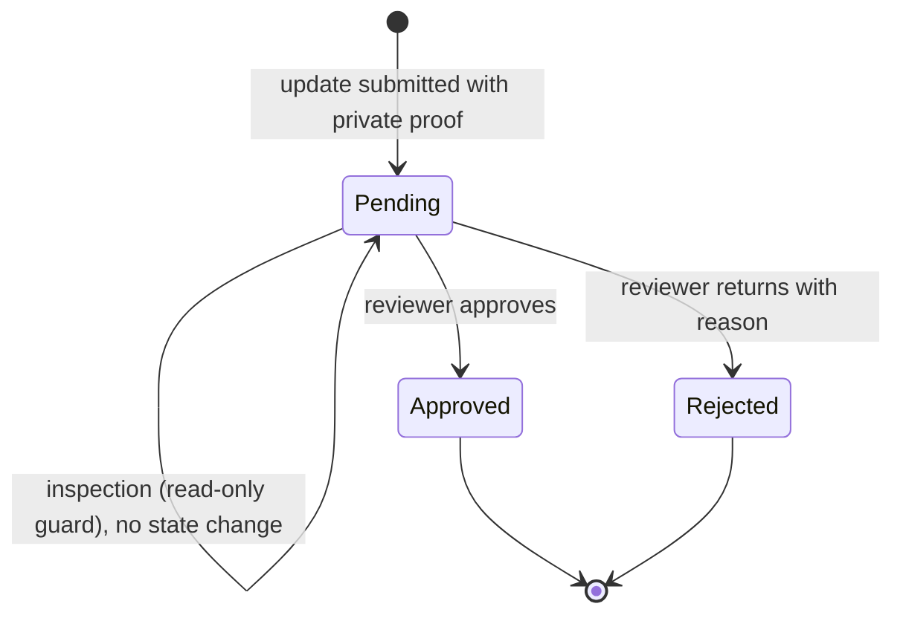
```mermaid
stateDiagram-v2
  [*] --> Pending: update submitted with private proof
  Pending --> Pending: inspection (read-only guard), no state change
  Pending --> Approved: reviewer approves
  Pending --> Rejected: reviewer returns with reason
  Approved --> [*]
  Rejected --> [*]
```

Expense approval lifecycle, from migration 0034 function `p34_review_expense`. Final sign-off is an append-only `expense_signoffs` row on an Approved expense; it does not change the status.

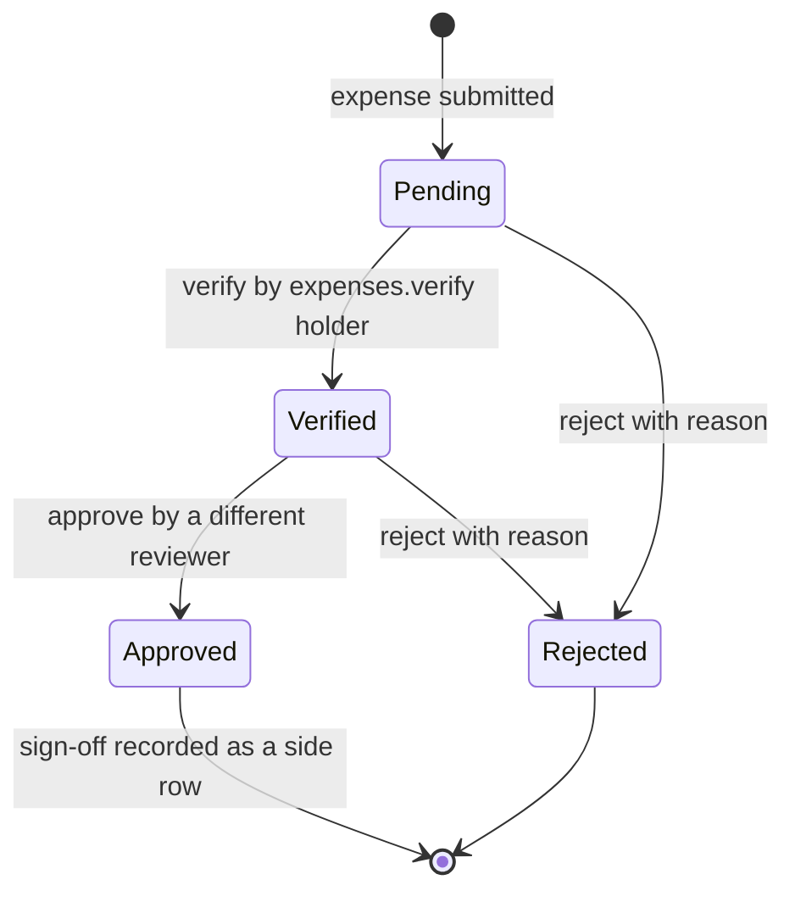
```mermaid
stateDiagram-v2
  [*] --> Pending: expense submitted
  Pending --> Verified: verify by expenses.verify holder
  Pending --> Rejected: reject with reason
  Verified --> Approved: approve by a different reviewer
  Verified --> Rejected: reject with reason
  Approved --> [*]: sign-off recorded as a side row
  Rejected --> [*]
```

### PRD-F3 Centralized Beneficiary Profile

**Purpose:** Keep one organization-scoped, project-linked profile for each beneficiary, registered through a published registration form and kept as project monitoring data. (R1, R5; objectives 1.1, 1.3)
**Why it helps:** Removes records scattered across files and tools and the need for technical staff to reconcile them. (P1, P5; Project Officer, Monitoring and Evaluation Officer, Project Manager)
**Bounds (in):**
- Register, search, view and update beneficiary profiles inside assigned projects; archive exists in code but `beneficiaries.records.archive` is granted to no default role.
- Register through a project registration form or the one system default registration form provisioned on first use.
- Minimum beneficiary age 5 at the enrollment date and no future birth date, on create, import and changed-profile edit.
- Enroll a beneficiary in a project and hold a possible duplicate identity for review; the Monitoring and Evaluation Officer reviews same-name, same-birth-date pairs and records a link or keep-distinct decision (`beneficiaries.identities.review`, cr-pathways-core-rbac-identity-review).
- Open beneficiary detail only after a fresh server-verified step-up (TOTP or PIN).
**Bounds (out):**
- Beneficiary self-registration, login or public submission: beneficiaries are never users (Scope and Limitations, paragraph 6).
- Evaluating a beneficiary as an individual: records are project monitoring data only (Scope and Limitations, paragraph 4).
- Raw beneficiary detail for System Administrator, Program Manager and Grant Manager: aggregate-only access (cr-pathways-admin-read-access, cr-pathways-beneficiary-step-up).
- Automatic record merge or movement of profile data: a review records an audited decision only (Scope and Limitations, paragraph 3).
**Lock:** Locked. Adding a gate or widening a bound requires an approved `cr-pathways-*`; anything outside these bounds is out of scope by default. System-wide bounds: section 6.1.

#### Gate Criteria

| Gate | Condition | Status | QAD |
|---|---|---|---|
| G-F3-1 | An authorized registrar in an assigned project creates a profile and enrollment through a published registration form, and the search and read routes return it only within that project scope | Met | QAD-T03 |
| G-F3-2 | Age 4, a supplied age below 5 and a future birth date are rejected on create, import and changed-profile edit; age 5 is accepted | Met | QAD-DRF-05 |
| G-F3-3 | A project without a published registration form provisions exactly one system form with the canonical field set; a second or parallel call returns the same form | Met | QAD-DRF-01 |
| G-F3-4 | Beneficiary detail without a fresh server-verified step-up returns 403 `STEP_UP_REQUIRED`, and client-supplied step-up values are ignored | Met | QAD-A11 |
| G-F3-5 | Program Manager, Grant Manager and System Administrator requests for beneficiary detail are denied | Met | QAD-A03 |
| G-F3-6 | A registration sharing an identity with an existing profile is held as review-required, and the matched profile stays hidden from registrars; a Monitoring and Evaluation Officer lists unreviewed pairs and records a link or keep-distinct decision, each audited; other roles are denied and no profile data is merged | Met | QAD-A23, QAD-IR-01, QAD-IR-02, QAD-IR-03 |

#### Use Cases

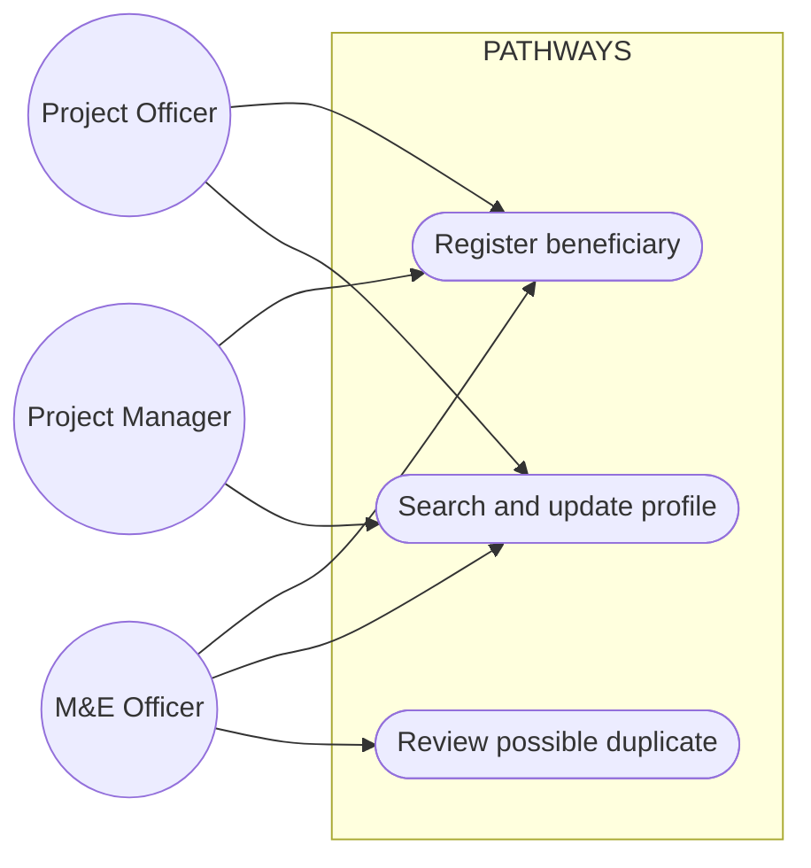
```mermaid
flowchart LR
  po((Project Officer))
  me((M&E Officer))
  pm((Project Manager))
  subgraph PATHWAYS
    uc1([Register beneficiary])
    uc2([Search and update profile])
    uc3([Review possible duplicate])
  end
  po --> uc1
  me --> uc1
  pm --> uc1
  po --> uc2
  me --> uc2
  pm --> uc2
  me --> uc3
```

##### UC-F3-1 Register beneficiary

| Field | Value |
|---|---|
| Actor | Project Officer, Monitoring and Evaluation Officer, Project Manager |
| Permission | `beneficiaries.records.register` |
| Trigger | The user opens the new beneficiary screen for an assigned project. |
| Preconditions | The user is signed in with a fresh step-up and assigned to the project; the project is active. |
| Main flow | 1. The web loads the registration context (`GET /beneficiaries/projects/:projectId/registration-context`). 2. If no published registration form exists, the user provisions the system form (`POST /beneficiaries/projects/:projectId/registration-context/default-form`). 3. The user fills the form on `/beneficiaries/new`; the web derives age from the birth date. 4. The user submits (`POST /beneficiaries/projects/:projectId/registrations`). 5. The system validates the age and birth date, stores the profile, enrollment, submission and consent rows, and returns the beneficiary. |
| Alternate / exception | Permission denied or unassigned project: 403 before any write. Age below 5 or future birth date: rejected with a field message. Archived system form: unavailable state, no retry. Stale step-up: 403 `STEP_UP_REQUIRED`. |
| Postconditions | One profile and one enrollment exist in the project; a registration audit event is recorded. |
| Gates | G-F3-1, G-F3-2, G-F3-3, G-F3-4 |

##### UC-F3-2 Search and update profile

| Field | Value |
|---|---|
| Actor | Project Officer, Monitoring and Evaluation Officer, Project Manager |
| Permission | `beneficiaries.profiles.update` |
| Trigger | The user searches the beneficiary list and opens a profile to correct it. |
| Preconditions | The user holds `beneficiaries.records.read`, a fresh step-up and project assignment. |
| Main flow | 1. The user searches on `/beneficiaries` (`GET /beneficiaries/projects/:projectId`). 2. The user opens a profile (`GET /beneficiaries/projects/:projectId/:beneficiaryId`). 3. The user edits it on `/beneficiaries/[beneficiaryId]/edit` and saves (`PATCH /beneficiaries/projects/:projectId/:beneficiaryId`). 4. Archive (`POST /beneficiaries/projects/:projectId/:beneficiaryId/archive`) needs `beneficiaries.records.archive`, which no default role holds, so it is unreachable by default. |
| Alternate / exception | Program Manager, Grant Manager or System Administrator: denied. Edit that would leave a new age below 5 or a future birth date: rejected; an unchanged existing under-5 record is accepted. |
| Postconditions | The profile reflects the change and an audit event is recorded. |
| Gates | G-F3-1, G-F3-2, G-F3-4, G-F3-5 |

##### UC-F3-3 Review possible duplicate

| Field | Value |
|---|---|
| Actor | Monitoring and Evaluation Officer |
| Permission | `beneficiaries.identities.review` |
| Trigger | A registration shares an identity with an existing profile and is held for review. |
| Preconditions | The user holds the review permission, a fresh step-up and project assignment. |
| Main flow | 1. The registration response reports `IDENTITY_REVIEW_REQUIRED` or `DUPLICATE_IDENTITY` (`POST /beneficiaries/projects/:projectId/registrations`). 2. The reviewer opens `/beneficiaries/duplicates`, which lists unreviewed pairs (`GET /beneficiaries/projects/:projectId/duplicate-candidates`). 3. The reviewer compares a pair and confirms Keep as distinct people or Merge linked profiles (`POST /beneficiaries/projects/:projectId/duplicate-candidates/resolve`). |
| Alternate / exception | A caller without the review permission sees only the review-required code and cannot see the matched profile; the queue and decision routes return 403. A pair already decided, the same profile twice or a profile outside the project is rejected. |
| Postconditions | The pair leaves the queue; no profile data is merged or moved; the decision is audited. |
| Gates | G-F3-6 |

#### State Machines

Not applicable to this charter: a profile is active or archived, and journey lifecycle states belong to PRD-F4.

### PRD-F4 Beneficiary Journey Tracking

**Purpose:** Record and read each beneficiary's participation, progression and enrollment outcome across project activities and configured journey stages. (R6; objectives 1.1, 1.3)
**Why it helps:** Replaces manual tracing of who took part in what and how far they progressed. (P6; Project Officer, Monitoring and Evaluation Officer, Project Manager)
**Bounds (in):**
- Configure project journey stages (entry, core, branch, follow-up) and map activities to them.
- Record enrollment events: participation, progress update, completion, follow-up, dropout and transfer.
- Attach an optional free-text note (1 to 1000 characters) to a journey event or its correction.
- Correct an event by adding a linked correction with a reason; the original is kept.
- Read chronological participation and progression history within assigned projects.
**Bounds (out):**
- Judging whether a beneficiary learned, improved or failed: project-level review only (Scope and Limitations, paragraph 4).
- Journey stage configuration reading beneficiary events: configuration holders cannot retrieve events without the read permission and step-up (cr-pathways-admin-read-access).
- Data-ripple display from the manuscript: no route exists (Not carried forward, see the use case disposition).
- Participation history for Program Manager and Grant Manager: aggregate-only roles (cr-pathways-beneficiary-step-up).
**Lock:** Locked. Adding a gate or widening a bound requires an approved `cr-pathways-*`; anything outside these bounds is out of scope by default. System-wide bounds: section 6.1.

#### Gate Criteria

| Gate | Condition | Status | QAD |
|---|---|---|---|
| G-F4-1 | System Administrator, Monitoring and Evaluation Officer and Project Manager can list and save journey stages for a project (`journeys.read` or `journeys.manage` lists; `journeys.manage` saves); other roles are denied | Met | QAD-T49 |
| G-F4-2 | A participation or progress event persists against the enrollment and history returns it in chronological order | Met | QAD-T04 |
| G-F4-3 | A completion, dropout or transfer event closes the enrollment with its end date and reason | Met | QAD-T50 |
| G-F4-4 | A correction adds a new event linked to the original with a required reason; the original is never overwritten | Met | QAD-T51 |
| G-F4-5 | Reading journey history requires a fresh step-up, project assignment and `journeys.read`; unassigned or cross-organization requests are denied, and System Administrator (aggregate-only) is denied beneficiary journey history with 403 while keeping project-level stage configuration | Met | QAD-A11, QAD-JR-01, QAD-JR-02 |
| G-F4-6 | A user can attach a free-text note to a journey record | Met | QAD-T52, QAD-T83, QAD-A24 |

#### Use Cases

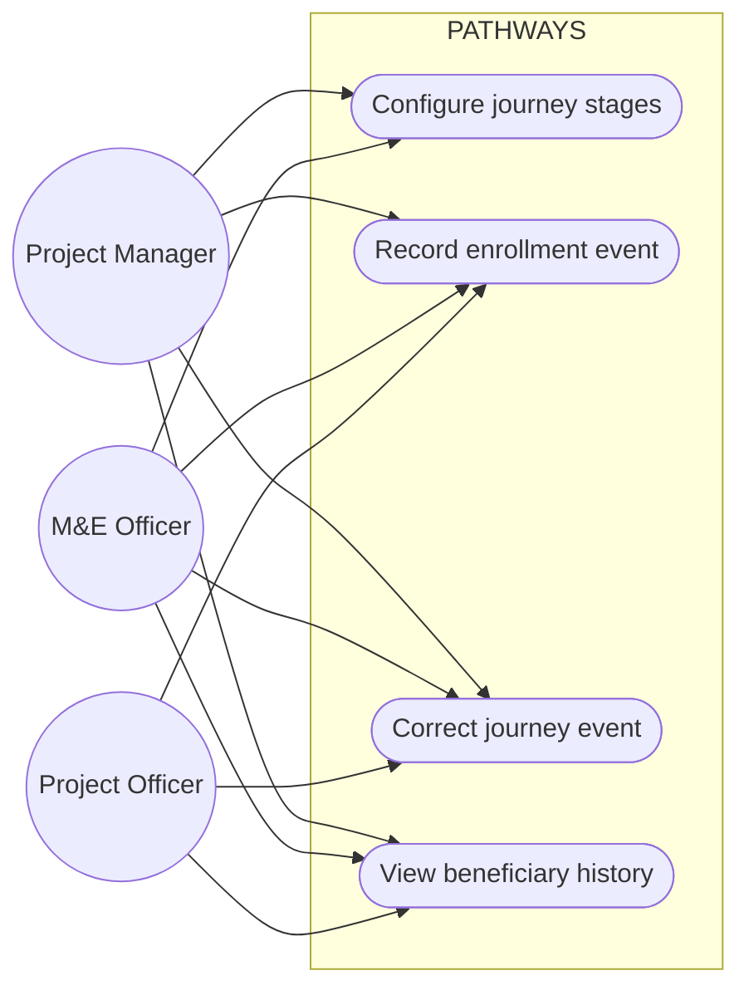
```mermaid
flowchart LR
  po((Project Officer))
  me((M&E Officer))
  pm((Project Manager))
  subgraph PATHWAYS
    uc1([Configure journey stages])
    uc2([Record enrollment event])
    uc3([Correct journey event])
    uc4([View beneficiary history])
  end
  me --> uc1
  pm --> uc1
  po --> uc2
  me --> uc2
  pm --> uc2
  po --> uc3
  me --> uc3
  pm --> uc3
  po --> uc4
  me --> uc4
  pm --> uc4
```

##### UC-F4-1 Configure journey stages

| Field | Value |
|---|---|
| Actor | Monitoring and Evaluation Officer, Project Manager |
| Permission | `journeys.manage` |
| Trigger | The user edits stages on the project journey screen. |
| Preconditions | The user is assigned to the project; activities exist to map. |
| Main flow | 1. The user opens `/projects/[projectId]/journey-stages`. 2. The web loads the current stages (`GET /projects/:projectId/journey-stages`). 3. The user adds, orders or archives stages and maps activities. 4. The user saves (`PUT /projects/:projectId/journey-stages`). |
| Alternate / exception | Permission denied: 403. Invalid stage order or unknown activity: rejected with a field message. |
| Postconditions | The stage set is stored for the project; an audit event is recorded. |
| Gates | G-F4-1 |

##### UC-F4-2 Record enrollment event

| Field | Value |
|---|---|
| Actor | Project Officer, Monitoring and Evaluation Officer, Project Manager |
| Permission | `beneficiaries.enrollments.manage` |
| Trigger | A beneficiary attends, progresses, completes, drops out or transfers. |
| Preconditions | The beneficiary has an enrollment in the project; the user has a fresh step-up. |
| Main flow | 1. The user opens the beneficiary on `/participants`. 2. The user submits the event (`POST /beneficiaries/projects/:projectId/:beneficiaryId/journey/events`). 3. The system stores the event against the enrollment. 4. For completion, dropout or transfer the system sets the enrollment status, end date and reason. |
| Alternate / exception | Permission denied or stale step-up: no write. Event on a closed enrollment or unknown beneficiary: rejected. An optional note over 1000 characters or only whitespace: rejected with 400. |
| Postconditions | The event is in history; closing events end the enrollment; an audit event is recorded. |
| Gates | G-F4-2, G-F4-3, G-F4-5, G-F4-6 |

##### UC-F4-3 Correct journey event

| Field | Value |
|---|---|
| Actor | Project Officer, Monitoring and Evaluation Officer, Project Manager |
| Permission | `participation.record` |
| Trigger | A recorded event has a wrong date, type or detail. |
| Preconditions | The original event exists in the project and is not itself a correction. |
| Main flow | 1. The user selects the event on `/participants`. 2. The user enters the correction and a reason. 3. The user submits (`POST /beneficiaries/projects/:projectId/:beneficiaryId/journey/events/:eventId/corrections`). 4. The system adds a correction event that references the original. |
| Alternate / exception | Missing reason or correcting a correction: rejected. Aggregate-only roles: 403. |
| Postconditions | The original stays; history shows the correction; an audit event records the reason. |
| Gates | G-F4-4 |

##### UC-F4-4 View beneficiary history

| Field | Value |
|---|---|
| Actor | Project Officer, Monitoring and Evaluation Officer, Project Manager |
| Permission | `journeys.read` |
| Trigger | The user opens a beneficiary's participation or progression history. |
| Preconditions | Fresh step-up; the user is assigned to the project. |
| Main flow | 1. The user opens `/participants` and selects a beneficiary. 2. The web requests the journey (`GET /beneficiaries/projects/:projectId/:beneficiaryId/journey`). 3. The system returns stages and the beneficiary's events in chronological order. |
| Alternate / exception | No events: an empty history is shown with stages not started. Outside assigned scope or stale step-up: denied. |
| Postconditions | No record changes; the read is audited. |
| Gates | G-F4-2, G-F4-5 |

#### State Machines

Enrollment lifecycle, set by journey events (`apps/api/prisma/schema.prisma`, `EnrollmentStatus`). The INACTIVE value exists in the enum but no journey event sets it.

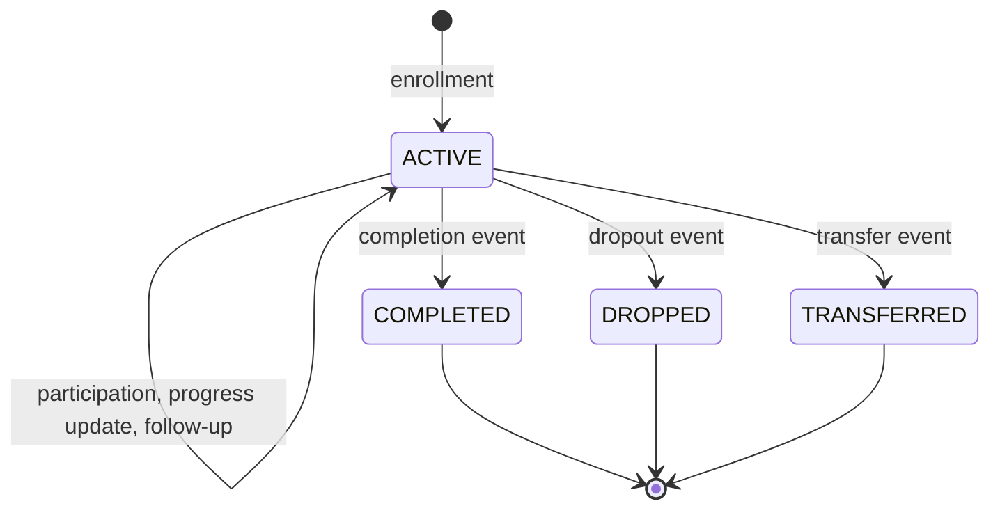
```mermaid
stateDiagram-v2
  [*] --> ACTIVE: enrollment
  ACTIVE --> ACTIVE: participation, progress update, follow-up
  ACTIVE --> COMPLETED: completion event
  ACTIVE --> DROPPED: dropout event
  ACTIVE --> TRANSFERRED: transfer event
  COMPLETED --> [*]
  DROPPED --> [*]
  TRANSFERRED --> [*]
```

### PRD-F5 Digital Data Collection and Preparation

**Purpose:** Let authorized users build, publish and export digital monitoring forms, and encode validated records directly into a project. (R2; objectives 1.4, 2.1)
**Why it helps:** Gives field data a structured entry point so records need no later rework before review. (P2; Project Officer, Monitoring and Evaluation Officer)
**Bounds (in):**
- Generate a form from a template or build one, edit it by new version, publish and archive it.
- Export a form definition (CSV, XLSX, XLS, PDF) for the Monitoring and Evaluation Officer and System Administrator, with one audit row and no field content.
- Encode records through a published form: validate, save a draft, submit, each linked to the project and audited.
- Field rules are deterministic validation; no AI proposes or fills values.
**Bounds (out):**
- Replacing specialized field collection platforms: PATHWAYS prepares and receives data only (Scope and Limitations, paragraph 3).
- Real-time synchronization or API integration with KOBO, YES!ME or PMERL (Scope and Limitations, paragraph 3).
- Form management for Project Officer: encoding and blank registration definitions only (cr-pathways-core-p1-supporting-operations).
- Form-definition export for Project Officer, Project Manager, Program Manager and Grant Manager (cr-pathways-import-throughput-and-pdf).
**Lock:** Locked. Adding a gate or widening a bound requires an approved `cr-pathways-*`; anything outside these bounds is out of scope by default. System-wide bounds: section 6.1.

#### Gate Criteria

| Gate | Condition | Status | QAD |
|---|---|---|---|
| G-F5-1 | An authorized user generates or builds a form, a different holder of `forms.publish` publishes it and it is offered for entry; the author cannot publish their own form (403), and a form with missing required structure cannot publish | Met | QAD-T05, QAD-FP-01 |
| G-F5-2 | A valid direct entry persists as a validated submission linked to the project, and an invalid entry is rejected with field messages | Met | QAD-T05 |
| G-F5-3 | A draft submission can be saved and edited before submit | Met | QAD-T53 |
| G-F5-4 | Each form-definition export format downloads and writes one audit row; roles other than Monitoring and Evaluation Officer and System Administrator are denied | Met | QAD-IMP-04 |
| G-F5-5 | A form request from another organization or an unassigned project is denied before any form is read | Met | QAD-IMP-11 |

#### Use Cases

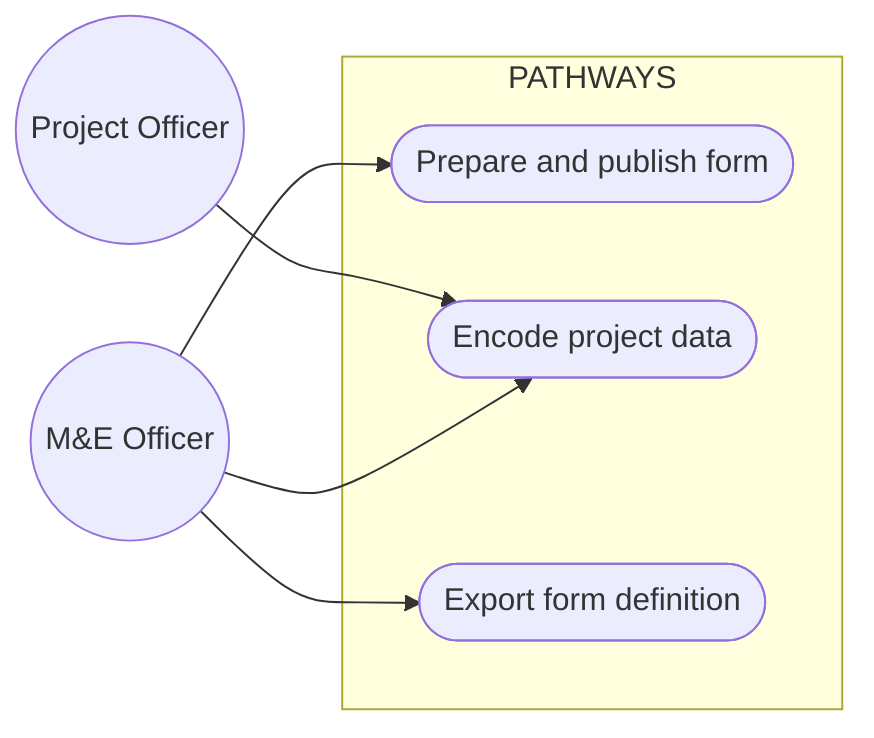
```mermaid
flowchart LR
  po((Project Officer))
  me((M&E Officer))
  subgraph PATHWAYS
    uc1([Prepare and publish form])
    uc2([Encode project data])
    uc3([Export form definition])
  end
  me --> uc1
  po --> uc2
  me --> uc2
  me --> uc3
```

##### UC-F5-1 Prepare and publish form

| Field | Value |
|---|---|
| Actor | Monitoring and Evaluation Officer |
| Permission | `forms.generate` |
| Trigger | The user creates a monitoring form for a project. |
| Preconditions | The user is assigned to the project; holds `forms.manage` for edit. Publishing needs `forms.publish`, held by Monitoring and Evaluation Officer and System Administrator only; a second holder (another M&E Officer or a System Administrator) must publish, because the author cannot publish their own form. |
| Main flow | 1. The user opens `/collection/forms/new`. 2. The user generates a form (`POST /metadata/projects/:projectId/forms/generate`) or creates one (`POST /metadata/projects/:projectId/forms`). 3. The user previews and edits it (`PATCH /metadata/projects/:projectId/forms/:formId`). 4. A second `forms.publish` holder publishes (`POST /metadata/projects/:projectId/forms/:formId/publish`). |
| Alternate / exception | Missing required fields: publish blocked with a field message. Edits to a published form create a new version (`POST /metadata/projects/:projectId/forms/:formId/versions`). Permission denied, or the publisher is the form's author: 403. |
| Postconditions | The form is published and linked to the project; form metadata and an audit event are recorded. |
| Gates | G-F5-1, G-F5-5 |

##### UC-F5-2 Encode project data

| Field | Value |
|---|---|
| Actor | Project Officer, Monitoring and Evaluation Officer |
| Permission | `submissions.write` |
| Trigger | The user enters collected data for a published form. |
| Preconditions | A published form exists in an assigned project. |
| Main flow | 1. The user opens `/collection/entry` and selects the form. 2. The user fills the form; the web validates it (`POST /metadata/projects/:projectId/forms/:formId/validate`). 3. The user saves a draft (`POST /metadata/projects/:projectId/forms/:formId/submissions`) and later edits it (`PATCH /metadata/projects/:projectId/forms/:formId/submissions/:submissionId`). 4. The user submits (`POST /metadata/projects/:projectId/forms/:formId/submissions/:submissionId/submit`). |
| Alternate / exception | Validation failure: fields highlighted, submit blocked. Retry with the same client submission id returns the existing submission. Unassigned project: denied. |
| Postconditions | A submission exists in the project with its status and an audit event. |
| Gates | G-F5-2, G-F5-3, G-F5-5 |

##### UC-F5-3 Export form definition

| Field | Value |
|---|---|
| Actor | Monitoring and Evaluation Officer |
| Permission | `forms.export` |
| Trigger | The user downloads a form definition to share or reuse. |
| Preconditions | The form exists in an assigned project. |
| Main flow | 1. The user opens `/collection/forms`. 2. The user picks a format. 3. The web requests the file (`GET /metadata/projects/:projectId/forms/:formId/export`). 4. The system returns the definition and audits the export. |
| Alternate / exception | Permission denied or cross-project request: 403. Definition beyond artifact bounds: the export fails whole, never truncated. |
| Postconditions | One audit row without field content. |
| Gates | G-F5-4, G-F5-5 |

#### State Machines

Form lifecycle (`FormStatus`); a published form changes only through a new version.

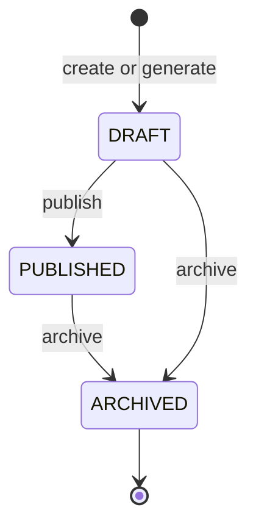
```mermaid
stateDiagram-v2
  [*] --> DRAFT: create or generate
  DRAFT --> PUBLISHED: publish
  PUBLISHED --> ARCHIVED: archive
  DRAFT --> ARCHIVED: archive
  ARCHIVED --> [*]
```

### PRD-F6 Metadata-Driven Data Integration

**Purpose:** Turn uploaded field datasets into validated project records by mapping columns to form metadata, validating them and processing them in bounded chunks. (R2; objectives 1.1, 1.4, 2.1)
**Why it helps:** Replaces repeated export, import, mapping and consolidation with one governed path from file to project record. (P2, P5; Project Officer, Monitoring and Evaluation Officer)
**Bounds (in):**
- Upload CSV, XLS, XLSX and text-layer PDF tables into a staged batch (up to 5,000 rows, 500 columns).
- Map columns to form fields: deterministic automatic mapping (algorithm `AUTO_SMART_V2`) with no AI, a human confirmation step, and manual edits.
- Validate required fields, formats and mapping completeness; invalid rows stay staged with errors.
- Process valid rows in chunks of at most 25, with resumable progress, into submissions linked to the project.
**Bounds (out):**
- AI or learned mapping: automatic mapping is rules over names and sampled values only (cr-pathways-smart-import-mapping).
- Data-type selection for new fields and value translation: on hold (docs/deferred-features.md).
- Real-time synchronization or API integration with KOBO, YES!ME or PMERL (Scope and Limitations, paragraph 3).
- Scanned, encrypted, table-less or script-carrying PDFs and formula-like cells: rejected (cr-pathways-import-throughput-and-pdf).
**Lock:** Locked. Adding a gate or widening a bound requires an approved `cr-pathways-*`; anything outside these bounds is out of scope by default. System-wide bounds: section 6.1.

#### Gate Criteria

| Gate | Condition | Status | QAD |
|---|---|---|---|
| G-F6-1 | A mapped, validated import normalizes into project submissions and the batch reaches PROCESSED | Met | QAD-T06 |
| G-F6-2 | A batch with invalid rows or a missing required mapping stays staged and cannot be normalized until corrected | Met | QAD-T22 |
| G-F6-3 | Automatic mapping is deterministic, never maps an ambiguous name such as "Gender" to a different field, and leaves low-confidence columns pending | Met | QAD-SM-05 |
| G-F6-4 | Only users holding `imports.review` confirm or change a mapping; cross-project and other-uploader calls are denied before any write | Met | QAD-SM-11 |
| G-F6-5 | A 5,000-row batch finishes through repeated bounded process calls; a failed or stopped run keeps server state and offers resume | Met | QAD-IMP-02 |
| G-F6-6 | Spreadsheet formulas and scripted PDFs are not executed and scanned or oversized files fail with stable messages | Met | QAD-A07 |
| G-F6-7 | A reviewer can declare a data type and translate source values per mapped column; a value that still fails stays staged with a reason | Met | QAD-T54 |

#### Use Cases

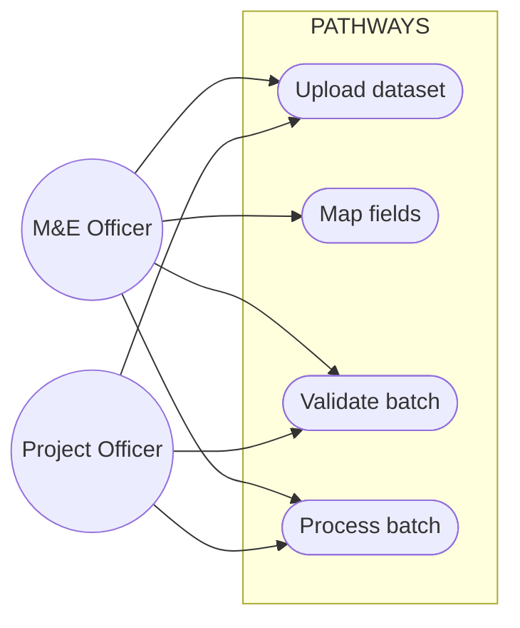
```mermaid
flowchart LR
  po((Project Officer))
  me((M&E Officer))
  subgraph PATHWAYS
    uc1([Upload dataset])
    uc2([Map fields])
    uc3([Validate batch])
    uc4([Process batch])
  end
  po --> uc1
  me --> uc1
  me --> uc2
  po --> uc3
  me --> uc3
  po --> uc4
  me --> uc4
```

##### UC-F6-1 Upload dataset

| Field | Value |
|---|---|
| Actor | Project Officer, Monitoring and Evaluation Officer |
| Permission | `imports.upload` |
| Trigger | The user imports a collected file into a project. |
| Preconditions | A published target form exists in an assigned project; the file is CSV, XLS, XLSX or a text-layer PDF. |
| Main flow | 1. The user opens `/collection/import`. 2. The user selects the project, form and file. 3. The user uploads (`POST /imports/projects/:projectId/batches/upload`). 4. The system stores the file, parses the rows and sets the batch to UPLOADED. 5. The user may request automatic mapping (`POST /imports/projects/:projectId/batches/:batchId/automatic-mapping`, `imports.upload`); suggestions are reviewed in UC-F6-2. |
| Alternate / exception | Unsupported or unsafe file: rejected with a stable code. Interrupted upload: batch is RECOVERY_REQUIRED and is resumed (`POST /imports/projects/:projectId/batches/:batchId/resume`). Permission denied: 403. |
| Postconditions | A staged batch exists with its source rows; an audit event is recorded. |
| Gates | G-F6-3, G-F6-5, G-F6-6 |

##### UC-F6-2 Map fields

| Field | Value |
|---|---|
| Actor | Monitoring and Evaluation Officer |
| Permission | `imports.review` |
| Trigger | A batch has suggested or pending column mappings. |
| Preconditions | The batch is UPLOADED or MAPPED and belongs to an assigned project. |
| Main flow | 1. The user opens the batch on `/imports`. 2. The user reviews each suggestion and its reason. 3. The user confirms all or one, maps, or ignores a column (`PATCH /imports/projects/:projectId/batches/:batchId/mapping`). 4. The system records a new mapping revision attributed to the reviewer. |
| Alternate / exception | Automatic-mapping suggestions are requested under `imports.upload` (UC-F6-1) and confirmed here under `imports.review`. A Project Officer sees suggestions read-only and is denied. Stale revision: conflict. Field mapped twice: rejected. A reviewer may also declare a data type and add up to 50 value translations per mapped column; an untranslated value that fails stays staged with a reason. |
| Postconditions | The batch is MAPPED at a new revision; an audit event is recorded without cell values. |
| Gates | G-F6-3, G-F6-4, G-F6-7 |

##### UC-F6-3 Validate batch

| Field | Value |
|---|---|
| Actor | Project Officer, Monitoring and Evaluation Officer |
| Permission | `imports.validate` |
| Trigger | The mapping is complete and the user checks the data. |
| Preconditions | Required fields are mapped; the batch is UPLOADED, MAPPED or VALIDATED. |
| Main flow | 1. The user selects Validate on `/imports`. 2. The web requests validation (`POST /imports/projects/:projectId/batches/:batchId/validate`). 3. The system marks each row valid or invalid and sets the batch to VALIDATED. 4. The user reviews flagged rows (`GET /imports/projects/:projectId/batches/:batchId/rows`). |
| Alternate / exception | Missing required mapping: validation blocks. Invalid rows stay staged with messages. |
| Postconditions | The batch is VALIDATED for the current mapping revision. |
| Gates | G-F6-1, G-F6-2 |

##### UC-F6-4 Process batch

| Field | Value |
|---|---|
| Actor | Project Officer, Monitoring and Evaluation Officer |
| Permission | `imports.process` |
| Trigger | A validated batch is ready to become project records. |
| Preconditions | The batch is VALIDATED, PARTIALLY_PROCESSED or PROCESSING for the current mapping revision; access is still assigned. |
| Main flow | 1. The user starts processing on `/imports`. 2. The web calls process repeatedly (`POST /imports/projects/:projectId/batches/:batchId/process`). 3. Each call promotes at most 25 valid rows into submissions and audits each row. 4. The system sets PROCESSED or PARTIALLY_PROCESSED from the row counts. |
| Alternate / exception | A failed chunk rolls back and reruns row by row; only the failing row is held back. Revoked permission or removed assignment stops promotion at the next chunk. A retry after a partial chunk reuses the existing submission. |
| Postconditions | Valid rows are project submissions; unprocessed rows remain for correction; the batch summary is saved. |
| Gates | G-F6-1, G-F6-5 |

#### State Machines

Import batch lifecycle (`ImportStatus`, `apps/api/src/modules/imports/imports.service.ts`).

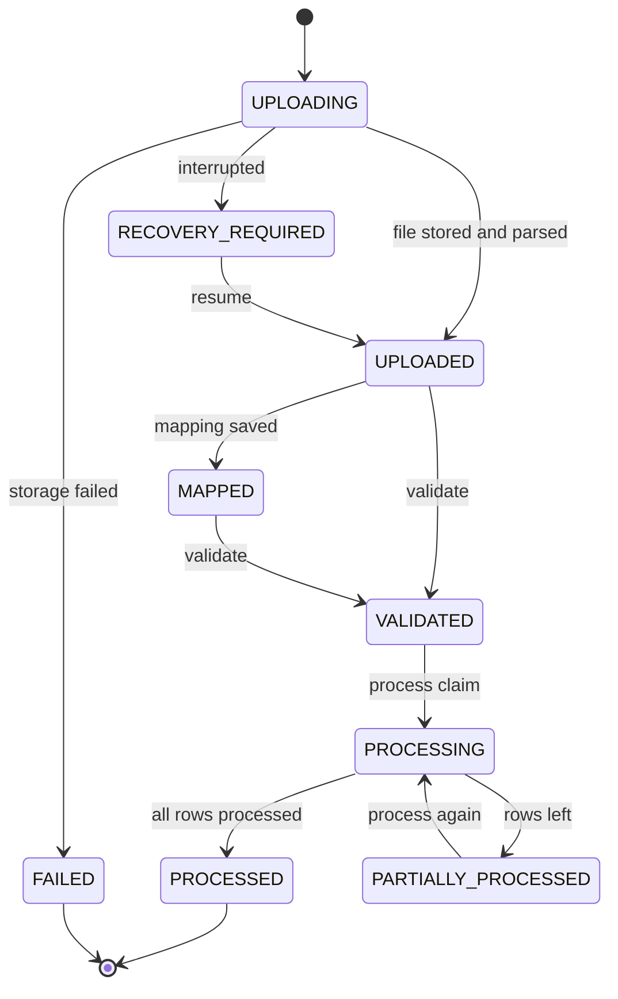
```mermaid
stateDiagram-v2
  [*] --> UPLOADING
  UPLOADING --> UPLOADED: file stored and parsed
  UPLOADING --> FAILED: storage failed
  UPLOADING --> RECOVERY_REQUIRED: interrupted
  RECOVERY_REQUIRED --> UPLOADED: resume
  UPLOADED --> MAPPED: mapping saved
  UPLOADED --> VALIDATED: validate
  MAPPED --> VALIDATED: validate
  VALIDATED --> PROCESSING: process claim
  PROCESSING --> PROCESSED: all rows processed
  PROCESSING --> PARTIALLY_PROCESSED: rows left
  PARTIALLY_PROCESSED --> PROCESSING: process again
  PROCESSED --> [*]
  FAILED --> [*]
```

### PRD-F7 Project Indicator and Monitoring

**Purpose:** Let the Monitoring and Evaluation Officer and the Project Manager define project indicators with baseline, target and direction, and record measurements against them. (R3, R4; objective 1.5)
**Why it helps:** Removes manual indicator setup and spreadsheet tracking of target versus actual. (P3, P4; Monitoring and Evaluation Officer, Project Manager)
**Bounds (in):**
- Create, update and list project-scoped indicators with baseline, target, direction and data source.
- Record measurements against an indicator, with a replayed save returning the original result.
- Show trusted current value and progress; missing values and invalid denominators show the established unavailable state, never an invented zero.
- Audit every indicator create, update and measurement.
- Keep an organization indicator library of definition templates (create, list, archive under `indicators.library.*`) and create a project indicator from an entry by copying its definition; no live link and no project data in the library (cr-pathways-indicator-library).
**Bounds (out):**
- Live links between a library entry and project indicators, editing or deleting a library entry, sharing a library across organizations, and project structure templates: not built (deferred-features)
- Archiving indicators: the archive route exists but `indicators.archive` is granted to no role (rbac-contract.json)
- Project-level target goal comparison: retired, historical column preserved (cr-pathways-retire-project-target-goal)
- Disaggregation requirements on the indicator definition: disaggregation is computed in PRD-F8 from beneficiary fields (Scope and Limitations)
**Lock:** Locked. Adding a gate or widening a bound requires an approved `cr-pathways-*`; anything outside these bounds is out of scope by default. System-wide bounds: section 6.1.

#### Gate Criteria

| Gate | Condition | Status | QAD |
|---|---|---|---|
| G-F7-1 | An authorized user creates and updates an indicator in an assigned project; unauthorized roles and other organizations are refused | Met | QAD-T55 |
| G-F7-2 | An indicator shows the correct trusted metric, target and source | Met | QAD-T07 |
| G-F7-3 | A measurement save is idempotent: the same key and input is read-only on retry, conflicting reuse fails | Met | QAD-T56 |
| G-F7-4 | Indicator progress is independent of the retired project target goal and shows unavailable states instead of zero | Met | QAD-T57 |
| G-F7-5 | Indicator definitions can be reused across projects through an organization library; a project indicator created from an entry is an independent copy | Met | QAD-IL-01, QAD-IL-02, QAD-T58 |

#### Use Cases

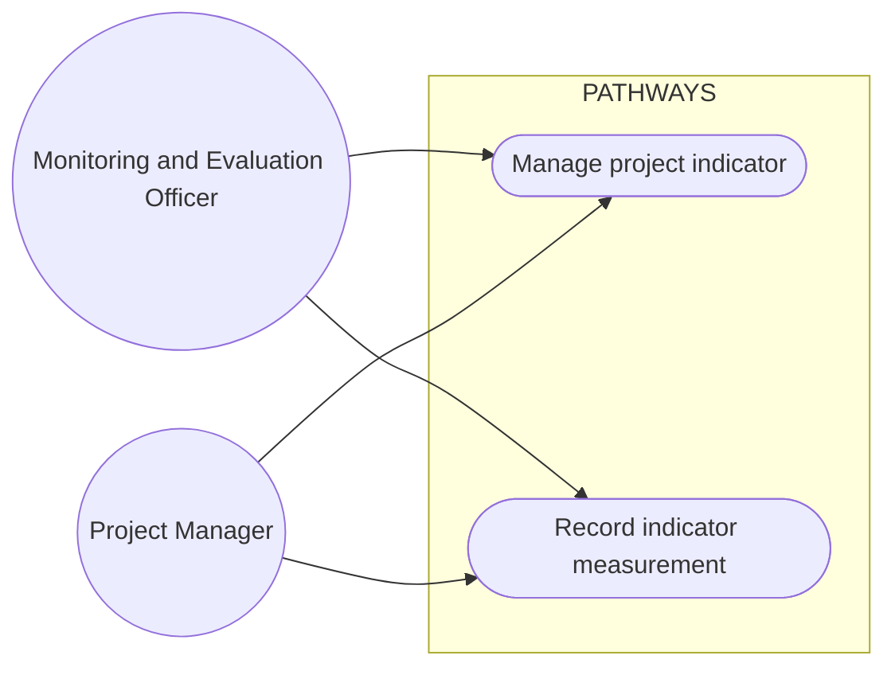
```mermaid
flowchart LR
  me((Monitoring and Evaluation Officer))
  pm((Project Manager))
  subgraph PATHWAYS
    uc1([Manage project indicator])
    uc2([Record indicator measurement])
  end
  me --> uc1
  pm --> uc1
  me --> uc2
  pm --> uc2
```

##### UC-F7-1 Manage project indicator

| Field | Value |
|---|---|
| Actor | Monitoring and Evaluation Officer, Project Manager |
| Permission | `indicators.create`, `indicators.update` |
| Trigger | The user opens a project workspace to define or change an indicator |
| Preconditions | The user is authenticated, assigned to the project and holds the permission |
| Main flow | 1. The user opens the indicator list (route `/projects/:projectId/indicators`). 2. The system lists existing indicators (`indicators.read`). 3. The user defines name, unit, baseline, target, direction and source. 4. The system validates the definition. 5. The user saves. |
| Alternate / exception | Permission denied: 403, no change. Required field missing or invalid: 400, nothing saved. Library entry missing, archived or from another organization: 404, nothing created. Using a library entry also needs `indicators.library.read`. |
| Postconditions | The indicator is stored for the project and an audit event is written |
| Gates | G-F7-1, G-F7-2, G-F7-5 |

##### UC-F7-2 Record indicator measurement

| Field | Value |
|---|---|
| Actor | Monitoring and Evaluation Officer, Project Manager |
| Permission | `indicators.update` |
| Trigger | A new actual value is available for an indicator |
| Preconditions | The indicator is active and in the user's assigned project |
| Main flow | 1. The user opens the indicator. 2. The user enters the measured value and period. 3. The system saves it (route `/projects/:projectId/indicators/:indicatorId/measurements`). 4. The system recomputes progress against the target. |
| Alternate / exception | Retry with the same key and input: the original result is returned. Same key with different input: rejected. Permission denied: 403. |
| Postconditions | A measurement row exists and an audit event is written |
| Gates | G-F7-3, G-F7-4 |

#### State Machines

Not applicable: indicators have active and archived flags only; no approval lifecycle exists.

### PRD-F8 Aggregated Monitoring Dashboard with SADDD Analysis

**Purpose:** Show authorized users aggregated monitoring dashboards and SADDD (sex, age, disability and related) breakdowns built from trusted persisted data, with privacy suppression. (R3; objectives 1.6, 2.2, 2.3)
**Why it helps:** Removes hand-built dashboards and lets managers read status and reach without waiting for a prepared report. (P3; Project Manager, Program Manager, Monitoring and Evaluation Officer)
**Bounds (in):**
- Role home dashboard and monitoring dashboard limited to the user's authorized projects and organization.
- SADDD view for one project: sex, age band and disability breakdowns, available only for a fixed, valid, closed project period.
- Age is completed years at period end in the business timezone, in the locked bands 0–9, 10–14, 15–17, 18–24, 25+ and Unknown (rfc-pathways-saddd-privacy). A missing birth date is Unknown; an invalid one is excluded and flagged.
- Small-cell suppression: counts 1 to 4 are suppressed (threshold 5), with complementary suppression so a suppressed value cannot be rebuilt from totals.
- Aggregate output only; no SADDD drilldown to individual beneficiaries for any role.
**Bounds (out):**
- SADDD for an open or undefined project period: omitted, not estimated (analytics.service.ts precondition)
- Drilldown to beneficiary records for Program Manager and Grant Manager: aggregate-only roles (rfc-pathways-auth-rbac-isolation)
- Custom dashboard widgets and "Add to Dashboard": hidden pending a storage decision (deferred-features)
- Predictive or machine-learning analysis: not in scope (Scope and Limitations)
**Lock:** Locked. Adding a gate or widening a bound requires an approved `cr-pathways-*`; anything outside these bounds is out of scope by default. System-wide bounds: section 6.1.

#### Gate Criteria

| Gate | Condition | Status | QAD |
|---|---|---|---|
| G-F8-1 | Dashboards show only projects the role and assignment allow, with no cross-organization data | Met | QAD-T59 |
| G-F8-2 | Dashboard and SADDD values come from trusted persisted data | Met | QAD-T08 |
| G-F8-3 | SADDD counts 1 to 4 are suppressed, counts 0 and 5 or more are shown, and complementary suppression holds | Met | QAD-A10 |
| G-F8-4 | Age bands follow the locked boundaries; missing birth date is Unknown and an invalid one is excluded | Met | QAD-T60 |
| G-F8-5 | Program Manager and Grant Manager receive aggregates only, with raw beneficiary denial unchanged | Met | QAD-R06 |
| G-F8-6 | SADDD is omitted for an open project period instead of failing the dashboard | Met | QAD-T61 |
| G-F8-7 | Dashboard responsiveness is verified at production scale | Met (local, assumed scale, single user; staging re-measure pending) | QAD-T62, QAD-T87 |

#### Use Cases

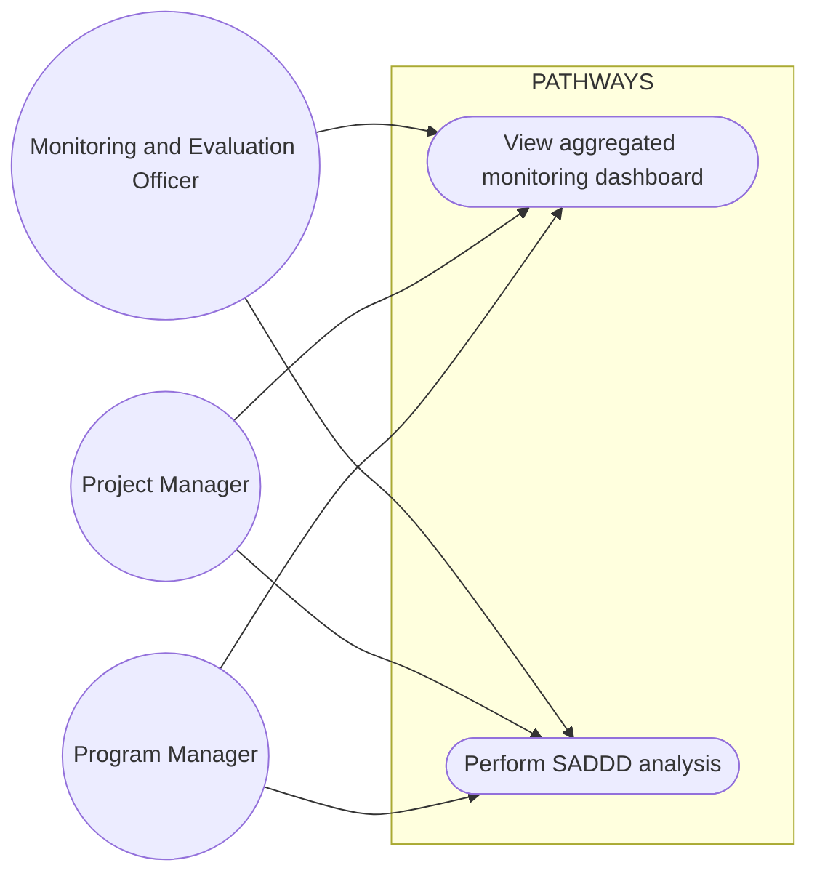
```mermaid
flowchart LR
  me((Monitoring and Evaluation Officer))
  pm((Project Manager))
  pg((Program Manager))
  subgraph PATHWAYS
    uc1([View aggregated monitoring dashboard])
    uc2([Perform SADDD analysis])
  end
  me --> uc1
  pm --> uc1
  pg --> uc1
  me --> uc2
  pm --> uc2
  pg --> uc2
```

##### UC-F8-1 View aggregated monitoring dashboard

| Field | Value |
|---|---|
| Actor | Monitoring and Evaluation Officer, Project Manager, Program Manager, Grant Manager, System Administrator |
| Permission | `monitoring.read`, `projects.read` |
| Trigger | The user opens the dashboard |
| Preconditions | The user is authenticated; project data has been encoded or imported |
| Main flow | 1. The user opens the dashboard; the role home loads first (route `/dashboards/home`, `projects.read`). 2. The system retrieves aggregates for the user's authorized projects (route `/dashboards/monitoring`). 3. The system shows indicator progress, participation and milestone status. 4. The user filters by project or period. |
| Alternate / exception | Insufficient data: the system names the missing elements. Project outside the role's scope: not shown. Permission denied: 403. |
| Postconditions | The dashboard shows current persisted data; nothing is written except any audit event |
| Gates | G-F8-1, G-F8-2, G-F8-7 |

##### UC-F8-2 Perform SADDD analysis

| Field | Value |
|---|---|
| Actor | Project Officer, Monitoring and Evaluation Officer, Project Manager, Program Manager, Grant Manager, System Administrator |
| Permission | `analytics.saddd.read` |
| Trigger | The user opens the SADDD breakdown for a project |
| Preconditions | The project has a fixed, valid, closed period; beneficiary SADDD fields are present |
| Main flow | 1. The user opens analytics (route `/analytics`). 2. The user selects one project and the SADDD dimension. 3. The system computes the breakdown (route `/dashboards/saddd`). 4. The system suppresses counts 1 to 4 and applies complementary suppression. 5. The user reads the aggregate. |
| Alternate / exception | Open or invalid period: SADDD is omitted. Incomplete SADDD fields: a completeness warning is shown. No data: an empty result is shown. Permission denied: 403. |
| Postconditions | Only suppressed aggregates are returned; no individual record is exposed |
| Gates | G-F8-3, G-F8-4, G-F8-5, G-F8-6 |

#### State Machines

Not applicable: the dashboard is a read model with no lifecycle.

### PRD-F9 Descriptive Analytics and Project Performance Summaries

**Purpose:** Give authorized users descriptive summaries of KPI performance, survey improvement and timeline adherence for one project, with rule-based suggestions for review. (R3, R7; objectives 1.6, 2.2)
**Why it helps:** Puts performance summaries in front of managers without manual preparation so weak conditions show earlier. (P3, P7; Project Manager, Program Manager, Grant Manager)
**Bounds (in):**
- Four views: KPI summary, participation total, survey improvement and timeline status, for exactly one authorized project and an optional complete period.
- Aggregates read from persisted metrics (cr-pathways-f9-trusted-aggregates); an empty readable set shows "None yet" and a restricted or withheld set keeps its unavailable wording.
- Survey improvement only for roles holding `assessments.detail.read`, only for an exact non-overlapping defined period, and only for groups of 5 or more pairs.
- Program Manager and Grant Manager see the timeline view but a restricted state for survey improvement.
- Aggregate CSV export endpoint, audited per view and export.
- Rule-based suggestions only; every suggestion is a deterministic rule output that a person reviews.
**Bounds (out):**
- Prescriptive analytics beyond rules: the manuscript phrase is not carried forward; decision support stays rule-based (PRD-F11)
- Participation breakdowns by activity, month and attendance status: on hold (deferred-features)
- Indicator trend chart and server-side budget aggregate: on hold (deferred-features)
- Closed-period survey totals for aggregate-only roles: on hold until a frozen release table exists (cr-pathways-f9-trusted-aggregates)
- Export button in the user interface: hidden, endpoint kept (deferred-features)
- Performance at scale, steps 3 to 5: deferred (cr-pathways-performance-scaling)
**Lock:** Locked. Adding a gate or widening a bound requires an approved `cr-pathways-*`; anything outside these bounds is out of scope by default. System-wide bounds: section 6.1.

#### Gate Criteria

| Gate | Condition | Status | QAD |
|---|---|---|---|
| G-F9-1 | Descriptive summaries use trusted persisted metrics; nothing is fabricated as 0 | Met | QAD-T12 |
| G-F9-2 | Survey view pairs the latest pre-test and post-test per enrollment and reports the correct mean and improved, same and declined split | Met | QAD-T14 |
| G-F9-3 | Timeline metrics match the rule-metric population math | Met | QAD-T15 |
| G-F9-4 | Each view request and each export writes one audit row | Met | QAD-T16 |
| G-F9-5 | Survey pairing and ordering are deterministic and non-finite scores are excluded | Met | QAD-T17 |
| G-F9-6 | A retrieval fault returns 503, never a 500 or a silently empty payload | Met | QAD-T30 |
| G-F9-7 | Survey results are released only for an exact non-overlapping period and only to roles with `assessments.detail.read` | Met | QAD-T33 |
| G-F9-8 | Aggregate-only roles cannot difference open-period survey releases | Met | QAD-A21 |
| G-F9-9 | Participation breakdowns, indicator trends and a server budget aggregate are available | Not met | QAD-T63 |
| G-F9-10 | Survey totals for Program Manager and Grant Manager through a closed-period release table | Not met | QAD-T64 |

#### Use Cases

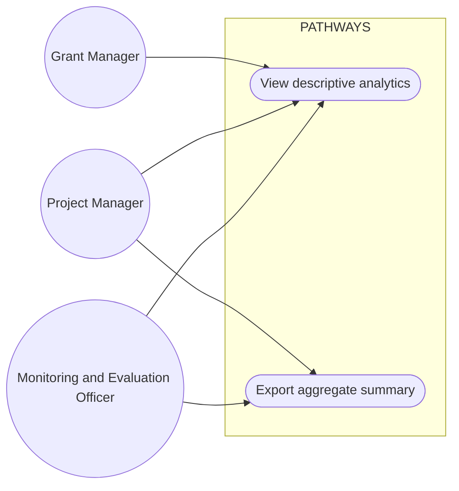
```mermaid
flowchart LR
  me((Monitoring and Evaluation Officer))
  pm((Project Manager))
  gm((Grant Manager))
  subgraph PATHWAYS
    uc1([View descriptive analytics])
    uc2([Export aggregate summary])
  end
  me --> uc1
  pm --> uc1
  gm --> uc1
  me --> uc2
  pm --> uc2
```

##### UC-F9-1 View descriptive analytics

| Field | Value |
|---|---|
| Actor | Monitoring and Evaluation Officer, Project Manager, Program Manager, Grant Manager, System Administrator |
| Permission | `analytics.descriptive.read` |
| Trigger | The user opens Analytics |
| Preconditions | The user holds the permission and `monitoring.read` for the project; processed data exists |
| Main flow | 1. The user opens Analytics (route `/analytics`). 2. The user selects one project, an optional period and a view. 3. The system returns the aggregate (route `/analytics/descriptive`). 4. The user reads the summary and any rule-based suggestion. |
| Alternate / exception | Insufficient data: "None yet". Survey view without `assessments.detail.read`: 403 and a restricted message, no audit row. Retrieval fault: 503. Project Officer: denied. |
| Postconditions | One `ANALYTICS_DESCRIPTIVE_VIEWED` audit row is written |
| Gates | G-F9-1, G-F9-2, G-F9-3, G-F9-4, G-F9-5, G-F9-6, G-F9-7, G-F9-8, G-F9-9 (Not met), G-F9-10 (Not met) |

##### UC-F9-2 Export aggregate summary

| Field | Value |
|---|---|
| Actor | Monitoring and Evaluation Officer, Project Manager, Program Manager, Grant Manager, System Administrator |
| Permission | `analytics.export` |
| Trigger | An API client or staff member requests the aggregate export |
| Preconditions | The user holds `analytics.export` and `analytics.descriptive.read` for the same project |
| Main flow | 1. The caller requests the export (route `/analytics/descriptive/export`). 2. The system applies the same role, period and suppression rules as the view. 3. The system returns the aggregate rows. |
| Alternate / exception | Permission denied or survey restriction: 403 before any query. Retrieval fault: 503. The interface button is hidden. |
| Postconditions | One `ANALYTICS_DESCRIPTIVE_EXPORTED` audit row records contract version, view and row count |
| Gates | G-F9-4, G-F9-6, G-F9-7 |

#### State Machines

Not applicable: analytics views are read models with no lifecycle.

### PRD-F10 Rule-Based Alerts

**Purpose:** Evaluate predefined, versioned rules against trusted metrics and raise one explainable alert per condition episode for human review. (R7; objectives 1.7, 2.4)
**Why it helps:** Removes information that is not ready for action: monitoring staff see flagged conditions with the rule and evidence that produced them instead of scanning raw data. (P7; Monitoring and Evaluation Officer, Project Manager, Program Manager)
**Bounds (in):**
- Predefined rule families, metrics, operators and thresholds stored as data, with draft, activate and archive lifecycle and versioning.
- One alert per condition episode with versioned evidence, severity and the plain-language if-then rule.
- Human review, outcome, resolve and dismiss actions, with a required note where the action needs one.
- Automatic resolution when the condition clears, and an unavailable result when a metric cannot be computed.
- In-application notifications list and read marking.
**Bounds (out):**
- Free-form rules, raw SQL or code in rules: rules are predefined data only (Scope and Limitations / rfc-pathways-rule-alerts-decision-support)
- Autonomous action on an alert: a human decision is always required (Scope and Limitations)
- Budget, Beneficiary and survey metrics: unavailable in the admitted catalog (cr-pathways-f10-f11-runtime-authority)
- Machine-learning or predictive alerts: out of scope (Scope and Limitations)
- Email, SMS or named-recipient notifications: only in-application notifications exist (Scope and Limitations)
**Lock:** Locked. Adding a gate or widening a bound requires an approved `cr-pathways-*`; anything outside these bounds is out of scope by default. System-wide bounds: section 6.1.

#### Gate Criteria

| Gate | Condition | Status | QAD |
|---|---|---|---|
| G-F10-1 | A rule that holds for an episode raises exactly one alert carrying versioned evidence | Partly met | QAD-T09 |
| G-F10-2 | An unavailable metric is recorded as not evaluated and never raises a misleading alert | Met | QAD-T24 |
| G-F10-3 | A rule containing raw SQL or code is rejected | Met | QAD-A08 |
| G-F10-4 | Alert status follows the lifecycle state machine and terminal alerts accept no further disposition | Met | QAD-T65 |
| G-F10-5 | Only holders of the alert permissions read, review or record an outcome, scoped to their organization and project | Partly met | QAD-T66 |
| G-F10-6 | Budget, Beneficiary and survey rule metrics evaluate and raise alerts | Not met | QAD-T67 |
| G-F10-7 | Background evaluation runs on a schedule in the hosted environment | Not met | QAD-T68 |

#### Use Cases

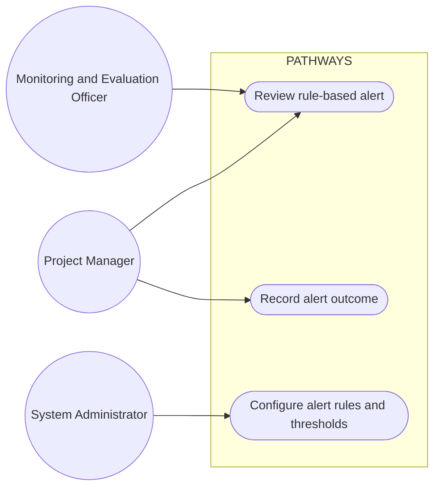
```mermaid
flowchart LR
  me((Monitoring and Evaluation Officer))
  pm((Project Manager))
  admin((System Administrator))
  subgraph PATHWAYS
    uc1([Review rule-based alert])
    uc2([Record alert outcome])
    uc3([Configure alert rules and thresholds])
  end
  me --> uc1
  pm --> uc1
  pm --> uc2
  admin --> uc3
```

##### UC-F10-1 Review rule-based alert

| Field | Value |
|---|---|
| Actor | Monitoring and Evaluation Officer, Project Manager, Program Manager, Grant Manager |
| Permission | `alerts.read`, `alerts.review` |
| Trigger | User opens the alerts list or an alert notification |
| Preconditions | Authenticated; an active rule has raised an alert in the user's scope |
| Main flow | 1. User opens the alerts page (route `/alerts`). 2. System lists alerts with severity, affected project and the if-then rule. 3. User opens an alert and reads the evidence (route `/alerts/:id`). 4. User marks it reviewed (route `/alerts/:id/review`). |
| Alternate / exception | Permission denied: no alert controls shown; no open alerts: empty state; condition cleared: alert becomes Auto-resolved |
| Postconditions | Status moves New to Reviewed; review recorded in the audit log |
| Gates | G-F10-1, G-F10-2, G-F10-4, G-F10-5, G-F10-6, G-F10-7 |

##### UC-F10-2 Record alert outcome

| Field | Value |
|---|---|
| Actor | Project Manager, Program Manager |
| Permission | `alerts.outcome.record` |
| Trigger | User decides how to respond to a reviewed alert |
| Preconditions | Alert is not terminal; user holds the outcome permission |
| Main flow | 1. User opens the alert (route `/alerts`), selects Accept, Partially accept, Decline or Escalate and enters a note. Decline and Escalate record the outcome and leave the alert status unchanged. 2. System previews the effect (route `/alerts/:id/outcome-preview`). 3. User confirms (route `/alerts/:id/outcomes`). |
| Alternate / exception | Missing note: rejected; terminal alert: rejected; permission denied: read-only view |
| Postconditions | Accept or Partially accept moves the alert to Actioned; outcome, note, actor and time recorded; audit event written |
| Gates | G-F10-4, G-F10-5 |

##### UC-F10-3 Configure alert rules and thresholds

| Field | Value |
|---|---|
| Actor | System Administrator |
| Permission | `rules.create`, `rules.update`, `rules.activate` |
| Trigger | Administrator changes a threshold or rule |
| Preconditions | Authenticated; rule catalog available |
| Main flow | 1. Administrator opens rule settings (route `/settings/rules`). 2. Administrator drafts a rule version (route `/rules/:id/drafts`). 3. System validates it with a dry run (route `/rules/dry-run`). 4. Administrator activates it (route `/rules/:id/activate`). |
| Alternate / exception | Invalid threshold or code-like content: rejected; archived rule cannot be activated |
| Postconditions | New version is active and used by later evaluations; change recorded in the audit log |
| Gates | G-F10-3, G-F10-4 |

#### State Machines

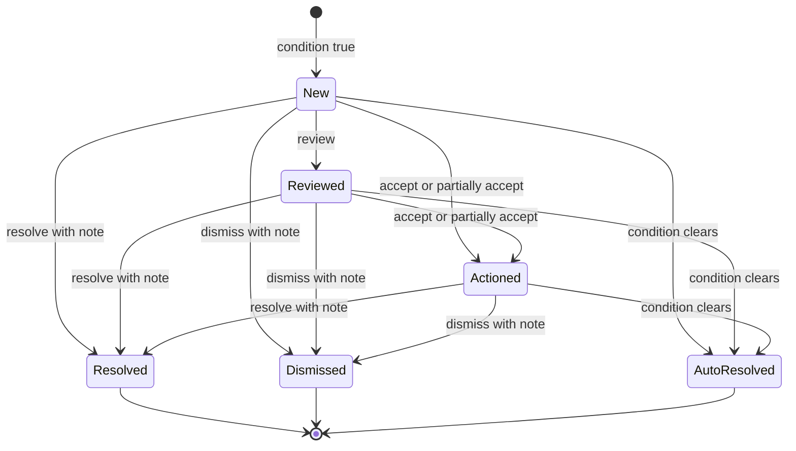
```mermaid
stateDiagram-v2
  %% Decline and Escalate outcomes leave status unchanged
  [*] --> New: condition true
  New --> Reviewed: review
  New --> Actioned: accept or partially accept
  Reviewed --> Actioned: accept or partially accept
  New --> Resolved: resolve with note
  Reviewed --> Resolved: resolve with note
  Actioned --> Resolved: resolve with note
  New --> Dismissed: dismiss with note
  Reviewed --> Dismissed: dismiss with note
  Actioned --> Dismissed: dismiss with note
  New --> AutoResolved: condition clears
  Reviewed --> AutoResolved: condition clears
  Actioned --> AutoResolved: condition clears
  Resolved --> [*]
  Dismissed --> [*]
  AutoResolved --> [*]
```

### PRD-F11 Rule-Based Decision Support and Recommendations

**Purpose:** Show predefined recommendation prompts linked to triggered rules so authorized managers can accept, decline or escalate them with a recorded note. (R7; objectives 1.7, 2.4)
**Why it helps:** Turns a flagged condition into a suggested next step, so managers decide from explained evidence instead of interpreting raw figures. (P7; Project Manager, Program Manager)
**Bounds (in):**
- Predefined recommendation text attached to rules at configuration time and retrieved, not generated, when an alert fires.
- Recommendation list and detail with the linked alert and supporting evidence.
- Human review and outcome (Accept, Partially accept, Decline, Escalate) with a required note.
- Status follows the recommendation state machine; the linked alert is updated with the decision.
**Bounds (out):**
- Generated or predictive recommendations: prompts are predefined only (Scope and Limitations)
- Automatic execution of a recommendation: a human decision is always required (Scope and Limitations)
- Recommendations on budget, Beneficiary or survey conditions: their metrics are unavailable (cr-pathways-f10-f11-runtime-authority)
- Named-individual notification of decisions: only in-application notifications exist (Scope and Limitations)
**Lock:** Locked. Adding a gate or widening a bound requires an approved `cr-pathways-*`; anything outside these bounds is out of scope by default. System-wide bounds: section 6.1.

#### Gate Criteria

| Gate | Condition | Status | QAD |
|---|---|---|---|
| G-F11-1 | An authorized user reviews a predefined recommendation linked to its alert and evidence | Partly met | QAD-T10 |
| G-F11-2 | An outcome requires a note and records actor, time and decision | Met | QAD-T69 |
| G-F11-3 | A user without the outcome permission sees the recommendation read-only | Met | QAD-T70 |
| G-F11-4 | A recommendation is retrieved from configuration and never generated at runtime | Met | QAD-A08 |
| G-F11-5 | A recommendation is marked Auto-resolved when its linked alert clears | Not met | QAD-T71 |

#### Use Cases

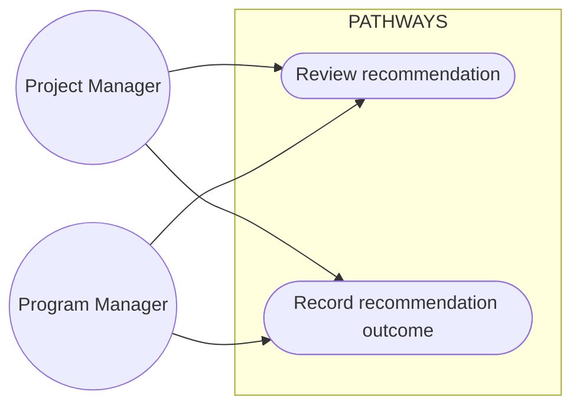
```mermaid
flowchart LR
  pm((Project Manager))
  prog((Program Manager))
  subgraph PATHWAYS
    uc1([Review recommendation])
    uc2([Record recommendation outcome])
  end
  pm --> uc1
  prog --> uc1
  pm --> uc2
  prog --> uc2
```

##### UC-F11-1 Review recommendation

| Field | Value |
|---|---|
| Actor | Monitoring and Evaluation Officer, Project Manager, Program Manager, Grant Manager |
| Permission | `recommendations.read`, `recommendations.review` |
| Trigger | User opens the recommendations list |
| Preconditions | Authenticated; a triggered alert has a linked recommendation in the user's scope |
| Main flow | 1. User opens recommendations (route `/recommendations`). 2. User opens one to see the suggested action, linked alert and evidence (route `/recommendations/[recommendationId]`). 3. User marks it reviewed (route `/recommendations/:id/review`). |
| Alternate / exception | Permission denied: no controls; no recommendations: empty state |
| Postconditions | Status moves New to Reviewed; review recorded in the audit log |
| Gates | G-F11-1, G-F11-3, G-F11-4, G-F11-5 |

##### UC-F11-2 Record recommendation outcome

| Field | Value |
|---|---|
| Actor | Project Manager, Program Manager |
| Permission | `recommendations.outcome.record` |
| Trigger | User decides on a reviewed recommendation |
| Preconditions | Recommendation is open; user holds the outcome permission |
| Main flow | 1. User opens the recommendation (route `/recommendations`), selects an outcome and enters a note. 2. System previews the effect (route `/recommendations/:id/outcome-preview`). 3. User confirms (route `/recommendations/:id/outcomes`). |
| Alternate / exception | Missing note: rejected; permission denied: read-only view |
| Postconditions | Decision, actor, note and time recorded; linked alert updated; audit event written |
| Gates | G-F11-2, G-F11-3 |

#### State Machines

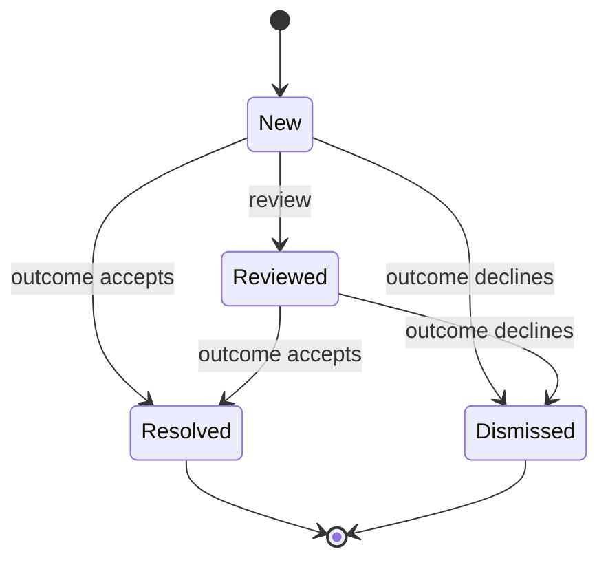
```mermaid
stateDiagram-v2
  %% Decline and Escalate record an outcome and leave status unchanged
  [*] --> New
  New --> Reviewed: review
  New --> Resolved: outcome accepts
  Reviewed --> Resolved: outcome accepts
  New --> Dismissed: outcome declines
  Reviewed --> Dismissed: outcome declines
  Resolved --> [*]
  Dismissed --> [*]
```

### PRD-F12 Reporting and Data Visualization

**Purpose:** Let authorized users preview, generate and export scoped monitoring reports and view descriptive visual outputs from trusted data. (R3; objective 1.6)
**Why it helps:** Replaces manual assembly of monitoring outputs with reports and charts built from the same trusted records, so figures match across views. (P3; Monitoring and Evaluation Officer, Project Manager, Program Manager, Grant Manager)
**Bounds (in):**
- Project summary, indicator summary, Beneficiary summary, survey results, evaluation and monitoring report types scoped by project and period.
- Report preview, generation, stored artifact and export as CSV, XLS, XLSX or PDF.
- Descriptive survey and timeline views with CSV export, governed by the aggregate rules of PRD-F9.
- Role scope and small-group suppression applied to every output.
**Bounds (out):**
- Hosted report delivery: hosted application deferred (Scope and Limitations / rfc-pathways-aws-hosting-migration)
- Report exports containing Beneficiary identity for aggregate-only roles: denied by policy (rfc-pathways-saddd-privacy)
- Scheduled or emailed reports: not built (Scope and Limitations)
- Maps and free-form chart building: not built (Scope and Limitations)
**Lock:** Locked. Adding a gate or widening a bound requires an approved `cr-pathways-*`; anything outside these bounds is out of scope by default. System-wide bounds: section 6.1.

#### Gate Criteria

| Gate | Condition | Status | QAD |
|---|---|---|---|
| G-F12-1 | Report and visualization output respects role scope and suppression | Partly met | QAD-T13 |
| G-F12-2 | A failed report or export leaves source data intact | Met | QAD-T26 |
| G-F12-3 | Export writes an audit event without report content | Met | QAD-T72 |
| G-F12-4 | Every report type exports as CSV, XLS, XLSX and PDF | Not met | QAD-T73 |
| G-F12-5 | Descriptive views refuse callers without `analytics.descriptive.read` and exports refuse callers without `analytics.export` | Met | QAD-A18 |

#### Use Cases

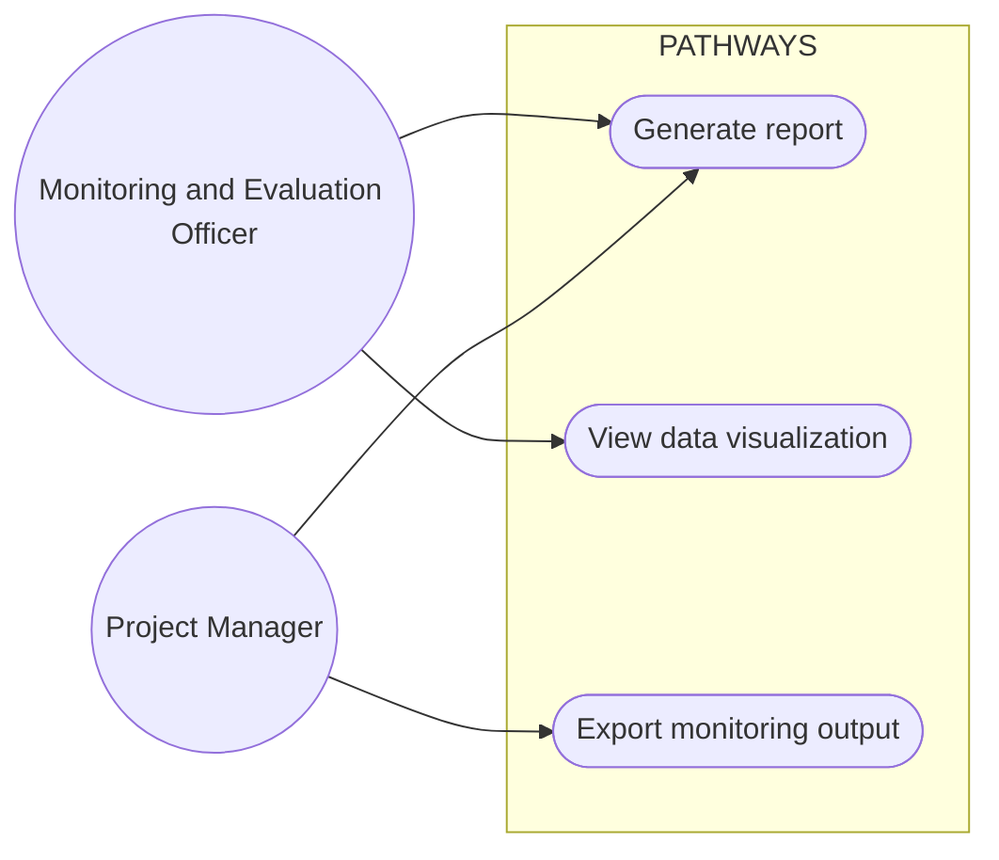
```mermaid
flowchart LR
  me((Monitoring and Evaluation Officer))
  pm((Project Manager))
  subgraph PATHWAYS
    uc1([Generate report])
    uc2([View data visualization])
    uc3([Export monitoring output])
  end
  me --> uc1
  pm --> uc1
  me --> uc2
  pm --> uc3
```

##### UC-F12-1 Generate report

| Field | Value |
|---|---|
| Actor | Monitoring and Evaluation Officer, Project Manager, Program Manager, Grant Manager |
| Permission | `reports.generate` |
| Trigger | User needs a monitoring report for a scope and period |
| Preconditions | Authenticated; project data exists in scope |
| Main flow | 1. User opens reports (route `/reports`). 2. User selects a report type and scope. 3. System previews it (route `/projects/:projectId/reports/preview`). 4. User generates it (route `/projects/:projectId/reports`). |
| Alternate / exception | Permission denied: generate control hidden; no data: empty preview message |
| Postconditions | Report artifact stored and listed; generation recorded in the audit log |
| Gates | G-F12-1, G-F12-2 |

##### UC-F12-2 View data visualization

| Field | Value |
|---|---|
| Actor | Monitoring and Evaluation Officer, Project Manager, Program Manager, Grant Manager |
| Permission | `analytics.descriptive.read` |
| Trigger | User opens the descriptive analytics view |
| Preconditions | Authenticated; trusted data processed for the scope |
| Main flow | 1. User opens analytics (route `/analytics`). 2. User selects a view and period. 3. System renders aggregates (route `/analytics/descriptive`). |
| Alternate / exception | Insufficient data: explicit missing or withheld state; fetch failure: error with retry |
| Postconditions | View rendered; the view request is audited |
| Gates | G-F12-1, G-F12-5 |

##### UC-F12-3 Export monitoring output

| Field | Value |
|---|---|
| Actor | Monitoring and Evaluation Officer, Project Manager, Program Manager, Grant Manager |
| Permission | `reports.export` |
| Trigger | User exports a generated report |
| Preconditions | A report exists; user holds the export permission |
| Main flow | 1. User picks a report and a format. 2. System builds the file (route `/projects/:projectId/reports/:reportId/export`). 3. File downloads. |
| Alternate / exception | Permission denied: 403; generation failure: error, source data unchanged |
| Postconditions | File delivered; export audit event written without content |
| Gates | G-F12-2, G-F12-3, G-F12-4 |

### PRD-F13 Public Project Tracker

**Purpose:** Let internal users publish approved, non-sensitive, high-level project summaries that external stakeholders read without an account. (R8; objective 1.8)
**Why it helps:** Gives donors, sponsors and partners controlled visibility of approved progress without exposing internal records. (P8; Program Manager, Grant Manager, external stakeholders)
**Bounds (in):**
- Submit, approve, publish and withdraw of a frozen project summary, with a distinct approving actor.
- Public list and project page showing only the approved allowlisted fields.
- Immediate effect of withdrawal and uncached public responses.
**Bounds (out):**
- Beneficiary-level data, counts, assessments, budgets, indicators and private media: never published unless separately approved (cr-pathways-self-managed-rollout-scenarios)
- External stakeholder accounts or comments: stakeholders are anonymous viewers (Scope and Limitations)
- Stakeholder access analytics: not built (Scope and Limitations)
- Hosted public portal: hosted application deferred (rfc-pathways-aws-hosting-migration)
**Lock:** Locked. Adding a gate or widening a bound requires an approved `cr-pathways-*`; anything outside these bounds is out of scope by default. System-wide bounds: section 6.1.

#### Gate Criteria

| Gate | Condition | Status | QAD |
|---|---|---|---|
| G-F13-1 | The public surface exposes only approved data and no private media | Met | QAD-T11 |
| G-F13-2 | A public request for private media is denied | Met | QAD-A09 |
| G-F13-3 | Publication requires a distinct approver and follows the publication state machine | Met | QAD-T74 |
| G-F13-4 | A withdrawn project disappears from public reads immediately | Met | QAD-T75 |
| G-F13-5 | The public pages are verified in a hosted environment | Not met | QAD-T76 |

#### Use Cases

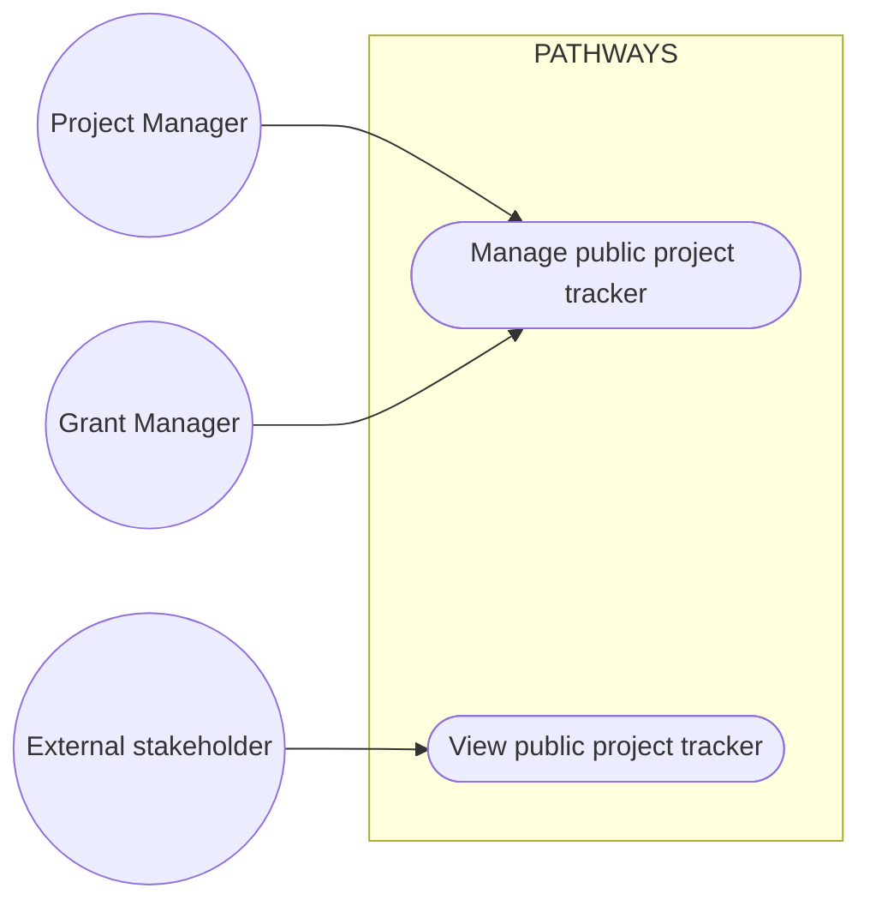
```mermaid
flowchart LR
  pm((Project Manager))
  gm((Grant Manager))
  ext((External stakeholder))
  subgraph PATHWAYS
    uc1([Manage public project tracker])
    uc2([View public project tracker])
  end
  pm --> uc1
  gm --> uc1
  ext --> uc2
```

##### UC-F13-1 Manage public project tracker

| Field | Value |
|---|---|
| Actor | System Administrator, Program Manager, Project Manager, Grant Manager |
| Permission | `public.preview`, `public.approve`, `public.publish` |
| Trigger | User prepares, approves, publishes or withdraws a project summary |
| Preconditions | Authenticated; project information reviewed for public disclosure |
| Main flow | 1. User previews the publication state (route `/projects/:projectId/publication`). 2. User submits the summary (route `/projects/:projectId/publication/submit`). 3. A different user approves it (route `/projects/:projectId/publication/approve`). 4. User publishes it (route `/projects/:projectId/publication/publish`). |
| Alternate / exception | Not approved: publish refused; permission denied: action refused; withdraw (route `/projects/:projectId/publication/withdraw`) removes it from public reads at once and returns it to review as a new revision |
| Postconditions | Published revision visible publicly; each step recorded in the audit log |
| Gates | G-F13-3, G-F13-4 |

##### UC-F13-2 View public project tracker

| Field | Value |
|---|---|
| Actor | External stakeholder, any internal user |
| Permission | No permission (public route) |
| Trigger | Stakeholder opens the public portal |
| Preconditions | At least one project is published |
| Main flow | 1. Stakeholder opens the public projects page (route `/public/projects`). 2. Stakeholder selects a project (route `/public/projects/[projectId]`). 3. System shows the approved summary only. |
| Alternate / exception | No published projects: "No current projects" message; unpublished or unknown project: not found |
| Postconditions | Approved fields shown; no internal data exposed |
| Gates | G-F13-1, G-F13-2, G-F13-5 |

#### State Machines

```mermaid
stateDiagram-v2
  [*] --> Private: no publication row
  Private --> ForReview: submit
  ForReview --> ForReview: resubmit new revision
  ForReview --> Approved: approve
  Approved --> Published: publish
  Approved --> ForReview: resubmit new revision
  Published --> ForReview: withdraw as new revision
```

## 5. App Flow & UX Intent

### 5.1 Screen Inventory

One row per web route in `apps/web/src/app`. Roles come from `apps/web/src/lib/rbac/route-access.ts`, resolved against the atomic grants in `apps/api/src/modules/auth/authorization-policy.ts`. The route decision is a UI ceiling; the API remains the authority. Alias routes reuse the verified route named in their Screen cell. Program Manager and Grant Manager never reach beneficiary-scoped routes.

| Route | Screen | Roles | Feature |
|---|---|---|---|
| `/auth/access-unavailable` | Access unavailable | Signed-in staff | PRD-F1 |
| `/auth/callback` | Sign-in callback | Signed-in staff | PRD-F1 |
| `/auth/mfa` | MFA enrollment and verification | Signed-in staff | PRD-F1 |
| `/login` | Sign in | Public | PRD-F1 |
| `/workspace` | Workspace redirect to dashboard | All six roles | PRD-F1 |
| `/alerts` | Alerts | All six roles | PRD-F10 |
| `/alerts/repository` | Alerts Repository | System Administrator | PRD-F10 |
| `/analytics` | Analytics | All six roles | PRD-F8, PRD-F9 |
| `/beneficiaries/:beneficiaryId/edit` | Edit beneficiary profile | Project Manager, Monitoring and Evaluation Officer, Project Officer | PRD-F3 |
| `/beneficiaries/:beneficiaryId` | Beneficiary profile and journey | Project Manager, Monitoring and Evaluation Officer, Project Officer | PRD-F3, PRD-F4 |
| `/beneficiaries/duplicates` | Duplicate review (alias of Beneficiaries) | Project Manager, Monitoring and Evaluation Officer, Project Officer | PRD-F3 |
| `/beneficiaries/evaluation-center` | Evaluation center (alias of Beneficiaries) | Project Manager, Monitoring and Evaluation Officer, Project Officer | PRD-F4 |
| `/beneficiaries/new` | Beneficiary registration | Project Manager, Monitoring and Evaluation Officer, Project Officer | PRD-F3 |
| `/beneficiaries` | Beneficiaries | Project Manager, Monitoring and Evaluation Officer, Project Officer | PRD-F3 |
| `/collection/entry` | Encode project data | Monitoring and Evaluation Officer, Project Officer | PRD-F5 |
| `/collection/forms/new` | Form setup | System Administrator, Monitoring and Evaluation Officer | PRD-F5 |
| `/collection/forms` | Forms | System Administrator, Monitoring and Evaluation Officer | PRD-F5 |
| `/collection/import` | Metadata-Driven Data Integration | System Administrator, Monitoring and Evaluation Officer, Project Officer | PRD-F6 |
| `/collection` | Collection | System Administrator, Monitoring and Evaluation Officer, Project Officer | PRD-F5 |
| `/collection/projects/:projectId/forms/:formId/entries/new` | Direct data entry | Monitoring and Evaluation Officer, Project Officer | PRD-F5 |
| `/collection/projects/:projectId/forms/:formId` | Form definition | System Administrator, Monitoring and Evaluation Officer, Project Officer | PRD-F5 |
| `/dashboard` | Dashboard | All six roles | PRD-F1 |
| `/imports` | Imports (alias of Data Integration) | System Administrator, Monitoring and Evaluation Officer, Project Officer | PRD-F6 |
| `/indicators` | Indicators (alias of Projects) | All six roles | PRD-F7 |
| `/participants` | Participants (alias of Beneficiaries) | Project Manager, Monitoring and Evaluation Officer, Project Officer | PRD-F4 |
| `/projects/:projectId/activities/:activityId` | Activity | System Administrator, Project Manager, Monitoring and Evaluation Officer, Project Officer | PRD-F2 |
| `/projects/:projectId/activities` | Activities | System Administrator, Project Manager, Monitoring and Evaluation Officer, Project Officer | PRD-F2 |
| `/projects/:projectId/budget` | Budget | System Administrator, Program Manager, Grant Manager, Project Manager | PRD-F2 |
| `/projects/:projectId/edit` | Edit project | Project Manager | PRD-F2 |
| `/projects/:projectId/evidence` | Evidence review | All six roles | PRD-F2 |
| `/projects/:projectId/indicators` | Target indicators | System Administrator, Project Manager, Monitoring and Evaluation Officer | PRD-F7 |
| `/projects/:projectId/journey-stages` | Journey stages | System Administrator, Project Manager, Monitoring and Evaluation Officer | PRD-F4 |
| `/projects/:projectId/monitor-evaluate` | Monitor & Evaluate | System Administrator, Program Manager, Grant Manager, Project Manager, Monitoring and Evaluation Officer | PRD-F7 |
| `/projects/:projectId` | Project detail | All six roles | PRD-F2 |
| `/projects/new` | Project setup | Project Manager | PRD-F2 |
| `/projects` | Projects | All six roles | PRD-F2 |
| `/recommendations/:recommendationId` | Recommendation detail | All six roles | PRD-F11 |
| `/recommendations` | Recommendations | All six roles | PRD-F11 |
| `/reports/beneficiary-summary` | Beneficiary Summary | Project Manager, Monitoring and Evaluation Officer, Project Officer | PRD-F12 |
| `/reports/indicator-summary` | Indicator Summary | All six roles | PRD-F12 |
| `/reports` | Reports | All six roles | PRD-F12 |
| `/reports/preview` | Report preview | All six roles | PRD-F12 |
| `/reports/project-summary` | Project Summary | All six roles | PRD-F12 |
| `/reports/survey-results` | Survey/Form Results | All six roles | PRD-F12 |
| `/settings/audit` | Audit Log | System Administrator, Program Manager, Project Manager | PRD-F1 |
| `/settings/backups` | Backup & Recovery | System Administrator | PRD-F1 |
| `/settings/labels` | Edit Labels | None granted | PRD-F1 |
| `/settings` | Settings | All six roles | PRD-F1 |
| `/settings/profile` | My Profile | All six roles | PRD-F1 |
| `/settings/rules` | Alerts Repository (settings path) | System Administrator | PRD-F10 |
| `/settings/users` | User Management | System Administrator, Program Manager, Project Manager | PRD-F1 |
| `/transparency/:projectId/preview` | Public dashboard preview | System Administrator, Program Manager, Grant Manager, Project Manager | PRD-F13 |
| `/transparency` | Public Tracker queue | System Administrator, Program Manager, Grant Manager, Project Manager | PRD-F13 |
| `/unauthorized` | Unauthorized | All six roles | PRD-F1 |
| `/` | Public dashboard | Public | PRD-F13 |
| `/public/projects/:projectId` | Public project page | Public | PRD-F13 |
| `/public/projects` | Public project list | Public | PRD-F13 |
| `/auth/recovery/error` | Recovery error | Public | PRD-F1 |
| `/auth/update-password` | Update password | Recovery session | PRD-F1 |
| `/staff/forgot-password` | Forgot password | Public | PRD-F1 |
| `/staff/login` | Staff sign in | Public | PRD-F1 |
| `/staff/recover` | Recovery link handler | Public | PRD-F1 |
| `/staff/reset-password` | Reset password | Public | PRD-F1 |

### 5.2 Navigation Model & Information Architecture

- Staff shell: a left navigation with three groups, Workspace (Dashboard, Projects, Beneficiaries, Collection), Decision Support (Analytics, Alerts, Reports, Alerts Repository) and Administration (User Management, Edit Labels, Public Tracker, Audit Log, Backup & Recovery), defined in `apps/web/src/constants/navigation.ts`.
- Items are filtered by role; a route a role cannot open is not offered, and a direct visit lands on Unauthorized.
- Project-scoped screens sit under `/projects/:projectId/` (activities, budget, evidence, indicators, journey stages, monitor and evaluate, public dashboard controls).
- Public surfaces (`/`, `/public/projects`, `/public/projects/:projectId`) use a separate public navigation with Dashboard and Projects only and show approved public information only.
- Sign-in, recovery and MFA screens use their own frames and carry no staff navigation.
- Layout, spacing and component rules are in [dsd-pathways](dsd-pathways.md) section 3.

### 5.3 App Flow

Each diagram replaces one manuscript activity diagram (Figures 15 to 24) and shows current behavior. Swimlanes are roles; Public and System lanes are used where no staff role acts.

#### 5.3.1 Password Recovery

```mermaid
flowchart TD
  subgraph ST[Staff User]
    A1[Open Forgot password] --> A2[Enter approved email]
    A5[Open recovery link] --> A6[Enter new password]
  end
  subgraph SY[System]
    B1[Show the same neutral message for any email] --> B2[Send recovery message if account is approved]
    B3[Validate recovery session] -->|valid| B4[Update password]
    B3 -->|invalid| B5[Show Recovery error]
    B4 --> B6[Return to Sign in]
  end
  A2 --> B1
  B2 --> A5
  A5 --> B3
  A6 --> B4
```

#### 5.3.2 Login, MFA and Role-Based Access

```mermaid
flowchart TD
  subgraph ST[Any Staff Role]
    A1[Open Staff sign in] --> A2[Enter credentials]
    A4[Enroll or enter authenticator code]
    A7[Use role-filtered navigation]
  end
  subgraph SY[System]
    B1{Credentials valid} -->|no| B2[Show generic failure]
    B1 -->|yes| B3{MFA verified}
    B3 -->|no| B4[Route to MFA]
    B3 -->|yes| B5{Account authorized for an organization and role}
    B5 -->|no| B6[Show Access unavailable]
    B5 -->|yes| B7[Open Dashboard for the assigned role]
    B8[Check route permission and project assignment] -->|denied| B9[Show Unauthorized]
    B8 -->|allowed| B10[Render screen]
  end
  A2 --> B1
  B4 --> A4
  A4 --> B3
  B7 --> A7
  A7 --> B8
```

#### 5.3.3 Project Setup

```mermaid
flowchart TD
  subgraph PM[Project Manager]
    A1[Open Project setup] --> A2[Enter profile, target beneficiaries and opening budget]
    A4[Add activities and milestones]
  end
  subgraph SY[System]
    B1[Validate and create project] --> B2[Self-assign creator to the project]
    B2 --> B3[Write audit event]
  end
  A2 --> B1
  B3 --> A4
```

Later assignment changes are a separate user-management action under `assignments.manage`, not part of project setup.

#### 5.3.4 Monitoring Structure Configuration

```mermaid
flowchart TD
  subgraph MEO[Monitoring and Evaluation Officer]
    A1[Open Target indicators] --> A2[Define indicators and targets]
    A4[Configure journey stages]
    A6[Review the structure in Monitor and Evaluate]
  end
  subgraph PM[Project Manager]
    P1[Review and adjust structure for assigned project]
  end
  subgraph SY[System]
    B1[Validate and store indicator definitions] --> B2[Write audit event]
    B3[Store journey stage configuration]
  end
  A2 --> B1
  B2 --> A4
  A4 --> B3
  B3 --> A6
  A6 --> P1
```

#### 5.3.5 Digital Form and Input Structure

```mermaid
flowchart TD
  subgraph MEO[Monitoring and Evaluation Officer]
    A1[Open Form setup] --> A2[Define fields and metadata]
    A4[Review preview] --> A5[Publish form]
  end
  subgraph SY[System]
    B1[Save draft form definition] --> B2[Generate form preview]
    B3[Create immutable form version] --> B4[Write audit event]
  end
  subgraph PO[Project Officer]
    C1[Open published form in Direct data entry]
  end
  A2 --> B1
  B2 --> A4
  A5 --> B3
  B4 --> C1
```

#### 5.3.6 Direct Entry and Field Dataset Import

```mermaid
flowchart TD
  subgraph PO[Project Officer]
    A1[Choose direct entry or upload field file] --> A2[Submit entry or file]
    A5[Correct flagged rows]
  end
  subgraph SY[System]
    B1{Validate against form or mapping} -->|errors| B2[Flag rows and block commit]
    B1 -->|valid| B3[Stage records]
    B3 --> B4[Write audit event]
  end
  subgraph MEO[Monitoring and Evaluation Officer]
    C1[Review mapping and staged rows] --> C2[Commit verified records]
  end
  A2 --> B1
  B2 --> A5
  A5 --> B1
  B4 --> C1
  C2 --> D1[Records available for centralization]
```

#### 5.3.7 Records Centralization and Beneficiary Update

```mermaid
flowchart TD
  subgraph PO[Project Officer]
    A1[Register or open beneficiary] --> A2[Update profile or record participation]
  end
  subgraph MEO[Monitoring and Evaluation Officer]
    C1[Review duplicates and verify records]
  end
  subgraph SY[System]
    B1{Existing profile matches} -->|yes| B2[Flag for duplicate review]
    B1 -->|no| B3[Create centralized profile]
    B4[Append journey event and audit event]
  end
  A1 --> B1
  B2 --> C1
  C1 --> B3
  B3 --> A2
  A2 --> B4
```

#### 5.3.8 Monitoring Outputs, Alerts, Analytics and Decision Support

```mermaid
flowchart TD
  subgraph SY[System]
    B1[Aggregate verified monitoring records] --> B2[Evaluate alert rules against indicators]
    B2 --> B3[Raise alert for human review]
    B3 --> B4[Produce rule-based recommendation]
    B5[Record review decision and audit event]
  end
  subgraph MEO[Monitoring and Evaluation Officer]
    C1[Open Analytics and Alerts] --> C2[Review alert and recommendation]
  end
  subgraph PM[Project Manager]
    D1[Decide on follow-up action]
  end
  subgraph PGM[Program Manager and Grant Manager]
    E1[View aggregate dashboards only]
  end
  B1 --> C1
  B1 --> E1
  B3 --> C2
  B4 --> C2
  C2 --> B5
  B5 --> D1
```

#### 5.3.9 Report and Visualization Output

```mermaid
flowchart TD
  subgraph RO[Report Roles]
    A1[Open Reports] --> A2[Choose report kind and project]
    A4[Review preview] --> A5[Generate and export]
  end
  subgraph SY[System]
    B1{Role may view this report kind} -->|no| B2[Show Unauthorized]
    B1 -->|yes| B3[Build preview from verified records]
    B4[Create report artifact and audit event]
  end
  A2 --> B1
  B3 --> A4
  A5 --> B4
```

#### 5.3.10 Public Transparency Viewing

```mermaid
flowchart TD
  subgraph PM[Project Manager or Program Manager]
    A1[Open Public Tracker queue] --> A2[Preview public dashboard]
    A3[Publish approved content]
  end
  subgraph SY[System]
    B1[Build preview from approved fields only] --> B2[Store publication and audit event]
  end
  subgraph PU[Public Viewer]
    C1[Open public dashboard] --> C2[Browse public project list] --> C3[Open public project page]
  end
  A2 --> B1
  B1 --> A3
  A3 --> B2
  B2 --> C1
```

### 5.4 Onboarding Flow

Staff accounts are provisioned, not self-registered. There is no public sign-up.

1. A System Administrator, Program Manager or Project Manager opens User Management and authorizes an existing identity with a role through `POST /users/authorize-existing`, limited by the role hierarchy of the acting user.
2. The authorization writes `USER_AUTHORIZED` (or `USER_AUTHORIZATION_UPDATED`) to the audit log.
3. The staff member signs in at Staff sign in; with no verified authenticator, the system routes to MFA.
4. On the MFA screen the user starts TOTP enrollment with an explicit button, scans the code and confirms a six-digit code.
5. After verification the API re-checks the verified assurance level, then the user lands on the Dashboard for the assigned role.

An account with no authorization sees Access unavailable. Beneficiaries are never onboarded as users.

### 5.5 UX Constraints

Visual, component, accessibility and layout constraints are owned by [dsd-pathways](dsd-pathways.md) and are not repeated here. Product-level rules:

- Role-filtered navigation only; hiding is never the only control, since the API enforces every permission.
- Aggregate-only roles see no beneficiary-level screens.
- Decision-support outputs are shown as rule-based and need human review before any action.
- Public screens show approved public information only.

### 5.6 Instrumentation & Event Taxonomy

The product has no product analytics or usage tracking. Instrumentation is the audit log (`/settings/audit`), written by `apps/api/src/modules/audit` with one action code per recorded event.

| Domain | Audit action codes (implemented examples) |
|---|---|
| Users and access | `USER_AUTHORIZED`, `USER_AUTHORIZATION_UPDATED` |
| Projects and activities | `PROJECT_CREATED`, `PROJECT_UPDATED`, `ACTIVITY_CREATED`, `ACTIVITY_UPDATED`, `MILESTONE_CREATED`, `BUDGET_CREATED` |
| Beneficiaries and journeys | `BENEFICIARY_PROFILE_UPDATED`, `BENEFICIARY_ARCHIVED`, `BENEFICIARY_STEP_UP_ACCEPTED`, `PARTICIPATION_RECORDED`, `JOURNEY_CONFIGURATION_SAVED` |
| Forms | `FORM_DRAFT_CREATED`, `FORM_PUBLISHED`, `FORM_VERSION_CREATED`, `FORM_SUBMISSION_VALIDATED` |
| Imports | `IMPORT_UPLOAD_STAGED`, `IMPORT_VALIDATED`, `IMPORT_MAPPING_REVISED`, `IMPORT_ROW_PROMOTED` |
| Analytics and reports | `ANALYTICS_DESCRIPTIVE_VIEWED`, `ANALYTICS_DESCRIPTIVE_EXPORTED`, `REPORT_GENERATED`, `REPORT_EXPORTED` |

The list is not exhaustive; the code in the audit module is the source. Events carry actor, role, action and target, and never personal data in their labels.

### 5.7 Non-Functional Requirements

Sources are the manuscript Table 5 non-functional rows and the Quality Plan (Chapter 3, ISO/IEC 25010). A Measure holds a number only where a source gives one. Delivery status for each NFR is in the section 3.3 matrix.

| NFR | Requirement | ISO/IEC 25010 | Measure | Source |
|---|---|---|---|---|
| NFR-1 | Maintain secure role-based access control and organization workspace isolation | Security | Threshold not established | Table 5, non-functional row 1 |
| NFR-2 | Protect sensitive beneficiary and project information from unauthorized access | Security | Threshold not established | Table 5, non-functional row 2 |
| NFR-3 | Provide responsive dashboard generation and monitoring operations under normal usage | Performance Efficiency | p95 under 800 ms for normal pages, imports excluded (Developer target 2026-10-01) | Table 5, non-functional row 3 |
| NFR-4 | Maintain centralized and consistent monitoring records across project workflows | Reliability | Threshold not established | Table 5, non-functional row 4 |
| NFR-5 | Support metadata-driven configuration without repeated database restructuring | Maintainability | Threshold not established | Table 5, non-functional row 5 |
| NFR-6 | Provide a user-friendly and organized monitoring interface for users with varying technical experience | Usability | Threshold not established | Table 5, non-functional row 6 |
| NFR-7 | Maintain operational reliability during project monitoring and reporting activities | Reliability | Availability 99.5% monthly (Developer target 2026-10-01) | Table 5, non-functional row 7 |
| NFR-8 | Support scalability for increasing projects, beneficiaries and organizational records | Performance Efficiency | Threshold not established | Table 5, non-functional row 8 |
| NFR-9 | Maintain accurate processing of monitoring data, dashboards and analytical summaries | Functional Suitability | Threshold not established | Table 5, non-functional row 9 |
| NFR-10 | Validate uploaded datasets and prevent invalid monitoring records from being processed | Reliability | Threshold not established | Table 5, non-functional row 10 |
| NFR-11 | Remain accessible through modern web browsers and internet-enabled devices | Portability | Windows 10 minimum, Windows 11 recommended; latest Chrome or Edge recommended | Table 5, non-functional row 11; Table 64 |
| NFR-12 | Maintain auditability and traceability of important monitoring and administrative actions | Security | Threshold not established | Table 5, non-functional row 12 |
| NFR-13 | Work alongside existing tools with practical import, export and output preparation | Compatibility | Threshold not established | Quality Plan, Table 65 |
| NFR-14 | Keep organized structures, reusable components and documentation so maintainers can find, change and test issues | Maintainability | Threshold not established | Quality Plan, Table 65 |
| NFR-15 | Handle errors and interruptions and support recovery that reduces data loss | Reliability | RPO 24 hours, RTO 5 to 8 hours (Developer target 2026-10-01) | Quality Plan, Table 65 |

## 6. Out of Scope for This Release

### 6.1 System-wide Bounds

Each bound comes from the manuscript Scope and Limitations (Chapter 1).

- PATHWAYS is limited to project information management with rule-based decision support; it is not a full project management platform, an ERP system or a replacement for all organizational systems (paragraph 3).
- It does not fully replace specialized field data collection platforms (paragraph 3).
- It does not guarantee real-time synchronization or complete API-based integration with third-party systems such as KOBO, YES!ME or PMERL (paragraph 3).
- It does not evaluate beneficiaries as individuals or decide whether a beneficiary personally learned, improved, succeeded or failed (paragraph 4).
- Beneficiary-related records are handled only as project monitoring data for project-level review (paragraph 4).
- Final interpretation of project effectiveness, beneficiary outcomes and required interventions stays with authorized organization personnel (paragraph 4).
- Analytics, decision support and recommendations use predefined parameters, rules and thresholds; there is no advanced AI, predictive machine learning or autonomous decision-making (paragraph 5).
- The system may produce alerts, review prompts and suggested actions, but final decision, validation and approval stay with the organization (paragraph 5).
- Beneficiaries cannot apply, register themselves, log in or submit personal information as public users (paragraph 6).
- The Public Project Tracker exposes only high-level approved information, never confidential beneficiary-level records, private assessment records, internal financial evidence or restricted organizational data (paragraph 6).
- Development is bounded by the time, technical scope and resource constraints of an information technology capstone project (paragraph 6).

### 6.2 Deferred Features

Hidden, deferred and gapped items are tracked in [deferred-features](deferred-features.md). Also out of scope for this release: a Project Template Library (activity and monitoring structure templates) and SSO or AWS hosting work outside separately authorized releases (`docs/rfc-pathways-aws-hosting-migration.md`).

## 7. AI / Agent Feature Specifications

PATHWAYS has no AI or machine learning features. Alerts and recommendations are deterministic rules with explainable evidence and human review (PRD-F10, PRD-F11). AI coding agents used to build the system are development tooling, not product features; their rules are in [sad-pathways](sad-pathways.md) and [build-pathways](build-pathways.md).

## 8. Dependencies & Assumptions

| Dependency | Use |
|---|---|
| Supabase (Postgres, Auth, Storage) | Database with row-level policies, sign-in and private file storage |
| NestJS 10 API with Prisma 6.19.2 | Server-side authorization, business logic and migrations |
| Next.js ^15.2.2 web application | Role-aware workspace |
| KOBO, YES!ME, PMERL | External platforms; PATHWAYS exchanges files with them and does not synchronize |

Assumptions:

- Field data are already collected digitally and arrive as CSV, XLS, XLSX or text-layer PDF files.
- Users work on Windows 11 with Chrome, Edge, Brave or Firefox.
- Internal users are assigned to projects by an administrator; beneficiaries never sign in.
- Hosting follows the current Supabase and Vercel arrangement until a separately authorized release changes it.

## 9. Implementation Plan

Current position is in [state](state.md); manuscript alignment findings are in `docs/audit-pathways-manuscript-alignment-20261001.md`.

| Feature | Status |
|---|---|
| PRD-F1 to PRD-F8 | Implemented |
| PRD-F9 | Implemented for four views; breakdowns, trends and server budget aggregate on hold |
| PRD-F10, PRD-F11 | Local API; integration verification pending |
| PRD-F12 | Local preview and artifact APIs; final verification pending |
| PRD-F13 | Local publication and approved-public APIs; final verification pending |

Core features come first; supporting features follow their dependencies. Every authorized phase reads the manifest and registered docs, implements only its authorized scope, tests, updates durable docs when an approved contract or verified fact changes, reports and stops.

## Self-Check

- [x] eight core features stable
- [x] supporting features preserved
- [x] six roles preserved
- [x] no AI overclaim
