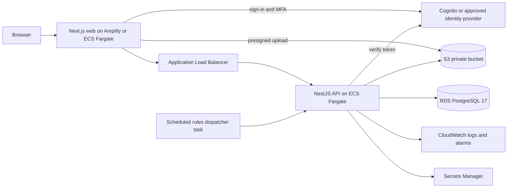

# RFC: PATHWAYS AWS Hosting Migration

**Status:** Draft
**Version:** 0.1
**Owner:** PATHWAYS capstone team
**Date:** 2026-10-01

This RFC is a strategy, not an approval. No implementation is authorized. Supabase and Vercel stay canonical until a CR approves each phase.

## 1. Context and Client Direction

The client intends to host PATHWAYS in its AWS environment. Production may run in the Plan International Pilipinas AWS account.

| Layer | Current | Client direction |
|---|---|---|
| Web | Next.js on Vercel | Next.js on AWS Amplify Hosting or ECS/Fargate |
| API | NestJS on Vercel | NestJS on ECS Fargate (Docker) |
| Database | Supabase PostgreSQL 17 | AWS RDS PostgreSQL |
| File storage | Supabase Storage | AWS S3 |
| Authentication | Supabase Auth | AWS Cognito or an organization-approved identity provider |
| Monitoring | pino stdout and Sentry | AWS CloudWatch |
| Secrets | Hosting dashboard settings | AWS Secrets Manager |

## 2. Requirements

- Multi-organization isolation is preserved: organization context and row-level security apply on every request.
- The domain model does not hard-code Plan International Pilipinas as the only organization; the name appears only in seed and bootstrap scripts (`apps/api/prisma/seed.ts`, `apps/api/prisma/developer-bootstrap.ts`).
- Known v1 constraint: one organization per login.
- Every phase keeps the release gates in `docs/ops-pathways.md` and the SAD review in `docs/sad-pathways.md`.

## 3. Current Architecture

The current deployment, trust boundaries and stack are in `docs/sdd-pathways.md` section 2.2 (Deployment View), 2.3 and 2.4; production database requirements are in section 3.3. Nothing there claims AWS readiness.

## 4. Coupling Inventory

### 4.1 Hard Couplings

| Coupling | Evidence | Change needed |
|---|---|---|
| API token verification and claims (`amr`, `aal`, `session_id`, `is_anonymous`, factors) | `apps/api/src/modules/auth/token-auth.service.ts` | Provider-neutral verifier adapter; map Cognito or provider claims to the same internal claim set |
| Session liveness reads the `auth` schema through a definer function | `apps/api/src/modules/auth/session-liveness.service.ts`, `apps/api/src/prisma/prisma.service.ts`, `apps/api/prisma/migrations/0000_pathways_baseline_through_0026/migration.sql` | App-owned session table or provider revocation check |
| `system_users.auth_user_id` references `auth.users`; baseline expects `auth.uid()` | `apps/api/prisma/migrations/0000_pathways_baseline_through_0026/migration.sql`, `apps/api/prisma/tests/security-adapter-local-bootstrap.sql` | Replace the foreign key with an opaque subject column; RLS context must not call `auth.uid()` |
| Migrations need `supabase_admin` or a true superuser; revoke lists name `anon`, `authenticated`, `service_role` | `apps/api/prisma/migrations/0031_f10_f11_rules_runtime`, `apps/api/prisma/migrations/0034_core_feature_completion` | RDS offers `rds_superuser` only; forward migrations written for RDS, applied history preserved |
| Step-up PIN fallback keyed on the provider session id; `pgcrypto` in the `extensions` schema | `apps/api/prisma/migrations/0037_step_up_pin` | Key the PIN on an app session id; create `pgcrypto` in a known schema |
| Web sign-in, TOTP, middleware assurance gate, recovery flow | `apps/web/src/middleware.ts`, `apps/web/src/features/auth/login-form.tsx`, `apps/web/src/features/auth/mfa-flow.ts`, `apps/web/src/features/auth/password-recovery.ts` | Auth client adapter; Cognito or provider hosted flows; recovery email from the provider |
| Staff provisioning through the provider admin API | `apps/api/src/modules/users/auth-directory.service.ts` | Directory adapter for Cognito admin calls or the provider API |
| Storage through supabase-js and raw storage REST with a service role; signed multipart upload | `apps/api/src/modules/storage/storage.service.ts`, `apps/api/src/modules/storage/private-inspection-reader.ts` | Storage adapter over S3 presigned URLs; web upload origin made configurable |
| Seeds and bootstrap call Auth and Storage admin APIs and `auth.*` tables | `apps/api/prisma/authorization-bootstrap-runner.ts`, `apps/api/prisma/developer-bootstrap.ts`, `apps/api/prisma/seed.ts` | Route through the same adapters |
| Loopback-only listeners | `apps/api/src/common/network/local-listener.ts`, `apps/api/src/main.ts`, `Dockerfile` | Configurable bind address; container binds all interfaces behind the load balancer |
| Hardcoded bucket name `pathways-private` | `apps/api/src/modules/finance/finance.service.ts`, `apps/api/src/modules/reports/reports.service.test.ts` | Bucket name from configuration, including SQL checks that name it |

### 4.2 Soft Couplings

| Coupling | Evidence | Change needed |
|---|---|---|
| Environment names (`SUPABASE_*`, `DATABASE_URL`, `DIRECT_URL`, bucket and origin names) | `apps/api/.env.example`, `apps/web/.env.example` | Neutral names; add missing templates for variables already read in code |
| Rules dispatcher has no scheduler | `docs/sdd-pathways.md` | Scheduled ECS task or EventBridge rule; `RULES_WORKER_ENABLED` and `BUSINESS_TIME_ZONE` set explicitly |
| Dashboard-held settings | `docs/ops-pathways.md` | Move to Secrets Manager and infrastructure definitions |
| Prisma binary target for the Vercel runtime | `apps/api/prisma/schema.prisma` | Add the target matching the container base image |
| Logging to stdout as JSON | `apps/api/src/main.ts` | None; CloudWatch collects container stdout |

## 5. Target Architecture

The target is a proposal and is not built.

## 6. Migration Phases

Each phase needs its own CR, SAD review, isolation tests and staging rehearsal.

| Phase | Scope | Required CR | Entry gate | Exit gate | Rollback |
|---|---|---|---|---|---|
| P0 Portability preparation | On current hosting: configurable listener and fixed Dockerfiles, storage and auth adapters, app-owned session liveness, RDS-compatible migrations, neutral environment names | One CR for the adapters and one for forward migrations | This RFC accepted; release gates green | Full test suite and isolation tests pass unchanged on Supabase and Vercel | Revert the change; behavior unchanged |
| P1 Database to RDS PostgreSQL 17 | Restore data and replay the migration chain on RDS; repoint `DATABASE_URL` and `DIRECT_URL` | CR for database cutover | P0 done; RDS staging replayed; restore tested | Row counts and policy counts match; isolation suite passes | Repoint to the Supabase database |
| P2 Storage to S3 | Copy objects with preserved key layout; S3 adapter enabled | CR for storage cutover | P0 done; bucket policy reviewed | Every object digest re-verified; upload and inspection flows pass | Switch adapter back to Supabase Storage |
| P3 Authentication | Cognito or approved provider; MFA re-enrollment; step-up freshness claim confirmed by a spike; recovery email | CR for authentication change | Identity decision made; spike result recorded | Role, organization and MFA gates behave as in `docs/rfc-pathways-auth-rbac-isolation.md` | Switch verifier back to Supabase Auth |
| P4 Compute and operations | Amplify or ECS web; ECS Fargate API behind a load balancer; scheduled dispatcher; Secrets Manager; CloudWatch alarms | CR for compute and operations | P1 to P3 in staging | Staging soak passes; alarms and log retention verified | Keep Vercel deployment live in parallel |
| P5 Cutover and rollback | DNS switch; freeze window; final data sync | CR for production cutover | Manuscript Alignment gate clear; rehearsal signed off | Smoke tests pass; monitoring quiet for the agreed window | DNS back to Vercel; database and storage pointers restored |

## 7. Data and Identity Migration

- **MFA:** authenticator enrollments are not portable; every staff user re-enrolls at first sign-in on the new provider.
- **Passwords:** handled as decided with the identity provider; the default is a reset through the recovery email.
- **Objects:** copy each object to S3 under the same key, then recompute and compare the stored digest before the object is served.
- **RDS prerequisites:** migrations run without `supabase_admin`; the `pathways_runtime` role is created explicitly; `pgcrypto` and other extensions are allowed on RDS; `auth.*` references are removed first.
- **Identity mapping:** each staff account is relinked to the new subject by verified email inside its own organization.

## 8. Risks

| Risk | Effect | Mitigation |
|---|---|---|
| Cognito claims differ from current claims | Step-up gates weaken or break | Spike in P3; adapter tests against the current claim set |
| Isolation regression during adapter work | Cross-organization exposure | Isolation suite in every phase exit gate |
| Migration history edited to suit RDS | Broken applied ledger | Only forward migrations; applied bytes untouched |
| Parallel running during cutover | Split writes | Freeze window and single writer |
| Scope creep into product work | Delay | Non-goals in section 10 |

## 9. Open Client Decisions

- Cognito or an existing organization identity provider. An existing Okta Verify MFA setup is noted and is an option to evaluate.
- AWS region and data residency.
- Operating responsibility: capstone team or client.
- Amplify Hosting or ECS/Fargate for the web app.

## 10. Non-goals

- No implementation is authorized by this RFC.
- Supabase and Vercel stay canonical until a CR approves each phase.
- No change to the domain model, feature scope or PRD.
