# PATHWAYS System Design Document

**Status:** Locked
**Version:** 2.0
**Last reconciled:** 2026-10-01
**Owner:** PATHWAYS capstone team

This document describes the architecture the repository implements today, the database baseline behind it, and the design tactics for each non-functional requirement in the PRD (section 5.7). Hosting migration is analyzed separately in `rfc-pathways-aws-hosting-migration.md` and is not part of the current design.

## 1. Architectural Vision & Principles

PATHWAYS is a web workspace for monitoring and evaluation staff of development organizations. It is a modular monolith: one Next.js web app, one NestJS API, one PostgreSQL database, with managed authentication and file storage beside them (PRD-F1 to PRD-F13).

| Principle | Meaning in this design | PRD |
|---|---|---|
| Backend authorization is authoritative | The API derives actor, organization and project scope on the server and never trusts client scope or user metadata for roles | PRD-F1 |
| Explicit isolation | Every domain row carries an organization anchor and row-level security repeats the check in the database | PRD-F1, PRD-F2 |
| Traceable provenance | Imports, submissions, evidence and outcomes keep their source and an audit row | PRD-F5, PRD-F6 |
| Metadata structures processing | Forms, fields and mappings drive collection and import, not hard-coded schemas | PRD-F5, PRD-F6 |
| Trusted metric definitions | Indicators, dashboards, analytics and rules read one set of definitions | PRD-F7, PRD-F8, PRD-F9 |
| Deterministic rules | Alerts and recommendations come from structured rules evaluated in code, then reviewed by a person | PRD-F10, PRD-F11 |
| Private by default | Beneficiary data and evidence never leave through public surfaces or public URLs | PRD-F3, PRD-F13 |
| PostgreSQL portability | Domain logic uses Prisma and plain SQL; vendor coupling is confined to the auth and storage adapters | PRD-F1 |
| Current versus target | Foundations not yet shipped are design only and are labeled as such | PRD-F1 to PRD-F13 |

## 2. High-Level Architecture

### 2.1 Component View

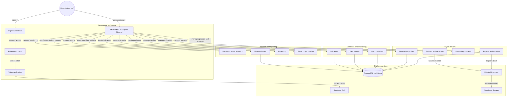

Domain modules live in `apps/api/src/modules`. Core domain reads and writes go through the API and Prisma; the browser never calls PostgREST or the Supabase Data API for domain data.

### 2.2 Deployment View

This is the current deployment. Nothing here claims AWS readiness.

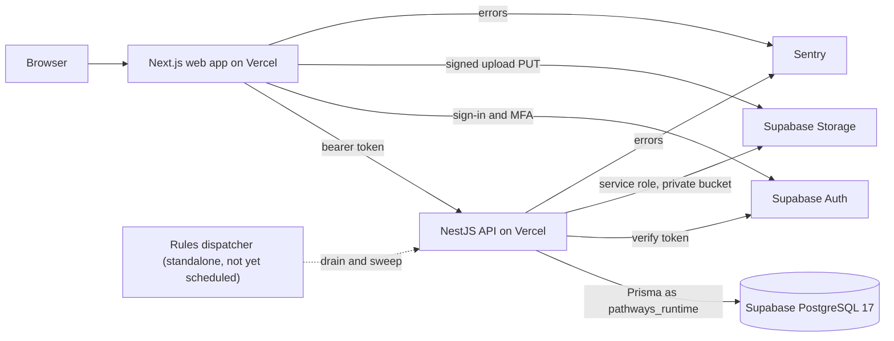

| Element | Current fact |
|---|---|
| Web and API | Two Vercel deployments; the repository has no `vercel.json` and no edge runtime |
| API listener | Binds the loopback address `127.0.0.1` locally (`local-listener.ts`); the API prefix and port come from `API_PREFIX` and `API_PORT` |
| Database | Supabase PostgreSQL 17; Prisma uses `DATABASE_URL` for runtime and `DIRECT_URL` for migrations; the runtime connects as the `pathways_runtime` role and startup checks the role |
| Auth and storage | Supabase Auth for identity and TOTP; Supabase Storage private bucket `pathways-private`, reached only through the API or short-lived signed upload URLs |
| Logging and errors | `nestjs-pino` writes JSON to stdout; Sentry captures errors in both apps |
| Rules dispatcher | A standalone worker exists (`RULES_WORKER_ENABLED=false` by default); no scheduler is installed in the repository, so sweeps run only when invoked |
| Extensions not used | No `pg_cron`, `pg_net`, realtime or edge functions |

### 2.3 Request and Trust Boundaries

| Step | Boundary | Enforcement |
|---|---|---|
| 1 | Browser to API | `Authorization: Bearer` access token; `SupabaseAuthGuard` is global and only `@Public()` routes skip it |
| 2 | Token to actor | Claims are verified with Supabase, then mapped to a `system_users` row; lifecycle must be active; email and user metadata never grant a role |
| 3 | Actor to workspace | One organization per auth user; `X-Pathways-Organization-Id` is checked against the actor's workspace, never trusted alone |
| 4 | Role to permission | `RolesGuard` and `@RequirePermission` check the canonical RBAC contract; project routes add assignment scope before any query |
| 5 | Step-up | Beneficiary detail routes marked `RequireBeneficiaryStepUp` need a TOTP `amr` claim within 15 minutes or a live session-bound PIN grant |
| 6 | API to database | Each request runs in a transaction that sets the transaction-local organization and user context; RLS policies on `pathways_runtime` repeat the tenant check |
| 7 | Evidence upload | The API reserves rows and issues signed upload URLs; the browser uploads straight to storage; finalize verifies size, leading-byte signature and SHA-256 before the commit |
| 8 | Public read path | `GET /public/projects` and `/public/projects/:projectId` are `@Public()` and return only approved, published aggregate fields; no beneficiary rows are read |

### 2.4 Tech Stack

Versions are the dependency specifiers in the repository `package.json` files and `.github/workflows/ci.yml`.

| Layer | Package | Version | Role |
|---|---|---|---|
| Runtime | node | 22 | JavaScript runtime for web and API |
| Tooling | pnpm | 11.20.0 | Workspace package manager |
| Language | typescript | ^5.9.3 | Typed source in both apps |
| Web framework | next | ^15.2.2 | App Router web application |
| Web UI | react | ^19.0.0 | Component rendering |
| Web UI | react-dom | ^19.0.0 | DOM renderer |
| Styling | tailwindcss | ^3.4.17 | Utility styles and design tokens |
| Web data | @tanstack/react-query | ^5.66.9 | Client read cache with live and summary modes |
| Web charts | echarts | ^5.6.0 | Dashboard and report charts |
| Web auth | @supabase/ssr | ^0.10.0 | Cookie session handling in the web app |
| Web errors | @sentry/nextjs | ^8.53.0 | Web error reporting |
| API framework | @nestjs/core | ^10.4.15 | Modules, guards and dependency injection |
| API docs | @nestjs/swagger | ^7.4.2 | OpenAPI document when `ENABLE_SWAGGER` is on |
| API validation | zod | ^3.25.76 | Contract schemas for analytics and rules |
| API logging | nestjs-pino | ^4.3.0 | Structured JSON logs |
| API hardening | helmet | ^8.0.0 | Security headers |
| API reports | pdfkit | 0.20.2 | PDF artifacts for reports and exports |
| API auth client | @supabase/supabase-js | ^2.49.1 | Token verification, admin and storage calls |
| API errors | @sentry/nestjs | ^8.53.0 | API error reporting |
| ORM | prisma | 6.19.2 | Schema and migration tooling |
| ORM client | @prisma/client | 6.19.2 | Typed database access |
| Database | postgresql | 17 | Primary data store with row-level security |
| Unit tests | vitest | ^3.2.4 | API and web unit tests |
| End-to-end tests | @playwright/test | ^1.55.0 | Browser tests |
| Hosting | Vercel | - | Web and API deployment |
| Identity | Supabase Auth | - | Sign-in, TOTP, recovery |
| Files | Supabase Storage | - | Private evidence and receipt objects |
| Monitoring | Sentry service | - | Hosted error tracking |

## 3. Data Architecture

The Prisma schema (`apps/api/prisma/schema.prisma`) defines 56 models in the `pathways` schema. Migrations run from the `0000_pathways_baseline_through_0026` baseline through 0053, 28 folders in `apps/api/prisma/migrations`. Enums are mapped in the same schema (for example `rule_metric`, `rule_operator`, `decision_status`).

### 3.1 Domain ER Diagrams

Entity names are Prisma model names. Each diagram shows the relations inside one module; cross-module keys (organization, project, actor) are described in section 3.4.

**Identity and Organization**

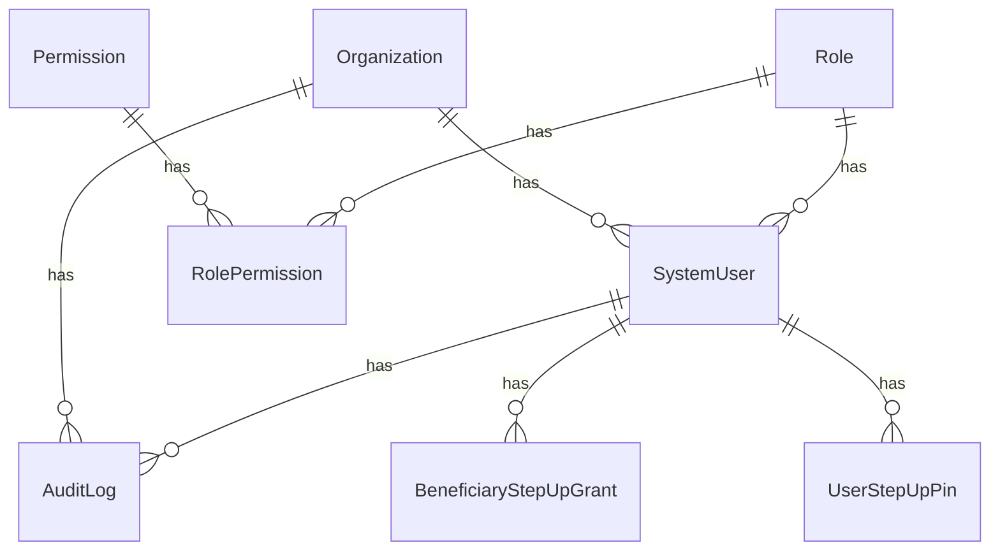

**Project and Activity**

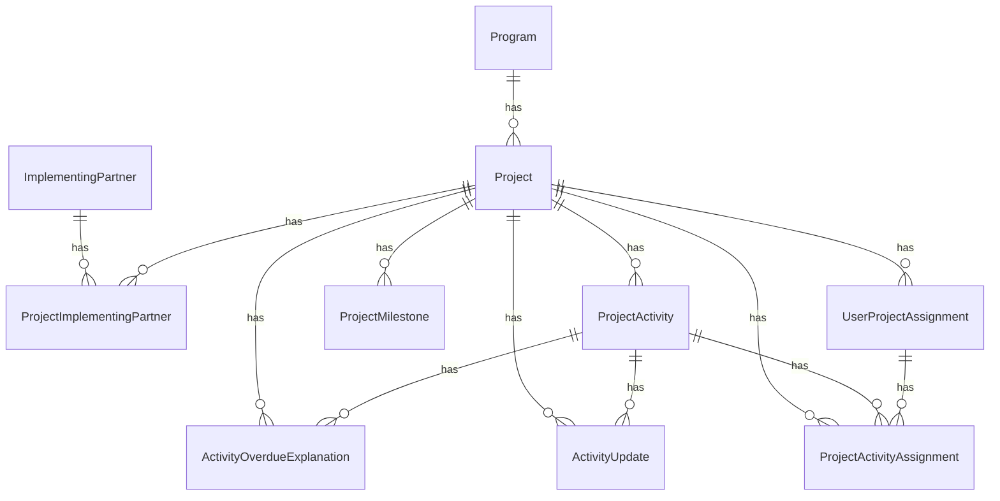

**Finance**

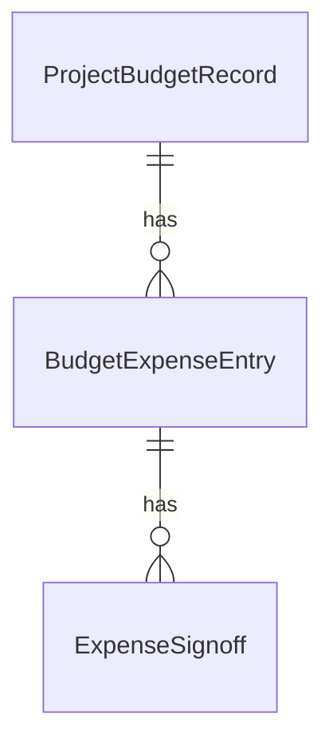

**Beneficiary and Journey**

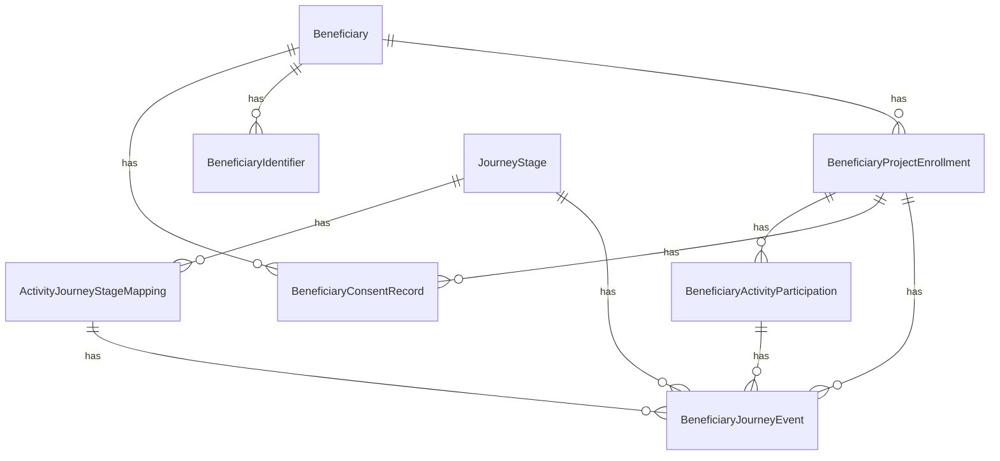

**Collection and Metadata**

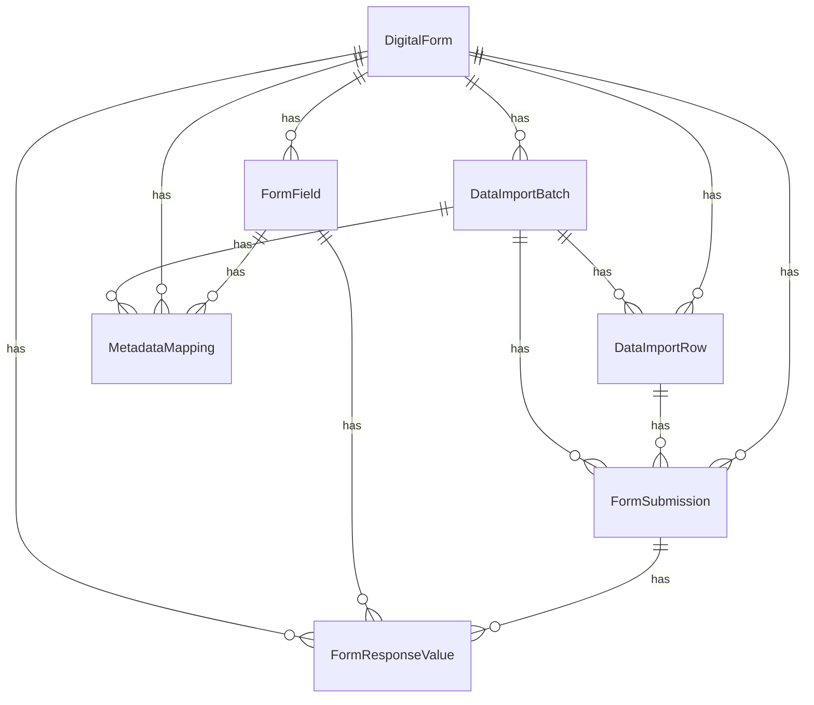

**Indicators and Monitoring**

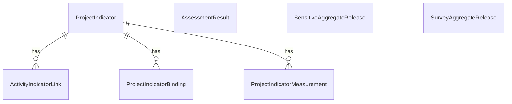

**Evaluation**

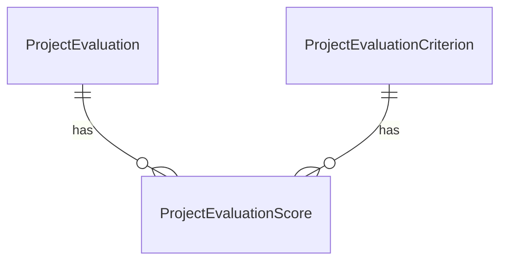

**Rules and Decision Support**

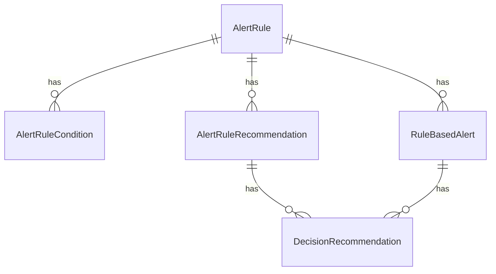

**Evidence, Reporting and Publication**

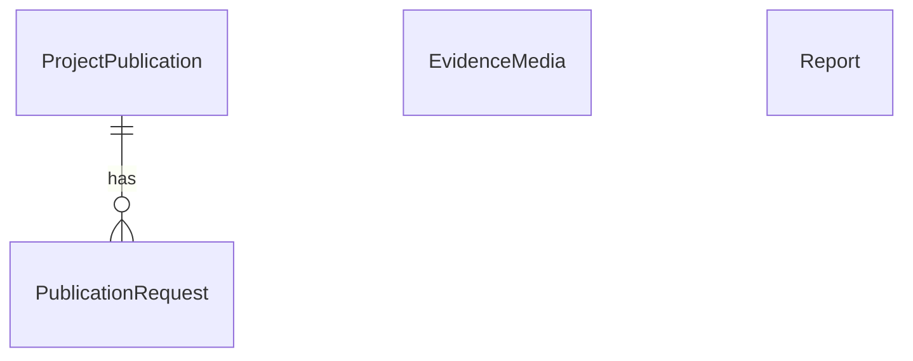

### 3.2 Database Architecture: Repository Baseline

Every model belongs to exactly one module. The Prisma model is shown; the mapped table name is its snake-case plural.

| Database Module | Tables | Purpose |
|---|---|---|
| Identity and Organization | `Organization`, `Role`, `Permission`, `RolePermission`, `SystemUser`, `AuditLog`, `UserStepUpPin`, `BeneficiaryStepUpGrant` | Supports PRD-F1, PRD-F3. Tenants, roles, permissions, users, audit trail and step-up PIN state. Not implemented: in-app staff invitations, single sign-on. |
| Project and Activity | `Program`, `ImplementingPartner`, `ProjectImplementingPartner`, `Project`, `UserProjectAssignment`, `ProjectActivity`, `ActivityUpdate`, `ActivityOverdueExplanation`, `ProjectActivityAssignment`, `ProjectMilestone` | Supports PRD-F1, PRD-F2. Programs, projects, partners, assignments, activities, progress updates, overdue explanations and milestones. Not implemented: a shared indicator library. |
| Finance | `ProjectBudgetRecord`, `BudgetExpenseEntry`, `ExpenseSignoff` | Supports PRD-F2. Project budgets, expense entries and expense signoff. Not implemented: external accounting exchange. |
| Beneficiary and Journey | `Beneficiary`, `BeneficiaryIdentifier`, `BeneficiaryProjectEnrollment`, `BeneficiaryConsentRecord`, `JourneyStage`, `ActivityJourneyStageMapping`, `BeneficiaryActivityParticipation`, `BeneficiaryJourneyEvent` | Supports PRD-F3, PRD-F4. Beneficiary profiles, identifiers, enrollments, consent, journey stages, participation and journey events. Not implemented: journey notes. |
| Collection and Metadata | `DigitalForm`, `FormField`, `DataImportBatch`, `DataImportRow`, `MetadataMapping`, `FormSubmission`, `FormResponseValue` | Supports PRD-F5, PRD-F6. Forms, fields, submissions, import batches and rows, and metadata mappings. Not implemented: offline collection. |
| Indicators and Monitoring | `ProjectIndicator`, `ActivityIndicatorLink`, `ProjectIndicatorBinding`, `ProjectIndicatorMeasurement`, `AssessmentResult`, `SurveyAggregateRelease`, `SensitiveAggregateRelease` | Supports PRD-F7, PRD-F8, PRD-F9. Project indicators, activity links, bindings, measurements, assessment results and aggregate release records. Not implemented: closed-period release freeze for manager survey totals. |
| Evaluation | `ProjectEvaluationCriterion`, `ProjectEvaluation`, `ProjectEvaluationScore` | Supports PRD-F12. Evaluation criteria, evaluations and scores. Not implemented: automated scoring. |
| Rules and Decision Support | `AlertRule`, `AlertRuleCondition`, `AlertRuleRecommendation`, `RuleBasedAlert`, `DecisionRecommendation` | Supports PRD-F10, PRD-F11. Alert rules, conditions, recommendations, alerts and decision recommendations. Not implemented: prescriptive analytics or named-person notifications. |
| Evidence, Reporting and Publication | `EvidenceMedia`, `Report`, `ProjectPublication`, `PublicationRequest` | Supports PRD-F2, PRD-F12, PRD-F13. Evidence media, generated reports, project publications and publication requests. Not implemented: public access logging. |

### 3.3 Production Requirements

| Requirement | Design |
|---|---|
| Migration ledger | One Prisma ledger; original migration bytes are preserved and never edited after application |
| Runtime role | `pathways_runtime` has no ownership and no DDL; policies are written `TO pathways_runtime` |
| Row-level security | RLS supplements backend authorization; the current set has roughly 490 policies, 75 tables with RLS enabled and 32 forced |
| Privileged functions | About 133 `SECURITY DEFINER` functions, owned by `prisma` with an empty `search_path` and executable only by the runtime role |
| Replay check | CI replays the chain on a disposable PostgreSQL with stub auth and storage shims |
| Backup and restore | `runbook-backup-restore.md` holds the procedure; restore testing is not verified (NFR-15) |
| Hosted application | Applying new migrations to hosted databases follows the release gates in `ops-pathways.md` |

### 3.4 Data Integrity

- UUID primary keys throughout.
- Organization and project anchors on domain tables, with composite foreign keys on `(organization_id, project_id, ...)` so a child cannot point across tenants.
- Business dates are `date` columns; event instants are timezone-aware.
- Domain numeric bounds are database checks, for example the session beneficiary count range of 0 to 100000.
- Sensitive history uses RESTRICT or archive, never cascade delete.
- Append-only tables (audit log, overdue explanations) have no UPDATE or DELETE grant.
- Retired inputs keep their column: the project target goal is nullable and read-only, and `projects.implementing_partners` free text is deprecated in favor of structured partners (migration 0039).

## 4. API Design & External Integrations

Exact routes come from the controllers in `apps/api/src/modules`. With `ENABLE_SWAGGER` on, the OpenAPI document is served by `@nestjs/swagger`; CI keeps it off.

All touched endpoints validate DTO input, bound their queries, derive actor and scope on the server, enforce authorization, avoid mass assignment, avoid leaking internal errors, support idempotency where processing can repeat, and expose aggregate-only contracts to aggregate-only roles.

| Method | Path | Purpose | Permission | PRD |
|---|---|---|---|---|
| GET | `/auth/me` | Current actor, role and workspace | authenticated | PRD-F1 |
| POST | `/auth/step-up/pin` | Verify step-up PIN | authenticated | PRD-F3 |
| PATCH | `/users/:userId` | Change user role or lifecycle | `users.authorize` | PRD-F1 |
| POST | `/projects` | Create project | `projects.create` | PRD-F2 |
| POST | `/projects/:projectId/activities/:activityId/progress` | Record progress | `activities.progress.update` | PRD-F2 |
| POST | `/projects/:projectId/activities/:activityId/updates/reservations` | Reserve proof upload | `activities.proof.submit` | PRD-F2 |
| POST | `/projects/:projectId/activities/:activityId/updates/:updateId/files/:evidenceId/finalize` | Verify uploaded file | `activities.proof.submit` | PRD-F2 |
| POST | `/projects/:projectId/activities/:activityId/overdue-explanations` | Explain an overdue activity | `monitoring.review` | PRD-F2 |
| POST | `/beneficiaries/projects/:projectId/registrations` | Register beneficiary | `beneficiaries.records.register` | PRD-F3 |
| POST | `/beneficiaries/projects/:projectId/:beneficiaryId/journey/events` | Record journey event | `beneficiaries.enrollments.manage` | PRD-F4 |
| POST | `/metadata/projects/:projectId/forms/:formId/publish` | Publish form version | `forms.publish` | PRD-F5 |
| POST | `/imports/projects/:projectId/batches/upload` | Upload dataset | `imports.upload` | PRD-F6 |
| PATCH | `/imports/projects/:projectId/batches/:batchId/mapping` | Save field mapping | `imports.review` | PRD-F6 |
| POST | `/imports/projects/:projectId/batches/:batchId/process` | Promote validated rows | `imports.process` | PRD-F6 |
| POST | `/projects/:projectId/indicators/:indicatorId/measurements` | Record measurement | `indicators.update` | PRD-F7 |
| POST | `/projects/:projectId/indicators/from-library` | Create a project indicator by copying a library entry | `indicators.create` and `indicators.library.read` | PRD-F7 |
| GET | `/indicator-library` | List active library entries | `indicators.library.read` | PRD-F7 |
| POST | `/indicator-library` | Create a library entry | `indicators.library.create` | PRD-F7 |
| POST | `/indicator-library/:entryId/archive` | Archive a library entry | `indicators.library.archive` | PRD-F7 |
| GET | `/dashboards/monitoring` | Aggregated monitoring dashboard | `monitoring.read` | PRD-F8 |
| GET | `/dashboards/saddd` | SADDD analysis | `analytics.saddd.read` | PRD-F8 |
| GET | `/analytics/descriptive` | Descriptive analytics views | `analytics.descriptive.read` | PRD-F9 |
| POST | `/alerts/:id/review` | Review rule-based alert | `alerts.review` | PRD-F10 |
| POST | `/recommendations/:id/review` | Review recommendation | `recommendations.review` | PRD-F11 |
| GET | `/recommendations` | List recommendations | `recommendations.read` | PRD-F11 |
| GET | `/projects/:projectId/reports/preview` | Preview report | `reports.read` | PRD-F12 |
| POST | `/projects/:projectId/reports` | Generate report | `reports.generate` | PRD-F12 |
| GET | `/public/projects` | Public tracker list | public | PRD-F13 |

Request: `POST /projects` takes project name, program, dates and budget profile; organization and actor are never read from the body.
Request: `POST .../progress` takes a progress value, a note and a `clientMutationId` used for idempotent retry.
Request: `POST .../updates/reservations` takes one to ten file declarations (name, content type, size, SHA-256), a `clientUpdateId` and an optional `beneficiariesReachedThisSession` from 0 to 100000.
Request: `POST .../files/:evidenceId/finalize` has no body; the server checks the stored object against the reservation.
Request: `POST .../overdue-explanations` takes `category` (WEATHER, SECURITY, FUNDING, COMMUNITY, LOGISTICS, OTHER), `explanation` of 10 to 2000 trimmed characters and `clientMutationId`.
Request: `POST /beneficiaries/projects/:projectId/registrations` takes the registration form values; a birth date after the business date or an age below 5 is rejected.
Request: `POST .../batches/upload` is multipart with one CSV, XLSX, XLS or text-layer PDF file and a form identifier.
Request: `PATCH .../mapping` takes source column to form field pairs for the batch.
Request: `GET /analytics/descriptive` takes optional `view` (`kpi`, `participation`, `survey`, `timeline`), and `periodStart` with `periodEnd` for `survey`.
Request: `POST /alerts/:id/review` takes `expectedRevision`, a required `note` of 1 to 2000 trimmed characters and `clientOperationId`.
Request: `POST /recommendations/:id/review` takes `expectedRevision`, a required `note` of 1 to 2000 trimmed characters and `clientOperationId`.
Request: `GET /recommendations` takes optional `projectId`, `alertId`, `cursor` and `limit` (1 to 100, default 25) query parameters and returns a bounded page.
Request: `GET .../reports/preview` takes `kind` (PROJECT_SUMMARY, INDICATOR_SUMMARY, BENEFICIARY_SUMMARY, SURVEY_FORM_RESULTS) and, for survey reports only, `formId` as query parameters.
Request: `POST /projects/:projectId/reports` takes `kind`, `formId` (survey reports only), `clientRequestId`, `name` and `format` (CSV, XLSX, XLS, PDF).

Other controller groups follow the same pattern: finance (budgets, expenses, receipts, review, signoff), evaluations, reports (PRD-F12), recommendations (PRD-F11), publication (submit, approve, publish, withdraw), rules and notifications. The internal rules routes `POST /internal/rules/drain` and `/internal/rules/sweep` are not exposed to browser roles.

### 4.1 Runtime Sequences

Import promotion. Normalization runs in chunks: a claim of at most 100 rows loads its batch and form context once, then promotes chunks of at most 25 rows, each a verified transaction bounded to 30 seconds with re-verified identity and assignment. A failed chunk reruns row by row. Staged rows insert in batches of 1,000. All file formats are parsed in a sandbox worker.

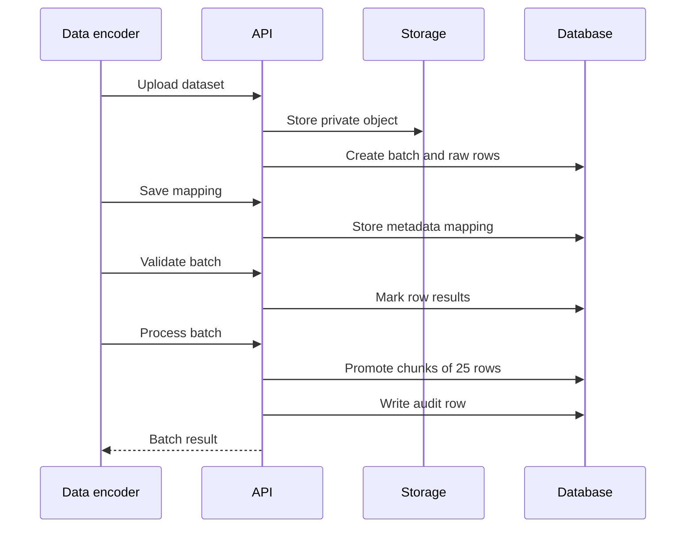

Evidence upload and finalize. Reserve creates one activity update and one to ten evidence rows with `storage_ready = false`. Accepted types are PDF, JPEG, PNG, WebP, MP4, MOV and WebM, typed PHOTO, VIDEO or DOCUMENT from the verified content type (migration 0041). The update commits only when every file is verified.

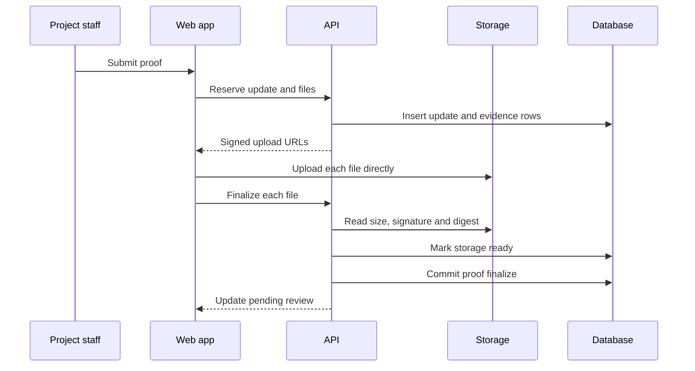

Rule evaluation and sweep. Trusted metrics feed a structured rule, which writes a snapshot and an alert, then a predefined recommendation, then a human outcome.

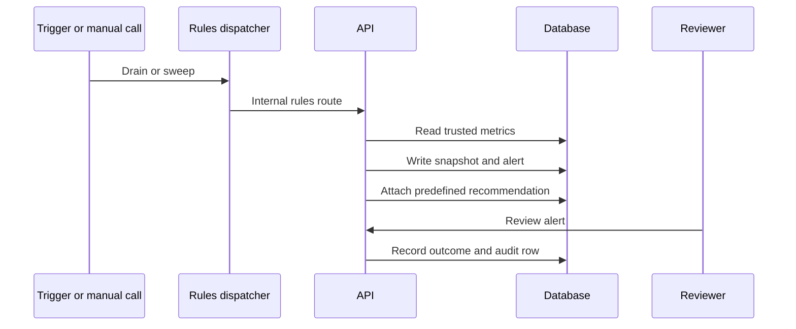

Step-up. The grant is read only after scope authorization, for the server-derived user, organization and verified session, in a transaction that rechecks session liveness.

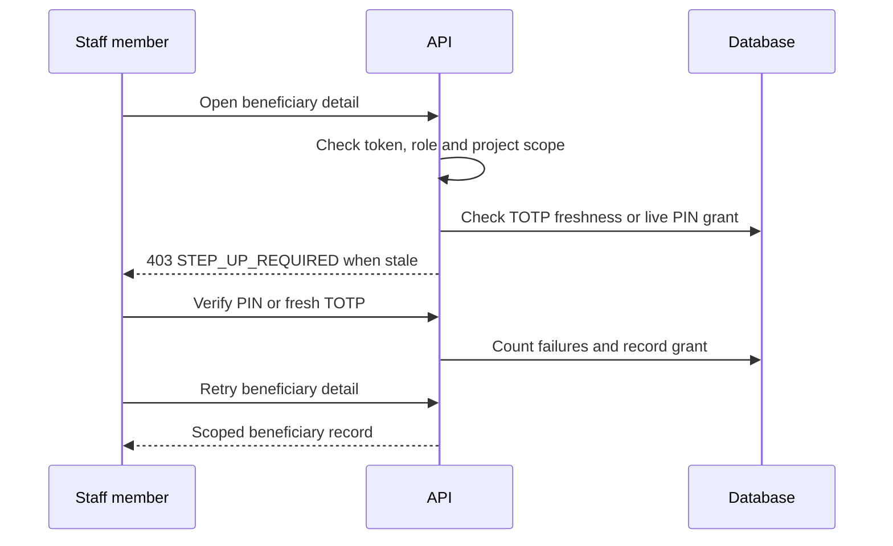

Further runtime contracts:

- **Form export.** `GET /metadata/projects/:projectId/forms/:formId/export?format=CSV|XLSX|XLS|PDF` exports a blank form definition under `forms.export` with project scope applied before the form query, writes one `FORM_DEFINITION_EXPORTED` audit row and returns a `no-store`, `nosniff` attachment.
- **Private proof inspection.** Initial human authorization, then a bounded private object read outside transactions, then fresh live authorization and a committed access audit, then a safe attachment. Storage reads are bounded to ten seconds, the request to thirty, size to 10 MiB with digest verification, and no cache, inline or public URL is allowed.
- **Proof session count.** An activity's `beneficiariesReached` is the sum of `beneficiaries_reached_this_session` over its APPROVED updates (null counts as 0), computed by `p08_activity_beneficiaries_reached` (migration 0042). It carries no sex or age breakdown, so SADDD breakdowns stay sourced from participation records.
- **Overdue explanation.** A replay with the same `clientMutationId` and input returns the existing row, a changed replay is a 409, and a non-overdue activity is a 409. Scope is the actor's project assignment, matching the RLS policy in migration 0043.
- **Project overview metrics.** `GET /projects/:projectId/overview-metrics` returns `project.overview-metrics.v1`; a section is `null` when the viewer lacks its source permission and a `MISSING` metric is never reported as zero. KPI achievement is the mean baseline-to-target progress of reported indicators, rounded once to one decimal. Budget utilization is approved expenses over planned budget, and is `MISSING` with `NO_APPROVED_EXPENSES` until an expense is approved. Beneficiaries reached comes only from the SADDD release.
- **Descriptive analytics.** `view` dispatches `kpi`, `participation`, `survey` or `timeline`; every view needs `monitoring.read` and writes `ANALYTICS_DESCRIPTIVE_VIEWED`. Survey and timeline use trusted functions `p10_f9_survey_aggregate` and `p10_f9_timeline_aggregate` (migration 0045) that return counts and sums only, never row identifiers. Survey results are released only for one defined reporting period, pair counts of 1 to 4 are suppressed with complementary suppression, and roles without `assessments.detail.read` see a restricted state. Provider or database faults return 503, never an empty payload.
- **Default registration form.** `POST .../registration-context/default-form` calls `pathways.ensure_default_registration_form`, which checks `beneficiaries.records.register` with project scope before and after an advisory lock and returns `PROVISIONED`, `EXISTING` or `CODE_IN_USE` (migration 0040).

## 5. Security & Authorization

Protected request order: token validation, system user, lifecycle, organization, role and permissions, assignments, beneficiary step-up on marked routes, scoped Prisma query.

- Authorization follows the approved revised CSV contract in `rfc-pathways-auth-rbac-isolation.md`; API and web share the canonical role ceiling and the active database grants remain authoritative.
- Never authorize by email, trust user metadata for a role, trust client scope, or expose private beneficiary data through public surfaces.
- Step-up (`cr-pathways-beneficiary-step-up.md`, `cr-pathways-beneficiary-step-up-pin.md`): `GET /auth/step-up/status` reports freshness, method and `pinState` (`NONE`, `SET`, `LOCKED`) and no business data. PIN routes take the PIN only in the JSON body and call migration 0037 functions; the PIN tables have RLS on and no API grants. Five failures lock the PIN, a locked PIN is not compared, and only a newer TOTP unlocks it. Logs and audit rows never hold the PIN or its hash.
- Client read caching (`cr-pathways-performance-scaling.md`): reads default to `live` (no retained cache); `summary` (30 seconds) is opt-in for lists and summaries; `beneficiar*`, `step-up` and `import-batch` resources are always `live`. Query keys include organization, user, roles, permissions and assignments; sign-out clears other identities' entries; a 401 or 403 starts a denial epoch that hides earlier data until each reader re-verifies once.
- SADDD privacy (`rfc-pathways-saddd-privacy.md`): released only for a closed fixed period, counts of 1 to 4 suppressed with complementary suppression.
- Secrets live in environment variables only; this document names variables and never values.
- Project partners: `project_implementing_partners` and `implementing_partners` (migration 0030) are the single source; writes carrying the legacy `implementingPartners` field return 400.
- Revised boundaries: admin activity context excludes detail and assignment identities, blank-form management is separate from assessment access, and administrators process only their own imported submissions.

## 6. Infrastructure, CI/CD & Deployment

| Area | Current fact |
|---|---|
| CI | `.github/workflows/ci.yml` runs on push to `dev` and `master` and on pull requests: install, checks, unit tests, migration replay and the SAD automated check |
| Replay database | PostgreSQL 18 disposable instance with stub auth and storage shims |
| Release | Pull requests to `dev`, then `master`; migrations and conflicts are gated by release checks in `ops-pathways.md` |
| Web and API hosting | Vercel |
| Local stack | Supabase CLI config in `supabase/config.toml` |
| Hosting migration | Analyzed in `rfc-pathways-aws-hosting-migration.md` (Draft). Coupling to Supabase Auth claims, `auth.sessions`, storage REST calls and superuser-only migrations is documented there; the platform is not declared portable to AWS today |

Single sign-on and AWS hosting are not acceptance criteria for current feature work.

## 7. Non-Functional Requirements

| NFR | Architectural tactic | PRD |
|---|---|---|
| NFR-1 RBAC and organization workspace isolation | Global auth guard, permission decorators, assignment scope, transaction-local organization and RLS | PRD-F1 |
| NFR-2 Protection of sensitive information | Step-up on beneficiary detail, private bucket, no public URLs, aggregate-only roles, small-cell suppression | PRD-F1, PRD-F3, PRD-F13 |
| NFR-3 Responsive dashboards and operations | Bounded queries, database-side aggregate functions, client `summary` cache for lists | PRD-F8, PRD-F9 |
| NFR-4 Centralized, consistent monitoring records | One schema, composite tenant keys, import promotion through the same validators as direct entry | PRD-F2, PRD-F6 |
| NFR-5 Metadata-driven configuration | Forms, fields and mappings stored as rows and versioned | PRD-F5, PRD-F6 |
| NFR-6 User-friendly, organized interface | Design foundations in `dsd-pathways.md`; unfinished controls hidden | PRD-F1 to PRD-F13 |
| NFR-7 Operational reliability | Idempotent client mutation ids, chunked transactions with timeouts, 503 on provider faults | PRD-F2, PRD-F8 |
| NFR-8 Scalability | Chunked imports, lean list projections, indexed organization and project anchors | PRD-F2, PRD-F3, PRD-F6 |
| NFR-9 Accurate processing and analytics | Shared metric calculators, trusted SQL functions, `MISSING` never shown as zero | PRD-F8, PRD-F9 |
| NFR-10 Dataset validation | Validate step before process, row-level results, bounded file types and sizes | PRD-F5, PRD-F6 |
| NFR-11 Browser and device accessibility | Accessible components and tokens; conformance not verified | PRD-F1 to PRD-F13 |
| NFR-12 Auditability and traceability | Audit log rows in the same transaction as the change; append-only tables | PRD-F1, PRD-F2 |
| NFR-13 Compatibility with existing tools | CSV, XLS, XLSX and PDF import; CSV, XLSX, XLS and PDF export | PRD-F5, PRD-F6, PRD-F12 |
| NFR-14 Maintainable, modular code | Feature modules, single Prisma ledger, typed contracts, SAD review checks | PRD-F1 to PRD-F13 |
| NFR-15 Recoverability | Backup runbook, idempotent retries, resumable import batches; restore not verified | PRD-F1 to PRD-F13 |

ISO/IEC 25010 coverage: Functional Suitability, Performance Efficiency, Compatibility, Usability, Reliability, Security, Maintainability and Portability map to the rows above.

## 8. AI / Agent Architecture

No AI or machine-learning feature exists in the product. Alerts and recommendations come from deterministic structured rules over trusted metrics, and a person records every outcome (PRD-F10, PRD-F11). Development-time review agents are described in `sad-pathways.md` and are not part of the runtime.

## Self-Check

- [x] No AI overclaim
- [x] Server-side authorization explicit
- [x] Metadata and rule flows explicit
- [x] All 55 Prisma models placed in one module
- [x] Stack versions match dependency files
- [x] No AWS readiness claim
