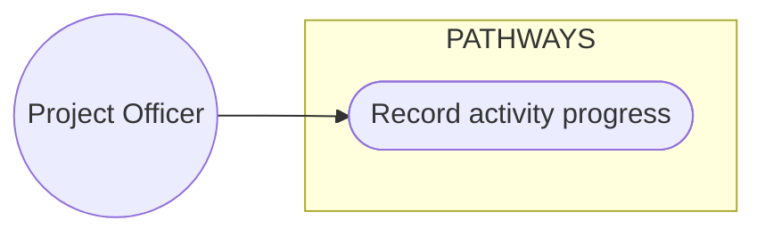
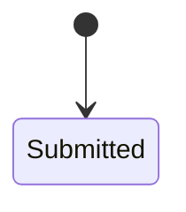

# Docs Canonical Reconciliation Implementation Plan

> **For agentic workers:** REQUIRED SUB-SKILL: Use superpowers:subagent-driven-development (recommended) or superpowers:executing-plans to implement this plan task-by-task. Steps use checkbox (`- [ ]`) syntax for tracking.

**Goal:** Rebuild the PATHWAYS documentation suite into one reconciled, self-contained canonical baseline (spec decisions D1-D16) and integrate it into `origin/dev`.

**Architecture:** Template-first rebuild: every suite doc takes the section skeleton listed in its task, and its content comes only from the repository (current behavior), the rev-2026 manuscript (purpose, scope, objectives, methodology) and the new design foundations (design). A scratchpad harness (`facts.json`, manuscript extracts, `verify_suite.py`, `clean_check.sh`) is the test suite: each task turns its checks from FAIL to PASS before committing.

**Tech Stack:** Markdown, Mermaid (fenced `mermaid` blocks), Python 3.14 (harness and `scripts/docs/*.py`), pnpm scripts (`docs:check`, `docs:materialize`, `sad:test`, `sad:typecheck`), Git.

**Spec:** `docs/superpowers/specs/2026-10-01-docs-canonical-reconciliation-design.md`

## Global Constraints

- Branch `docs/canonical-reconcile`; never stage `docs/reference/`, `docs/document suite reference ONLY from another repo/` or `docs/activity-log.md`.
- No tracked file names or credits the other repository; no template wording, product terms or workflow names are carried over (the `leak` check lists the banned terms).
- Source precedence: repository (code, migrations, `rbac-contract.json`, `schema.prisma`, Applied CRs) > rev-2026 manuscript > new foundations (design only) > template (headings and order only).
- Stable IDs never change: `PRD-F1` to `PRD-F13`, existing `QAD-*` IDs, RFC/CR filenames, migration numbers. New ID formats: gates `G-F<n>-<m>`, use cases `UC-F<n>-<m>`, `FR-<n>`, `NFR-<n>`, problems `P1`-`P8`, requirements `R1`-`R8`. New IDs are stable once committed.
- Manuscript F1-F11 = PRD-F1 to PRD-F11; manuscript F12 (Public Project Tracker) = PRD-F13; PRD-F12 Reporting / Visualization stays.
- ISO/IEC 25010 names, exactly: Functional Suitability, Performance Efficiency, Compatibility, Usability, Reliability, Security, Maintainability, Portability.
- Every rebuilt suite doc starts with `# <Title>` then a header block: `**Status:** <status>`, `**Version:** 2.0`, `**Last reconciled:** 2026-10-01`, `**Owner:** PATHWAYS capstone team`. Status per doc is fixed in the Doc Status table below.
- Voice (`scripts/docs/check.py` voice check): no em dash or dash look-alikes; en dash only inside numeric ranges with no spaces; no `--` in prose (allowed inside inline code and fenced blocks); no AI-tell phrases listed in `check.py`.
- Diagrams are Mermaid only, in fenced `mermaid` blocks; labels use role and screen names, never personal data.
- No personal data, sample records, credentials, keys or environment values anywhere; environment variable names only.
- Missing source material is never invented: write "Not established" plus the reason, and append the gap to `$S/ledger/not-established.md`.
- Diagrams and statements about the design never claim the new foundations are shipped; current vs target stays explicit (D1).
- Commits: one focused commit per task, message style `docs(<area>): <summary>`, ending with the line `Co-Authored-By: Claude Opus 5.5 <noreply@anthropic.com>`. Never push until Task 22.
- Drafting subagents use Sonnet (developer rule); reviewers keep their defined models.

### Paths and tools

`$S` = `C:/Users/CIANJA~1/AppData/Local/Temp/claude/C--PATHWAYS/8cceb6d5-4614-4d5f-ad07-32045c3c155b/scratchpad` (session scratchpad; never committed).

| Tool | Purpose |
|---|---|
| `$S/facts.py` -> `$S/facts.json` | Repository facts: Prisma models, mapped tables, fields, enums; API routes; web routes; RBAC roles, permissions, actions; dependency versions; CSS tokens; migrations |
| `$S/split_manuscript.sh` -> `$S/ms/*.txt` | Manuscript extracts by section (22 files, see Task 1) |
| `$S/verify_suite.py <checks>` | Checks: `scrub leak anchors ids charters usecases reqs qad schema stack tokens links audit rfc tracked mermaid`, or `all` |
| `$S/clean_check.sh` | Copies the working tree without the untracked reference folders, runs `docs:check` (must be 0 failures and 0 warnings) and verifies `docs:materialize` output is current |
| `$S/aws-coupling-inventory.md` | Supabase/Vercel coupling inventory with file references (input to Task 16) |
| `$S/ledger/*.md` | Cross-task ledgers feeding Task 18: `superseded.md`, `not-established.md`, `uc-disposition.md`, `not-met.md`, `section-map.md`, `dictionary-map.md` |

Run every command from `C:\PATHWAYS` in Git Bash after `export S=C:/Users/CIANJA~1/AppData/Local/Temp/claude/C--PATHWAYS/8cceb6d5-4614-4d5f-ad07-32045c3c155b/scratchpad`.

### Doc Status table

| Doc | Status | Doc | Status |
|---|---|---|---|
| `IDEA.md` (root) | Locked | `idea-pathways.md` | Locked |
| `val-pathways.md` | Working | `scrutiny-pathways.md` | Working |
| `voice-pathways.md` | Locked | `brd-pathways.md` | Working |
| `prd-pathways.md` | Locked | `dsd-pathways.md` | Locked |
| `sdd-pathways.md` | Locked | `qad-pathways.md` | Locked |
| `sad-pathways.md` | Control | `build-pathways.md` | Control |
| `clr-pathways.md` | Working | `aia-pathways.md` | Working; not triggered |
| `ops-pathways.md` | Working | `log-pathways.md` | Control; append-only |
| `ues-pathways.md`, `gtm-pathways.md`, `pitch-pathways.md`, `wrap-pathways.md` | set in Task 20 from the answers | `rfc-pathways-aws-hosting-migration.md` | Draft |

### Drafter brief (applies to every drafting task)

Read the spec, this Global Constraints section, your task, and only the sources your task lists. Write the files your task names, nothing else. When the manuscript and the repository disagree about current behavior, write the repository behavior and append a row to `$S/ledger/superseded.md` (`| Manuscript item | Location (ms file:line) | Current behavior | Evidence |`). Cite evidence as repository paths (`apps/api/src/modules/rules/rule-engine.ts`) or manuscript sections, never as URLs to other repositories. Keep prose short: tables for facts, one-sentence bullets for rules.

## Review Focus

1. **Manuscript use cases the system does not support written as current behavior.** Expected: every use case cites an existing route and an RBAC permission; unsupported ones land in `uc-disposition.md`. Pinned by `verify_suite.py usecases` in Tasks 5-9.
2. **Template product terms or tool names leaking into PATHWAYS docs** (already present: two template tool names in DSD/BRAND/DESIGN). Expected: none in any live doc. Pinned by `verify_suite.py leak` in every drafting task.
3. **DSD "current" design values drifting from `globals.css`.** Expected: every current token in the gap table is a real CSS variable; new ones are marked `(new)`. Pinned by `verify_suite.py tokens` in Task 10.
4. **`docs:check` warnings treated as success** (index status drift, SDD contract warnings, Must-Have coverage). Expected: 0 failures and 0 warnings. Pinned by `clean_check.sh` in every task.
5. **The AWS RFC citing files that do not exist or implying readiness.** Expected: every backticked repository path exists; status Draft. Pinned by `verify_suite.py rfc` in Task 16.

---

## Wave 0: Harness

### Task 1: Harness, extracts and plan registration

**Files:**
- Create: `$S/facts.json`, `$S/ms/*.txt`, `$S/ledger/{superseded,not-established,uc-disposition,not-met,section-map,dictionary-map}.md`
- Modify: `docs/index.md` (register this plan), `docs/superpowers/specs/2026-10-01-docs-canonical-reconciliation-design.md` (commit the pending wording fix and per-task commit wording)
- Test: `$S/verify_suite.py`, `$S/clean_check.sh`

**Interfaces:**
- Produces: `facts.json` keys `models{name:{table,schema,fields}}`, `enums{name:{table,schema,values}}`, `api_routes[{method,path,file}]`, `web_routes[{path,file}]`, `versions{pkg:spec}` (plus `node`, `pnpm`, `postgresql`), `rbac{roles,permissions,actions}`, `tokens{--name:value}`, `migrations[]`; ledger files with the header rows below.

- [ ] **Step 1: Confirm tools exist and the harness fails on the current state**

Run: `ls $S/{facts.py,split_manuscript.sh,verify_suite.py,clean_check.sh,aws-coupling-inventory.md,manuscript.txt} && python $S/verify_suite.py scrub leak charters`
Expected: files listed; `FAIL scrub`, `FAIL leak`, `FAIL charters`. If `manuscript.txt` is missing run `pdftotext -layout "docs/reference/NEW [Group 14] Capstone Manuscript rev 2026.pdf" $S/manuscript.txt`.

- [ ] **Step 2: Generate facts and extracts**

Run: `python $S/facts.py $S/facts.json && bash $S/split_manuscript.sh && ls $S/ms | wc -l`
Expected: `models=55 enums=53 api_routes=147 web_routes=63 permissions=98 roles=6 migrations=20 tokens=47` (counts may only grow if the branch changed) and `22`.

Extract files: `ch1-project-context`, `ch1-technical-background`, `ch1-problem-analysis`, `ch1-problem-requirements-matrix`, `ch1-purpose-objectives`, `ch1-scope-limitations`, `ch1-definition-of-terms`, `ch2-literature`, `ch3-requirements-features-matrix`, `ch3-use-case-diagrams`, `ch3-use-case-reports`, `ch3-activity-diagrams`, `ch3-erd-figures`, `ch3-data-dictionary`, `ch3-development-methodology-tools`, `ch3-test-methodology`, `ch3-quality-plan`, `ch3-implementation-plan`, `ch3-evaluation-plan`, `ch3-ethics`, `ch3-data-analysis-statistics`, `appendices`.

- [ ] **Step 3: Create ledgers**

```bash
mkdir -p $S/ledger
printf '| Manuscript item | Location | Current behavior | Evidence |\n|---|---|---|---|\n' > $S/ledger/superseded.md
printf '| Doc | Section | Missing information | Reason |\n|---|---|---|---|\n' > $S/ledger/not-established.md
printf '| Manuscript use case | Table | Disposition | PRD use cases or reason |\n|---|---|---|---|\n' > $S/ledger/uc-disposition.md
printf '| Gate | Condition | Missing behavior | Deferred register entry |\n|---|---|---|---|\n' > $S/ledger/not-met.md
printf '| Doc | Old section | New section | Concept |\n|---|---|---|---|\n' > $S/ledger/section-map.md
printf '| Manuscript table | Manuscript table no. | Current model / table | Mapping |\n|---|---|---|---|\n' > $S/ledger/dictionary-map.md
```

- [ ] **Step 4: Register the plan and fix spec commit wording**

In `docs/index.md`, add a row to the `### Design Specs` table: `| [Docs canonical reconciliation plan](superpowers/plans/2026-10-01-docs-canonical-reconciliation.md) | 2026-10-01-docs-canonical-reconciliation.md | 2026-10-01 | Task-by-task implementation plan for the reconciliation spec | Approved; in progress |`.
In the spec section 7, replace `One atomic commit per wave.` with `One focused commit per task, grouped by wave.`

- [ ] **Step 5: Verify**

Run: `bash $S/clean_check.sh && python $S/verify_suite.py tracked`
Expected: `PASS clean docs:check and materialize` and `PASS tracked`.

- [ ] **Step 6: Commit**

```bash
git add docs/index.md docs/superpowers/plans/2026-10-01-docs-canonical-reconciliation.md docs/superpowers/specs/2026-10-01-docs-canonical-reconciliation-design.md
git commit -m "docs(plan): add canonical reconciliation implementation plan

Co-Authored-By: Claude Opus 5.5 <noreply@anthropic.com>"
```

---

## Wave 1: Identity and requirements

### Task 2: Root IDEA.md and idea-pathways.md

**Files:**
- Modify (full rewrite): `IDEA.md`, `docs/idea-pathways.md`

**Interfaces:**
- Consumes: `$S/ms/ch1-*.txt`, `$S/ms/ch2-literature.txt` (synthesis part only), `$S/ms/ch3-{development-methodology-tools,test-methodology,quality-plan,implementation-plan,evaluation-plan,ethics,data-analysis-statistics}.txt`, `$S/facts.json` (`rbac.roles`, `versions`)
- Produces: the `P1`-`P8` / `R1`-`R8` labels and objective numbers (1.1-1.8, 2.1-2.4, 3.1-3.8) that every later task cites, exactly as numbered in `ch1-problem-requirements-matrix.txt` and `ch1-purpose-objectives.txt`.

- [ ] **Step 1: Confirm the failing state**

Run: `grep -c "" IDEA.md && grep -n "One-line pitch" IDEA.md docs/idea-pathways.md`
Expected: 8268+ lines; no `**One-line pitch:**` in root `IDEA.md` (the Locked IDEA lock bar is not met yet).

- [ ] **Step 2: Write root `IDEA.md` (400-700 lines)**

Title `# PATHWAYS: System Idea and Manuscript Baseline`; header block (Status Locked); then these six lines verbatim labels, each with a one-sentence value from the manuscript:

```markdown
**One-line pitch:** ...
**Problem:** ...
**Insight (why us, why now):** ...
**Primary user (named, specific):** ...
**Their moment of pain:** ...
**If we only ship one thing:** ...
```

Sections in order: `## 1. The Idea` (Purpose and Description summary; interoperable layer beside KOBO, YES!ME, PMERL; forty-hour preparation claim stated as a manuscript estimate) · `## 2. Organizational Context` (Plan International Pilipinas workflow and existing environment, described as context not mandate; the domain model is multi-organization) · `## 3. Problem Analysis` (fishbone categories People, Process, Data/Information, Technology; table `| Problem | Statement | Requirement | Statement |` for P1-P8 / R1-R8) · `## 4. Objectives` (general objective; specific objectives 1.1-1.8, 2.1-2.4, 3.1-3.8 each with the PRD feature(s) it maps to) · `## 5. Users and Roles` (the six RBAC roles from `facts.json` with one-line responsibility; external stakeholders read the public tracker only; beneficiaries are data subjects, never users) · `## 6. Scope and Limitations` (coverage areas; each limitation as a bullet) · `## 7. Requirements-Features Summary` (table `| Manuscript | PRD ID | Feature | Priority |` with the F12 to PRD-F13 mapping, link to `docs/prd-pathways.md`) · `## 8. Related Systems and Synthesis` (short, from Chapter 2) · `## 9. Methodology, Quality and Evaluation` (Agile SDLC; ISO/IEC 25010 eight characteristics; 5-point Likert; respondents; weighted mean; ethics) · `## 10. Technology Summary` (Frontend, Backend, Database and platform, Tools, one line each, link to `docs/sdd-pathways.md` section 2) · `## 11. Definition of Terms` (20-40 terms that later docs use) · `## 12. Superseded Manuscript Content` (one paragraph: outdated use cases, activity diagrams, ERD and data dictionary are replaced by PRD sections 4-5 and SDD section 3; link to `docs/cr-pathways-doc-reconciliation-2026-10-01.md`).

Do not link to `docs/reference/`.

- [ ] **Step 3: Write `docs/idea-pathways.md`**

Header (Status Locked) plus the same six load-bearing lines (identical values). Sections: `## 1. The Spark` · `## 2. Who It's For` · `## 3. Scope & Cut Line` (must-have features PRD-F1 to PRD-F8, supporting PRD-F9 to PRD-F13; cut line = system-wide bounds) · `## 4. Success & Judging Criteria` (success = objectives and ISO/IEC 25010 evaluation thresholds from the manuscript; judging criteria "Not established; collected in Task 19") · `## 5. Concept Visuals` (one `flowchart LR`: field collection tools -> import and mapping -> PATHWAYS records -> dashboards, alerts, reports, public tracker, with humans reviewing) · `## 6. Open Questions` · `## Self-Check`. Link to root `IDEA.md` for detail; do not repeat it.

- [ ] **Step 4: Verify**

Run: `python $S/verify_suite.py scrub leak links && bash $S/clean_check.sh`
Expected: `scrub` may still FAIL only for `README.md`, `docs/index.md`, `docs/log-pathways.md`, `docs/wrap-pathways.md` (fixed later); `PASS leak`, `PASS links`, `PASS clean docs:check and materialize` (inception check now passes with the load-bearing fields).

- [ ] **Step 5: Commit**

```bash
git add IDEA.md docs/idea-pathways.md
git commit -m "docs(idea): distill rev-2026 manuscript into canonical IDEA

Co-Authored-By: Claude Opus 5.5 <noreply@anthropic.com>"
```

### Task 3: BRD

**Files:**
- Modify (full rewrite): `docs/brd-pathways.md`

**Interfaces:**
- Consumes: `IDEA.md` (P/R labels, objectives), `$S/ms/ch1-{project-context,problem-analysis,problem-requirements-matrix,purpose-objectives,scope-limitations}.txt`, `$S/ms/ch3-evaluation-plan.txt`, current `docs/brd-pathways.md`
- Produces: BRD success measures cited by PRD section 1 and QAD section 6.

- [ ] **Step 1: Write the BRD**

Header (Status Working). Sections: `## 1. Executive Summary` · `## 2. The Problem & Opportunity` (P1-P8 with the operational cost each creates) · `## 3. Business Model` (internal organizational system for humanitarian and development organizations; funding and cost figures "Not established; collected in Task 19") · `## 4. Business Model Canvas` (table `| Block | Content | Source |`; every cell sourced to a manuscript section or marked Not established) · `## 5. Impact Variables` (timeliness of usable information, preparation effort, beneficiary tracking continuity, early issue detection, stakeholder visibility; each tied to P/R) · `## 6. Capital Philosophy Gate` (capstone scope; points to UES) · `## 7. Strategic Alignment` (humanitarian accountability and inclusive SADDD monitoring, from Chapter 2 synthesis) · `## 8. Scope` (points to IDEA section 6 and PRD section 6; no restatement) · `## 9. Success Metrics` (objective completion and the ISO/IEC 25010 UAT thresholds from the evaluation plan) · `## 10. Stakeholders & Owners` (roles, donors and sponsors as tracker viewers, capstone team as owner) · `## Self-Check`.

- [ ] **Step 2: Verify**

Run: `python $S/verify_suite.py leak links && bash $S/clean_check.sh`
Expected: `PASS leak`, `PASS links`, `PASS clean docs:check and materialize`.

- [ ] **Step 3: Commit**

```bash
git add docs/brd-pathways.md
git commit -m "docs(brd): rebuild business requirements from the rev-2026 manuscript

Co-Authored-By: Claude Opus 5.5 <noreply@anthropic.com>"
```

### Task 4: PRD frame (sections 1-3, 5.7, 6-9)

**Files:**
- Create: `$S/prd-parts/00-frame.md`

**Interfaces:**
- Consumes: `IDEA.md`, current `docs/prd-pathways.md`, `$S/ms/ch3-requirements-features-matrix.txt`, `$S/ms/ch1-scope-limitations.txt`, `$S/ms/ch3-quality-plan.txt`, `docs/deferred-features.md`, `$S/facts.json`
- Produces: the assembly markers `<!-- CHARTERS -->` (inside section 4) and `<!-- APPFLOW -->` (inside section 5, before 5.7) that Task 9 replaces; `FR-<n>` and `NFR-<n>` IDs that Tasks 5-8 and 12 cite.

- [ ] **Step 1: Write the frame**

```markdown
# PATHWAYS Product Requirements Document

**Status:** Locked
**Version:** 2.0
**Last reconciled:** 2026-10-01
**Owner:** PATHWAYS capstone team

## 1. Product Purpose & Value Proposition
## 2. Target Personas
## 3. Core Features & Priorities
### 3.1 Feature Table
### 3.2 Functional Requirements
### 3.3 Requirements-Features Matrix
### 3.4 Manuscript Feature ID Mapping
## 4. Feature Charters, Use Cases & Gate Criteria
<!-- CHARTERS -->
## 5. App Flow & UX Intent
<!-- APPFLOW -->
### 5.7 Non-Functional Requirements
## 6. Out of Scope for This Release
### 6.1 System-wide Bounds
### 6.2 Deferred Features
## 7. AI / Agent Feature Specifications
## 8. Dependencies & Assumptions
## 9. Implementation Plan
## Self-Check
```

Content rules:
- 3.1 table header exactly `| ID | Feature | Priority | Manuscript ID | Requirement | Objective | Status |`; PRD-F1 to PRD-F8 `Must-Have`, PRD-F9 to PRD-F13 `Supporting` (as today); Status from the current PRD traceability and `deferred-features.md`.
- 3.2 table header `| FR | Requirement | Feature | Priority | Source |`; one row per functional row of manuscript Table 5, reconciled; `Feature` cites PRD-F IDs.
- 3.3 table header `| Req ID | Requirement | Features | Priority | Problem / Requirement | Status |` covering every FR and NFR.
- 5.7 table header `| NFR | Requirement | ISO/IEC 25010 | Measure | Source |`; the ISO cell holds exactly one characteristic name; Measure is a number only when a source gives one, else `Threshold not established`.
- 6.1 lists each Scope and Limitations limitation as a bullet with its manuscript section; 6.2 links `deferred-features.md`.
- 7 states the product has no AI or ML features (rules only) and that development agents are tooling, not product features.

- [ ] **Step 2: Verify the frame's tables parse**

Run: `python -c "import sys; sys.path.insert(0,r'$S'); import verify_suite as v; t=open(r'$S/prd-parts/00-frame.md',encoding='utf-8').read(); print([h for h,_ in v.tables(t)])"`
Expected: the header lists for 3.1, 3.2, 3.3 and 5.7 printed as above.

No commit (scratch file; assembled in Task 9).

### Task 5: Charters PRD-F1 and PRD-F2 (access, projects, activities, finance)

**Files:**
- Create: `$S/prd-parts/10-charters-f1-f2.md`
- Append: `$S/ledger/uc-disposition.md`, `$S/ledger/superseded.md`, `$S/ledger/not-met.md`

**Interfaces:**
- Consumes: `$S/ms/ch3-use-case-reports.txt` (Login; Recover Account / Reset Password; Manage User Profile; Manage Users and Roles; View Audit Logs; Manage Backup and Recovery; Manage Project Profiles; Track Project Activities and Milestones), `$S/ms/ch3-use-case-diagrams.txt`, `$S/ms/ch1-{problem-requirements-matrix,purpose-objectives,scope-limitations}.txt`, `$S/facts.json`, current PRD/QAD/SDD text for F1/F2, `docs/rfc-pathways-auth-rbac-isolation.md`, CRs: revised-rbac-baseline, csv-rbac-realignment, rbac-audit-closure, admin-read-access, project-rbac-ui-and-partners, beneficiary-step-up, beneficiary-step-up-pin, private-activity-proof-inspection, activity-progress-media, proof-session-beneficiary-count, activity-overdue-explanation, retire-project-target-goal, frontend-usability; controllers under `apps/api/src/modules/{auth,users,projects,activities,finance,storage}` and pages under `apps/web/src/app/(dashboard)`.
- Produces: `### PRD-F1 ...`, `### PRD-F2 ...` charter blocks in the exact format below; gate IDs `G-F1-*`, `G-F2-*`; use case IDs `UC-F1-*`, `UC-F2-*`.

Charter format (every charter task uses exactly this shape):

````markdown
### PRD-F2 Project Profile, Activity and Budget Evidence Tracking

**Purpose:** <1-2 sentences> (R1, R4, R5; objective 1.2)
**Why it helps:** <problem removed> (P4, P5; Project Officer, Project Manager)
**Bounds (in):**
- <capability>
**Bounds (out):**
- <excluded capability>: <reason> (Scope and Limitations / cr-pathways-<slug>)
**Lock:** Locked. Adding a gate or widening a bound requires an approved `cr-pathways-*`; anything outside these bounds is out of scope by default. System-wide bounds: section 6.1.

#### Gate Criteria

| Gate | Condition | Status | QAD |
|---|---|---|---|
| G-F2-1 | <testable behavior> | Met | QAD-... |

#### Use Cases



##### UC-F2-1 Record activity progress

| Field | Value |
|---|---|
| Actor | Project Officer |
| Permission | `activities.update` |
| Trigger | ... |
| Preconditions | ... |
| Main flow | 1. ... 2. ... (route `/projects/:projectId/activities`) |
| Alternate / exception | Permission denied: ...; validation failure: ... |
| Postconditions | ... audit event ... |
| Gates | G-F2-1 |

#### State Machines


````

Rules: Status values `Met`, `Partly met`, `Not met`; every `Not met` / `Partly met` gate gets a row in `$S/ledger/not-met.md`. Every use case cites at least one permission from `facts.json` `rbac.permissions` in backticks and at least one route from `facts.json` (`api_routes` path or `web_routes` path) in backticks. State machines here: proof inspection lifecycle and expense approval lifecycle (F2), taken from the migrations/services, not invented. Record every manuscript use case report above in `uc-disposition.md` as `Supported`, `Partly supported` or `Not carried forward` with the reason.

- [ ] **Step 1: Write the two charters** as specified.
- [ ] **Step 2: Verify against a private test assembly** (safe to run while other charter tasks run)

Run:
```bash
python -c "import sys;f,c,o=sys.argv[1:];t=open(f,encoding='utf-8').read().replace('<!-- CHARTERS -->',open(c,encoding='utf-8').read());open(o,'w',encoding='utf-8').write(t)" $S/prd-parts/00-frame.md $S/prd-parts/10-charters-f1-f2.md $S/prd-test-10.md
PRD_PATH=$S/prd-test-10.md python $S/verify_suite.py usecases
python $S/verify_suite.py leak
```
Expected: `PASS usecases` (only this group's gates and use cases exist in the test assembly); `PASS leak`. `docs/prd-pathways.md` is never touched.

No commit (assembled in Task 9).

### Task 6: Charters PRD-F3 to PRD-F6 (beneficiaries, journeys, collection, metadata)

**Files:**
- Create: `$S/prd-parts/20-charters-f3-f6.md`
- Append: the three ledgers as in Task 5

**Interfaces:**
- Consumes: manuscript use case reports Prepare Digital Data Collection Forms; Encode Project Data; Import and Validate Field Metadata; Manage Beneficiary Profiles; Track Beneficiary Journey; View Participant and Beneficiary History; `docs/rfc-pathways-metadata-ingestion.md`, `docs/rfc-pathways-saddd-privacy.md`; CRs smart-import-mapping, import-throughput-and-pdf, default-registration-form, core-p1-supporting-operations, beneficiary-step-up, beneficiary-step-up-pin; modules `beneficiaries`, `participants`, `metadata`, `imports`, `forms` (as present in `facts.json`); `packages/imports`.
- Produces: charters `### PRD-F3` to `### PRD-F6` in the Task 5 charter format; state machines for the journey lifecycle (F4) and import batch lifecycle (F6).

- [ ] **Step 1: Write the four charters** in the Task 5 charter format, with the Task 5 rules (permissions and routes from `facts.json`, ledgers, no invented states). F3 bounds must carry the minimum beneficiary age 5 and no future birth date (default registration form CR); F5/F6 bounds must state deterministic mapping with no AI (smart import mapping CR).
- [ ] **Step 2: Verify** with the Task 5 Step 2 commands, substituting `20-charters-f3-f6.md` and output `$S/prd-test-20.md`. Expected: `PASS leak`; `usecases` reports no failures for UC-F3 to UC-F6.

### Task 7: Charters PRD-F7 to PRD-F9 (indicators, dashboards and SADDD, descriptive analytics)

**Files:**
- Create: `$S/prd-parts/30-charters-f7-f9.md`
- Append: the three ledgers

**Interfaces:**
- Consumes: use case reports Manage Indicator; View Aggregated Monitoring Dashboards; View Descriptive Analytics; Perform SADDD Analysis; `docs/rfc-pathways-saddd-privacy.md`; CRs f9-trusted-aggregates, performance-scaling; modules `indicators`, `dashboards` (analytics), migrations 0045; `docs/deferred-features.md` (F9 on-hold items).
- Produces: charters `### PRD-F7` to `### PRD-F9`.

- [ ] **Step 1: Write the three charters** in the Task 5 charter format with its rules. F8 bounds must carry SADDD suppression and privacy rules from the Locked SADDD RFC; F9 "prescriptive" wording from the manuscript is bounded to rule-based suggestions only (log the manuscript phrase in `superseded.md` if the system offers no prescriptive analytics beyond rules).
- [ ] **Step 2: Verify** with the Task 5 Step 2 commands, substituting `30-charters-f7-f9.md` and output `$S/prd-test-30.md`. Expected: `PASS leak`; no `usecases` failures for UC-F7 to UC-F9.

### Task 8: Charters PRD-F10 to PRD-F13 (rule alerts, decision support, reporting, public tracker)

**Files:**
- Create: `$S/prd-parts/40-charters-f10-f13.md`
- Append: the three ledgers

**Interfaces:**
- Consumes: use case reports Review Rule-Based Alerts; Review Rule-Based Project Recommendations; Configure Evaluation and Alert Parameters; Generate Reports; View Data Visualizations; Export Monitoring Outputs; Manage Public Project Tracker; View Public Project Tracker; `docs/rfc-pathways-rule-alerts-decision-support.md`; CRs f10-f11-runtime-authority, self-managed-rollout-scenarios; modules `rules`, `reports`, `public`; `apps/web/src/app/(public)` pages.
- Produces: charters `### PRD-F10` to `### PRD-F13`; alert lifecycle state machine (New, Reviewed, Actioned, Resolved, Dismissed, Auto-resolved, as implemented).

- [ ] **Step 1: Write the four charters** in the Task 5 charter format with its rules. F10/F11 bounds: predefined rules and thresholds only, human decision required; F13 bounds: approved, non-sensitive, high-level information only, no beneficiary-level data.
- [ ] **Step 2: Verify** with the Task 5 Step 2 commands, substituting `40-charters-f10-f13.md` and output `$S/prd-test-40.md`. Expected: `PASS leak`; no `usecases` failures for UC-F10 to UC-F13.

### Task 9: PRD app flow, screen inventory and assembly

**Files:**
- Create: `$S/prd-parts/50-appflow.md`
- Modify (full rewrite): `docs/prd-pathways.md`

**Interfaces:**
- Consumes: Tasks 4-8 parts, `$S/ms/ch3-activity-diagrams.txt`, `$S/facts.json` `web_routes`, `apps/web/src/lib/rbac/route-access.ts`, `apps/web/src/lib/rbac/access-matrix.ts`
- Produces: the assembled Locked PRD that Tasks 10-21 cite.

- [ ] **Step 1: Write `50-appflow.md`** with sections `### 5.1 Screen Inventory` (table `| Route | Screen | Roles | Feature |`, one row per `web_routes` entry, roles from `route-access.ts`), `### 5.2 Navigation Model & Information Architecture`, `### 5.3 App Flow` (one `flowchart TD` per end-to-end workflow with one `subgraph` per role as swimlanes, replacing manuscript Figures 15-24: password recovery; login, MFA and role-based access; project setup; monitoring structure configuration; digital form and input structure; direct entry and field dataset import; records centralization and beneficiary update; monitoring outputs, alerts, analytics and decision support; report and visualization output; public transparency viewing), `### 5.4 Onboarding Flow` (staff provisioning via authorize-existing and MFA enrollment), `### 5.5 UX Constraints` (points to DSD), `### 5.6 Instrumentation & Event Taxonomy` (audit events as implemented; no product analytics tracking).
- [ ] **Step 2: Assemble**

```bash
python - <<'EOF'
p = r"C:/Users/CIANJA~1/AppData/Local/Temp/claude/C--PATHWAYS/8cceb6d5-4614-4d5f-ad07-32045c3c155b/scratchpad/prd-parts/"
r = lambda n: open(p + n, encoding="utf-8").read().strip() + "\n"
t = r("00-frame.md").replace("<!-- CHARTERS -->", "\n".join(r(n) for n in ["10-charters-f1-f2.md", "20-charters-f3-f6.md", "30-charters-f7-f9.md", "40-charters-f10-f13.md"]))
t = t.replace("<!-- APPFLOW -->", r("50-appflow.md"))
open("docs/prd-pathways.md", "w", encoding="utf-8", newline="\n").write(t)
EOF
```

- [ ] **Step 3: Verify**

Run: `python $S/verify_suite.py ids charters usecases reqs leak links mermaid && bash $S/clean_check.sh`
Expected: all listed checks PASS; `PASS clean docs:check and materialize` (coverage: every Must-Have already cited by the current SDD and QAD). Fix and re-run until green.

- [ ] **Step 4: Commit**

```bash
git add docs/prd-pathways.md
git commit -m "docs(prd): feature charters, gates, use cases, FR/NFR and app flow

Co-Authored-By: Claude Opus 5.5 <noreply@anthropic.com>"
```

---

## Wave 2: Contracts

### Task 10: DSD with new foundations and gap table; regenerate BRAND and DESIGN

**Files:**
- Modify (full rewrite): `docs/dsd-pathways.md`
- Regenerate: `BRAND.md`, `DESIGN.md` (via `pnpm docs:materialize`)

**Interfaces:**
- Consumes: `docs/reference/pahways-brand-foundations.md`, `docs/reference/pathways-color-foundations.md`, `docs/reference/pathways-ui-foundations.md`, `docs/reference/pathways-design-system-note.md`, `docs/reference/Pathways UI foundations.png`, `docs/reference/Pathways color palette.png`, current `docs/dsd-pathways.md`, `$S/facts.json` `tokens`, `apps/web/src/app/globals.css`, `scripts/docs/materialize.py` (section slicing: BRAND = sections 0, 0.5, 1, 2, 8, 9; DESIGN = sections 2-8)
- Produces: DSD section numbers 0, 0.5, 1-9 that `materialize.py` slices.

- [ ] **Step 1: Confirm failing checks**

Run: `python $S/verify_suite.py leak tokens`
Expected: `FAIL leak` (two template tool names in DSD/BRAND/DESIGN) and `FAIL tokens` (no gap table).

- [ ] **Step 2: Write the DSD**

Header (Status Locked). Sections exactly: `## 0. Brand Stance` · `## 0.5 Concept Visuals (from IDEA)` · `## 1. Design Philosophy & Vision` · `## 2. Brand Primitives` (`### 2.0 Token Architecture`, `### 2.1 Colors`, `### 2.2 Logo System` with `apps/web/public/brand/pathways-mark.png`, `### 2.3 Typography`, `### 2.4 Imagery & Illustration`, `### 2.5 Elevation & Depth`) · `## 3. Layout & Spatial System` · `## 4. Core Component Specs` · `## 5. Motion & Micro-interactions` · `## 6. Accessibility (a11y)` · `## 7. Design Review Settings` · `## 8. Design Quality Gate` · `## 9. Materialization` · `## Self-Check`.

Transcribe every exact value from the four foundation files and the two images into the DSD (color ramps with hex, neutrals, semantic 700/500/100 sets, radius scale, 4 px spacing rhythm, button sizes 36/44/52, 44 px minimum target, interaction states, card sizes and padding, border-first elevation levels, row heights 44/56/72, desktop layout 1440-1920 viewport with 1200 content max and 32-64 gutter, sidebar variants). The DSD must be complete without the reference folder. Carry the design system note's authority order and conflict rules into section 1.

Section 2.1 also carries the gap table, header exactly `| Token | Current | Target | Use |`: first column is the current CSS variable name without leading dashes (for example `primary`, `navy`), or a new target token marked `(new)` (for example `brand-cyan-500 (new)`); `Current` is the value from `globals.css`; `Target` is the foundation value.

- [ ] **Step 3: Regenerate root files**

Run: `pnpm docs:materialize`
Expected: `AGENTS.md`, `BRAND.md`, `DESIGN.md` rewritten with the materialized banner.

- [ ] **Step 4: Verify**

Run: `python $S/verify_suite.py leak tokens links mermaid && bash $S/clean_check.sh`
Expected: all PASS.

- [ ] **Step 5: Commit**

```bash
git add docs/dsd-pathways.md BRAND.md DESIGN.md AGENTS.md
git commit -m "docs(dsd): adopt Pathways brand, color and UI foundations with current-vs-target gap table

Co-Authored-By: Claude Opus 5.5 <noreply@anthropic.com>"
```

### Task 11: SDD with architecture, tech stack and database architecture

**Files:**
- Modify (full rewrite): `docs/sdd-pathways.md`
- Append: `$S/ledger/dictionary-map.md`, `$S/ledger/superseded.md`

**Interfaces:**
- Consumes: current `docs/sdd-pathways.md`, `docs/reference/pathways-architecture.md`, `$S/facts.json`, `apps/api/prisma/schema.prisma`, `$S/ms/ch3-{erd-figures,data-dictionary,development-methodology-tools,test-methodology}.txt`, `$S/aws-coupling-inventory.md` (current deployment facts only), the four RFCs, `.github/workflows/ci.yml`, `supabase/config.toml`, `apps/api/src/app.module.ts`, `apps/api/src/common/guards/supabase-auth.guard.ts`, `apps/api/src/prisma/prisma.service.ts`
- Produces: SDD sections cited by BUILD 3 (stack), RFC (current architecture), QAD (NFR tactics).

- [ ] **Step 1: Confirm failing checks**

Run: `python $S/verify_suite.py schema stack`
Expected: `FAIL schema` and `FAIL stack` (tables absent).

- [ ] **Step 2: Write the SDD**

Header (Status Locked). Sections: `## 1. Architectural Vision & Principles` · `## 2. High-Level Architecture` with `### 2.1 Component View` (Mermaid flowchart reconciled from the architecture file; no `click` lines pointing to external URLs), `### 2.2 Deployment View` (current: browser, Next.js web on Vercel, NestJS API on Vercel, Supabase PostgreSQL 17 via Prisma as `pathways_runtime`, Supabase Auth, Supabase Storage via the API only, Sentry, standalone rules dispatcher not yet scheduled), `### 2.3 Request and Trust Boundaries` (bearer token, guard, workspace resolution, transaction-local organization context, RLS; signed upload and digest-verified finalize; public tracker read path), `### 2.4 Tech Stack` (table header exactly `| Layer | Package | Version | Role |`; `Package` holds the dependency name as in `package.json` or `node`, `pnpm`, `postgresql`; `Version` copied exactly from `facts.json` `versions`; platform rows such as Vercel or Supabase Auth use `-`) · `## 3. Data Architecture` with `### 3.1 Domain ER Diagrams` (one `erDiagram` per module, entities and relations from `schema.prisma`), `### 3.2 Database Architecture: Repository Baseline` (table header exactly `| Database Module | Tables | Purpose |`; every Prisma model named once in backticks in exactly one module; Purpose states what the module supports, owning PRD features, and what is not implemented), `### 3.3 Production Requirements`, `### 3.4 Data Integrity` · `## 4. API Design & External Integrations` (endpoint table `| Method | Path | Purpose | Permission | PRD |` for Must-Have flows with `Request:` shape lines; pointer to Swagger when `ENABLE_SWAGGER` is on) with `### 4.1 Runtime Sequences` (`sequenceDiagram` for import promotion, evidence upload and finalize, rule evaluation and sweep, step-up; carry forward the existing runtime sequence text) · `## 5. Security & Authorization` · `## 6. Infrastructure, CI/CD & Deployment` (links `rfc-pathways-aws-hosting-migration.md`; no AWS readiness claim) · `## 7. Non-Functional Requirements` (NFR IDs from PRD 5.7 with the architectural tactic for each) · `## 8. AI / Agent Architecture` (no AI in the product; rule engine is deterministic) · `## Self-Check`. Fold the four appended sections of the current SDD into the numbered sections.

For every manuscript data dictionary table (Tables 32-61) append a row to `$S/ledger/dictionary-map.md` with mapping `Same`, `Renamed`, `Merged`, `Split` or `Not implemented`.

- [ ] **Step 3: Verify**

Run: `python $S/verify_suite.py schema stack leak links mermaid && bash $S/clean_check.sh`
Expected: all PASS (no SDD contract warnings: `erDiagram`, `Request:` and `sequenceDiagram` present).

- [ ] **Step 4: Commit**

```bash
git add docs/sdd-pathways.md
git commit -m "docs(sdd): high-level architecture, tech stack and database architecture baseline

Co-Authored-By: Claude Opus 5.5 <noreply@anthropic.com>"
```

### Task 12: QAD organized by ISO/IEC 25010

**Files:**
- Modify (full rewrite): `docs/qad-pathways.md`

**Interfaces:**
- Consumes: current `docs/qad-pathways.md` (every `QAD-*` ID must survive), assembled PRD (gates, use cases, NFRs), `$S/ms/ch3-{test-methodology,quality-plan,evaluation-plan,data-analysis-statistics}.txt`, test files (`git ls-files | grep -E "\.(test|spec)\.tsx?$|/tests/.*\.sql$"`), `package.json` scripts, `.github/workflows/ci.yml`
- Produces: `#### 3.5.<n> <Characteristic>` headings and the Manuscript Alignment release gate that BUILD 5.5 references.

- [ ] **Step 1: Write the QAD**

Header (Status Locked). Sections: `## 1. Testing Strategy & Scope` (ISO/IEC 25010 eight characteristics as the quality model) · `## 2. Test Environments & Data` (synthetic seed only; PostgreSQL 18 CI replay; no real beneficiary data) · `## 3. Core Test Scenarios (Test Matrix)` with `### 3.1 Happy Paths`, `### 3.2 Sad Paths`, `### 3.3 Abuse / Adversarial Paths` (tables with header exactly `| QAD ID | Scenario | Path | ISO/IEC 25010 | PRD | Gate | UC | Evidence |`; every existing `QAD-*` row kept with its ID; every gate `G-F<n>-<m>` from the PRD cited by at least one row; Evidence is a test file path or `Manual`), `### 3.4 Traceability` (each Must-Have to its QAD IDs), `### 3.5 ISO/IEC 25010 Coverage` with `#### 3.5.1 Functional Suitability` through `#### 3.5.8 Portability` in the global order (each: automated tests, manual checks, NFR IDs, gaps stated), `### 3.6 Rule-Engine Matrix` (carried forward) · `## 4. Automation vs. Manual Testing` (exact commands from `package.json` and CI) · `## 5. Bug Triage Protocol` · `## 6. Release Criteria (Definition of Done)` (includes `### 6.1 Manuscript Alignment Gate`: production deployment blocked while any Must-Have alignment item is Not met or Partly met without an approved CR; audit re-run before each production release) · `## 7. AI Evaluation` (not applicable: rules only) · `## 8. User Acceptance Testing (ISO/IEC 25010)` with `### 8.1 Instrument` (5-point Likert; item counts per characteristic from the manuscript), `### 8.2 Respondents and Method`, `### 8.3 Statistical Treatment` (weighted mean and verbal interpretation scale from the manuscript) · `## Self-Check`. Fold the current appended sections into the matrix.

- [ ] **Step 2: Verify**

Run: `python $S/verify_suite.py qad ids leak links && bash $S/clean_check.sh`
Expected: `qad` may FAIL only on `build-pathways.md: no Manuscript Alignment gate` (fixed in Task 13); everything else PASS.

- [ ] **Step 3: Commit**

```bash
git add docs/qad-pathways.md
git commit -m "docs(qad): organize testing and UAT by the eight ISO/IEC 25010 characteristics

Co-Authored-By: Claude Opus 5.5 <noreply@anthropic.com>"
```

### Task 13: SAD and BUILD renumbering, agent realignment, AGENTS.md

**Files:**
- Modify (full rewrite): `docs/sad-pathways.md`, `docs/build-pathways.md`
- Modify: `.claude/agents/*.md` (section references only; `requirements-qa-gate.md` wording)
- Regenerate: `AGENTS.md`
- Append: `$S/ledger/section-map.md`

**Interfaces:**
- Consumes: current SAD and BUILD, `scripts/sad/check.ts` (trigger globs), `scripts/docs/check.py` `check_agents` (roster table needs `Specialist` and `Model` columns), SDD 2.4, QAD 6.1, PRD section 3
- Produces: the anchors registered in `verify_suite.py`: SAD 3.1 Roster and Trigger Paths, 3.2 Mandatory Engineering Rules, 4.1 Sequenced Review Pipeline, 4.2 Handoff Packet, 4.3 Commands and Evidence, 4.4 Deterministic Output Schema; BUILD 1.3 Traceability, 2.1 SAD Review and Sign-off, 2.2 Release Sequence, 5.4 Human Intervention Contract, 5.5 Definition of Done.

- [ ] **Step 1: Confirm failing check**

Run: `python $S/verify_suite.py anchors`
Expected: `FAIL anchors`.

- [ ] **Step 2: Rewrite SAD** with this skeleton, moving existing content without changing roster rows, globs, models or schema:

```markdown
## 1. Purpose & Scope
## 2. Roster Design Rationale
## 3. The Roster
### 3.1 Roster and Trigger Paths
### 3.2 Mandatory Engineering Rules
#### organization-isolation-checker
#### migration-integrity-guardian
#### beneficiary-privacy-guardian
#### metadata-import-validator
#### rule-engine-determinism-checker
#### restraint-guardian
#### design-qa-agent
## 4. Orchestration
### 4.1 Sequenced Review Pipeline
### 4.2 Handoff Packet
### 4.3 Commands and Evidence
### 4.4 Deterministic Output Schema
## 5. Materialization (Platform Mapping)
## 6. Maintenance
## Self-Check
```

Section 2 maps roles to the eight ISO/IEC 25010 characteristics (same names as QAD). The 3.1 table keeps header `| Specialist | Trigger globs | ISO 25010 pillars | Model |` and the globs stay identical to `scripts/sad/check.ts`. Change "one file per section 1 specialist" to "one file per section 3.1 specialist".

- [ ] **Step 3: Rewrite BUILD** with this skeleton:

```markdown
## 1. How to Build From These Docs
### 1.1 Read Order
### 1.2 Source Authority
### 1.3 Traceability
## 2. Subagents
### 2.1 SAD Review and Sign-off
### 2.2 Release Sequence
## 3. Stack Currency & Deprecations
## 4. Golden-Path Patterns
## 5. Conventions & Guardrails
### 5.1 Brownfield Change Workflow
### 5.2 Public Surface & Crawler Policy
### 5.3 Restraint Ladder
### 5.4 Human Intervention Contract
### 5.5 Definition of Done and Release Criteria
## 6. Materialization
## Self-Check
```

1.3 states the chain `P<n>/R<n> -> PRD-F<n> -> G-F<n>-<m> -> UC-F<n>-<m> -> QAD-* -> ISO/IEC 25010`, plus FR/NFR. 3 points to SDD 2.4 and says versions come from dependency files (verified 2026-10-01). 4 keeps Protected request, Metadata ingestion, Beneficiary privacy, Rules, SADDD as `###` subsections. 5.2 covers the public tracker surface (source from the F13 charter; otherwise Not established). 5.5 includes the Manuscript Alignment gate, pointing to QAD 6.1 and the alignment audit.

- [ ] **Step 4: Realign agent references**

```bash
python - <<'EOF'
import re, pathlib
sad = {"1": "3.1", "2": "3.2", "3": "4.1", "3.1": "4.2", "5": "4.4"}
build = {"2": "2.2", "3": "1.3", "8": "5.4"}
for p in pathlib.Path(".claude/agents").glob("*.md"):
    t = p.read_text(encoding="utf-8")
    t = re.sub(r"\bSAD section (\d+(?:\.\d+)?)", lambda m: "SAD section " + sad.get(m.group(1), m.group(1)), t)
    t = re.sub(r"\bbuild guide section (\d+(?:\.\d+)?)", lambda m: "build guide section " + build.get(m.group(1), m.group(1)), t)
    t = t.replace("PRD acceptance criteria", "PRD gate criteria (`G-F<n>-<m>`)")
    p.write_text(t, encoding="utf-8", newline="\n")
EOF
git diff --stat .claude/agents
```

Expected: only reference lines change in the nine definitions. Then in `requirements-qa-gate.md` step text, replace "every acceptance criterion" with "every gate criterion" (search the file; one occurrence).
Append section-map rows (old to new) for SAD and BUILD to `$S/ledger/section-map.md`.

- [ ] **Step 5: Regenerate AGENTS.md and verify**

Run: `pnpm docs:materialize && python $S/verify_suite.py anchors qad leak links && bash $S/clean_check.sh && pnpm sad:test && pnpm sad:typecheck`
Expected: all PASS; `sad:test` and `sad:typecheck` exit 0.

- [ ] **Step 6: Commit**

```bash
git add docs/sad-pathways.md docs/build-pathways.md AGENTS.md .claude/agents
git commit -m "docs(sad,build): template section structure with realigned agent anchors and alignment gate

Co-Authored-By: Claude Opus 5.5 <noreply@anthropic.com>"
```

---

## Wave 3: Governance

### Task 14: VAL, SCRUTINY and VOICE

**Files:**
- Modify (full rewrite): `docs/val-pathways.md`, `docs/scrutiny-pathways.md`, `docs/voice-pathways.md`

**Interfaces:**
- Consumes: IDEA, BRD, PRD, `$S/ms/ch2-literature.txt`, `$S/ms/ch1-problem-analysis.txt`, current three docs, `scripts/docs/check.py` (voice rules and scrutiny rules)

- [ ] **Step 1: Write the docs**

VAL (Working): `## 1. Problem Evidence` (manuscript evidence for P1-P8) · `## 2. Competitor / Substitute Scan` (related systems from Chapter 2 and the coexisting tools KOBO, YES!ME, PMERL, each with what PATHWAYS does and does not replace) · `## 3. Feasibility in Timebox` · `## 4. Kill Criteria` · `## 5. Concept Visual Reactions` (reactions not established unless recorded; UI foundations are the design basis) · `## Self-Check`.
SCRUTINY (Working): `## 1. Verdict` (a `Decision:` line with `PROCEED WITH FIXES`; include the line `Claims extracted: <N> ...`) · `## 2. Claim & Reference Audit` (table with `Finding` and `Source` columns; every `Verified` row has a manuscript section or repository path with a year or path) · `## 3. Gap Analysis` · `## 4. Assumption Stress-Test` · `## 5. Feasibility & Scope` · `## 6. Risk & Compliance Pre-flight` · `## 7. Blocking Questions` · `## Self-Check`.
VOICE (Locked): `## 1. Hard Bans (always on)` (mirrors `check.py`) · `## 2. Register by document type` · `## 3. AI-tell pass (before locking any doc)` · `## 4. Project Voice Tuning` (PATHWAYS vocabulary: organization, workspace, beneficiary as data subject, SADDD, gate, charter; banned framings such as "AI-powered") · `## Self-Check`.

- [ ] **Step 2: Verify**

Run: `python $S/verify_suite.py leak links && bash $S/clean_check.sh`
Expected: all PASS.

- [ ] **Step 3: Commit**

```bash
git add docs/val-pathways.md docs/scrutiny-pathways.md docs/voice-pathways.md
git commit -m "docs(val,scrutiny,voice): rebuild inception and voice docs on the canonical baseline

Co-Authored-By: Claude Opus 5.5 <noreply@anthropic.com>"
```

### Task 15: CLR, AIA and OPS (without SLO targets)

**Files:**
- Modify (full rewrite): `docs/clr-pathways.md`, `docs/aia-pathways.md`, `docs/ops-pathways.md`

**Interfaces:**
- Consumes: SDD 3.2 (sensitivity), `docs/rfc-pathways-saddd-privacy.md`, `$S/ms/ch3-ethics.txt`, `$S/ms/ch1-technical-background.txt`, current three docs, `docs/runbook-*.md`, `$S/aws-coupling-inventory.md` (logging and scheduler facts)
- Produces: OPS section `## 1. SLOs & SLIs` with the text "Targets not established; collected in Task 19" (Task 20 replaces it).

- [ ] **Step 1: Write the docs**

CLR (Working): `## 0. Operating Jurisdiction` (Philippines-based deployment context from the manuscript; legal obligations only as stated in the manuscript ethics section, else Not established) · `## 1. Data Inventory / Record of Processing` (from SDD 3.2 sensitivity) · `## 2. Obligations Matrix` · `## 3. Escalation Flags` · `## 4. Terms of Use Readiness` · `## 5. IP Protection Readiness` · `## 6. Platform Compliance` · `## Self-Check`.
AIA (Working; not triggered): `## 0. Trigger and Scope` (no AI or ML in the product) · `## 1. System Card` (deterministic rule engine) · `## 2. Risk Register` · `## 3. Self-Audit Checklist` · `## 4. Cross-links and Escalation` · `## 5. Regulatory Awareness` · `## 6. Materialization` · `## Self-Check`.
OPS (Working): `## 0. Operating Posture` · `## 1. SLOs & SLIs` (text above) · `## 2. Observability; Logs, Metrics, Traces` (pino JSON to stdout, Sentry) · `## 3. Alerting & On-Call` (Not established) · `## 4. Incident Response` (links runbooks) · `## 5. Routine Operations` (backup/restore, migration baseline, rules dispatcher scheduling gap) · `## 6. Postmortems` · `## Self-Check`. Link the AWS RFC; no AWS readiness claim.

- [ ] **Step 2: Verify**

Run: `python $S/verify_suite.py leak links && bash $S/clean_check.sh`
Expected: all PASS.

- [ ] **Step 3: Commit**

```bash
git add docs/clr-pathways.md docs/aia-pathways.md docs/ops-pathways.md
git commit -m "docs(clr,aia,ops): rebuild compliance, AI impact and operations docs

Co-Authored-By: Claude Opus 5.5 <noreply@anthropic.com>"
```

### Task 16: AWS hosting migration RFC

**Files:**
- Create: `docs/rfc-pathways-aws-hosting-migration.md`

**Interfaces:**
- Consumes: `$S/aws-coupling-inventory.md`, SDD 2.2-2.4 and 3.3, spec section 5.12

- [ ] **Step 1: Confirm failing check**

Run: `python $S/verify_suite.py rfc`
Expected: `FAIL rfc` (missing).

- [ ] **Step 2: Write the RFC**

Header: `**Status:** Draft`, `**Version:** 0.1`, `**Owner:** PATHWAYS capstone team`, `**Date:** 2026-10-01`. Sections: `## 1. Context and Client Direction` (target table: Next.js web on AWS Amplify Hosting or ECS/Fargate; NestJS API on ECS Fargate with Docker; RDS PostgreSQL; S3; Cognito or organization-approved identity provider; CloudWatch; Secrets Manager) · `## 2. Requirements` (multi-organization isolation preserved; no hard-coded Plan International Pilipinas; one organization per login in v1) · `## 3. Current Architecture` (points to SDD 2.2) · `## 4. Coupling Inventory` (`### 4.1 Hard Couplings` and `### 4.2 Soft Couplings` tables `| Coupling | Evidence | Change needed |`, evidence as backticked repository paths) · `## 5. Target Architecture` (Mermaid deployment flowchart) · `## 6. Migration Phases` (P0 portability preparation, P1 database to RDS PostgreSQL 17, P2 storage to S3, P3 authentication, P4 compute and operations, P5 cutover and rollback; each with scope, required CR, entry gate, exit gate, rollback) · `## 7. Data and Identity Migration` (MFA re-enrollment; password handling decided with the identity provider; object copy with digest re-verification; migration prerequisites for RDS) · `## 8. Risks` · `## 9. Open Client Decisions` · `## 10. Non-goals` (no implementation authorized; Supabase and Vercel stay canonical until a CR approves each phase).

- [ ] **Step 3: Verify**

Run: `python $S/verify_suite.py rfc leak links mermaid` and add a row for this RFC to the `## 3. RFCs` table of `docs/index.md` (`| AWS hosting migration | rfc-pathways-aws-hosting-migration.md | Hosting, auth, storage, database portability | Draft |`), then `bash $S/clean_check.sh`
Expected: all PASS.

- [ ] **Step 4: Commit**

```bash
git add docs/rfc-pathways-aws-hosting-migration.md docs/index.md
git commit -m "docs(rfc): draft AWS hosting migration strategy with coupling inventory

Co-Authored-By: Claude Opus 5.5 <noreply@anthropic.com>"
```

### Task 17: Manuscript alignment audit

**Files:**
- Create: `docs/audit-pathways-manuscript-alignment-20261001.md`

**Interfaces:**
- Consumes: `docs/audit-template.md`, `$S/ms/ch1-{purpose-objectives,problem-requirements-matrix,scope-limitations}.txt`, PRD charters and gates, `$S/ledger/not-met.md`, repository code for evidence
- Produces: finding IDs `MA-01`... cited by `deferred-features.md` and the reconciliation CR.

- [ ] **Step 1: Confirm failing check**

Run: `python $S/verify_suite.py audit`
Expected: `FAIL audit` (missing).

- [ ] **Step 2: Write the audit** following `audit-template.md` sections, with the trace table header exactly `| Item | Source | Commitment | PRD / Gate | Status | Evidence | Finding |`. Rows: `R1`-`R8`; objectives `1.1`-`1.8`, `2.1`-`2.4`, `3.1`-`3.8` (Item cell holds exactly the ID); then one row per Purpose and Description capability claim (Item `PD-<n>`) and per Scope and Limitations coverage area or limitation (Item `SL-<n>`). Status is one of `Met`, `Partly met`, `Not met`, `Deferred`, `Not applicable to code` (UAT and evaluation items). Every non-Met row has a finding `MA-<nn>` with severity, evidence and recommended action (CR to implement or CR to descope with manuscript impact). Examine R4 reusable project structures, prescriptive analytics wording, beneficiary outcome assessment, the forty-hour claim and older CRs citing renumbered objectives (for example the step-up CR citing Objective 2.2). Register the audit in the `### Audits` table of `docs/index.md` (`| [audit-pathways-manuscript-alignment-20261001](audit-pathways-manuscript-alignment-20261001.md) | 2026-10-01 | Manuscript purpose, objectives, requirements and scope against the running system | Open; gates production release |`).

- [ ] **Step 3: Verify**

Run: `python $S/verify_suite.py audit leak links && bash $S/clean_check.sh`
Expected: all PASS.

- [ ] **Step 4: Commit**

```bash
git add docs/audit-pathways-manuscript-alignment-20261001.md docs/index.md
git commit -m "docs(audit): manuscript alignment audit gating production release

Co-Authored-By: Claude Opus 5.5 <noreply@anthropic.com>"
```

### Task 18: Records, control files and reconciliation CR

**Files:**
- Modify: CRs, RFCs, audits and runbooks that the rebuilt PRD/SDD contradict (add one line under the header: `**Superseded by:** <doc> <section> (2026-10-01 reconciliation)`), `docs/state.md`, `docs/deferred-features.md`
- Create: `docs/cr-pathways-doc-reconciliation-2026-10-01.md`

**Interfaces:**
- Consumes: all ledgers, `docs/change-record-template.md`, the spec (D1-D16), audit findings
- Produces: the CR linked from IDEA section 12 and the index change log.

- [ ] **Step 1: Superseded notes.** For each ledger row in `superseded.md` that concerns a record (CR/RFC/audit/runbook), add the `**Superseded by:**` line to that record. Do not rewrite record bodies. Records keep their filenames.
- [ ] **Step 2: Deferred register.** Add to `docs/deferred-features.md`: the UI migration to the new foundations (DSD 2.1 gap table), every `not-met.md` gate, and every audit finding whose action is "implement later", each with owner, reason and reopening condition, in the file's existing table format.
- [ ] **Step 3: State.** Update `docs/state.md` to the reconciled baseline: milestone, signals, assumptions, next step (Task 19 questionnaire, then integration).
- [ ] **Step 4: Write the CR** following `change-record-template.md`: `**Status:** Applied`; sections for source precedence, decisions D1-D16, the one-time append-only exception for `log-pathways.md`, the design-authority change, the SAD/BUILD section map (from `section-map.md`), manuscript use case disposition (from `uc-disposition.md`, including the "Manuscript use cases not carried forward" table), superseded manuscript items, the manuscript data dictionary mapping (from `dictionary-map.md`), manuscript Tables 62-64 against SDD 2.4, the ISO/IEC 25010 naming normalization, and the not-established register (from `not-established.md`). Its propagation table (`| Doc | Affected | Done |`) lists every suite doc with `Yes` and `[x]`.
- [ ] **Step 5: Verify**

Run: `python $S/verify_suite.py ids leak links && bash $S/clean_check.sh`
Expected: all PASS (Applied CR propagation rows all ticked).

- [ ] **Step 6: Commit**

```bash
git add docs/cr-pathways-doc-reconciliation-2026-10-01.md docs/state.md docs/deferred-features.md docs/cr-*.md docs/rfc-*.md docs/audit-*.md docs/runbook-*.md
git commit -m "docs(cr): record the canonical reconciliation and supersede contradicted records

Co-Authored-By: Claude Opus 5.5 <noreply@anthropic.com>"
```

---

## Wave 4: Developer-supplied content

### Task 19: Questionnaire (stop and wait)

**Files:**
- Create: `$S/questionnaire.md`

- [ ] **Step 1: Write the questionnaire** with these questions, grouped by doc, each with the answer format:
  - UES: hosting and tooling budget per month (PHP amount or "none"); who funds operation after the capstone; expected number of organizations and staff users in year one; any cost ceiling from the client.
  - GTM: rollout audience (organizations, units); rollout channels (training sessions, pilot group); phase dates; success metrics for the first 30 days after rollout.
  - PITCH: defense date and duration; panel rubric or judging criteria (paste text); live demo scope and roles to demonstrate.
  - WRAP: whether the project is concluded; outcome facts to record; continuation owner after the capstone.
  - OPS: availability target; API p95 response time target; recovery point and recovery time objectives; support hours; on-call owner.
- [ ] **Step 2: Present the questions to the developer in chat and stop.** Do not continue to Task 20 until answers arrive. Record answers verbatim in `$S/questionnaire.md`.

### Task 20: UES, GTM, PITCH, WRAP and OPS SLOs

**Files:**
- Modify (full rewrite): `docs/ues-pathways.md`, `docs/gtm-pathways.md`, `docs/pitch-pathways.md`, `docs/wrap-pathways.md`
- Modify: `docs/ops-pathways.md` section 1, `docs/prd-pathways.md` section 5.7 measures (only where an answer supplies a threshold), `docs/brd-pathways.md` sections 3-4 (only where answers fill Not established cells)

**Interfaces:**
- Consumes: `$S/questionnaire.md` answers, BRD, PRD, IDEA

- [ ] **Step 1: Write the docs** with the template skeletons: UES `## 0. Business Model Fit` · `## 0.5 Capital Doctrine Register` · `## 1. Unit Economics Sheet` · `## 2. Cash Budget and Runway` · `## 3. Margins Run the Business (not Capital)` · `## 4. Moat Register` · `## 5. Positioning and Pockets of Value` · `## 6. Raise Triggers and KPIs` · `## 7. Venture Stage Map` · `## Self-Check`; GTM `## 1. Product Summary (GTM View)` · `## 2. Target Audience` · `## 3. Pricing Model` · `## 4. Positioning & Messaging` · `## 5. Launch Channels & Tactics` · `## 6. Launch Phases` · `## 7. Success Metrics (30-day post-launch)` · `## 8. Answer Surfaces (AI Visibility)` · `## Self-Check`; PITCH `## 1. Narrative Spine` · `## 2. Slide / Scene Outline` · `## 3. Live Demo Script` · `## 4. Judging Criteria Map` · `## 5. Production Readiness Gate (pre-demo)` · `## 6. Anticipated Q&A` · `## Self-Check` (header adds `**IDEA:** idea-pathways.md`); WRAP `## 1. Outcome Snapshot` · `## 2. Keep / Cut / Borrow` · `## 3. Learnings (blameless)` · `## 4. Scale & Continuation` · `## 5. Production Readiness Gate (final check)` · `## 6. Owned Next Steps` · `## Self-Check` (no workflow-feedback section; it does not apply to PATHWAYS). Sections an answer does not cover say Not established with the reason. Status per doc: Working when every section is sourced, Deferred when the doc is inapplicable per the answers, Draft otherwise.
- [ ] **Step 2: Verify**

Run: `python $S/verify_suite.py reqs leak links scrub && bash $S/clean_check.sh`
Expected: `scrub` FAIL only for `README.md`, `docs/index.md`, `docs/log-pathways.md` (fixed in Task 21); others PASS.

- [ ] **Step 3: Commit**

```bash
git add docs/ues-pathways.md docs/gtm-pathways.md docs/pitch-pathways.md docs/wrap-pathways.md docs/ops-pathways.md docs/prd-pathways.md docs/brd-pathways.md
git commit -m "docs(ues,gtm,pitch,wrap,ops): fill developer-supplied economics, rollout, defense and service targets

Co-Authored-By: Claude Opus 5.5 <noreply@anthropic.com>"
```

---

## Wave 5: Closing and integration

### Task 21: Index, log, README; full verification

**Files:**
- Modify (full rewrite): `docs/index.md`, `docs/log-pathways.md`, `README.md`
- Regenerate: `AGENTS.md`, `BRAND.md`, `DESIGN.md`

**Interfaces:**
- Consumes: every doc header (Status, Version), CR list, audits, runbooks, specs and plans, SDD 2.1 and 2.4

- [ ] **Step 1: Rewrite the index** with sections `## 1. Document Suite` (`### 1.1 Root Files`, `### 1.2 Suite` with header `| Type | File | Version | Status |` whose File cells are links and whose Status matches each doc header, `### 1.3 RFCs`, `### 1.4 Runbooks`, `### 1.5 Governance Templates and Audits`, `### 1.6 Design Specs and Plans` (keep both rows from Task 1), `### 1.7 Traceability Matrix` `| PRD ID | Feature | Priority | Gates | SDD | QAD | RFC | Status |`) · `## 2. Change Log` (newest first; add `cr-pathways-doc-reconciliation-2026-10-01`; reword the 2026-09-26 workflow adoption row to "Adopted the PATHWAYS documentation and agent workflow") · `## 3. Incident Log (Postmortems)` · `## 4. Health Check` (dated 2026-10-01; list the verification results) · `## 5. Notes` (status semantics, maintenance rules, current next step). Every file under `docs/` except CRs must appear in a manifest row.
- [ ] **Step 2: Rewrite the log** as `## 1. Action log` (every existing dated entry preserved in order with neutral wording, plus a 2026-10-01 reconciliation entry citing the CR and the append-only exception) · `## 2. Friction` · `## 3. Lessons` · `## Self-Check`.
- [ ] **Step 3: Rewrite README.md**: what PATHWAYS is (from IDEA 1), component view (Mermaid, from SDD 2.1), tech stack summary (from SDD 2.4), quick start (pointer to `README-setup.md` and `docs/runbook-local-dev.md`), documentation map (pointer to `docs/index.md`).
- [ ] **Step 4: Materialize and run the full verification**

Run: `pnpm docs:materialize && python $S/verify_suite.py all && bash $S/clean_check.sh && pnpm sad:test && pnpm sad:typecheck`
Expected: every check PASS (including `scrub`, `mermaid`, `tracked`), clean check PASS, SAD tests pass.

- [ ] **Step 5: Commit**

```bash
git add docs/index.md docs/log-pathways.md README.md AGENTS.md BRAND.md DESIGN.md
git commit -m "docs(index,log,readme): canonical manifest, neutral history and repository entry point

Co-Authored-By: Claude Opus 5.5 <noreply@anthropic.com>"
```

### Task 22: Merge into dev and push origin/dev

**Files:** none (git only)

- [ ] **Step 1: Update and merge**

```bash
git fetch origin
git checkout dev && git merge --ff-only origin/dev
git merge --no-ff docs/canonical-reconcile -m "Merge branch 'docs/canonical-reconcile' into dev

Co-Authored-By: Claude Opus 5.5 <noreply@anthropic.com>"
```

- [ ] **Step 2: Resolve conflicts if any.** Docs files: keep the rebuilt version and carry in any content added upstream since `a732016` (for example new `deferred-features.md` rows or runbook lines), then `git add` the file. Any conflict in code, migrations or `.claude/agents` beyond section references: stop and ask the developer. Record each conflict and resolution in `docs/activity-log.md`.
- [ ] **Step 3: Re-verify on the merge result**

Run: `python $S/facts.py $S/facts.json && python $S/verify_suite.py all && bash $S/clean_check.sh && pnpm sad:test`
Expected: all PASS. If anything fails, fix on `docs/canonical-reconcile`, merge again, repeat.

- [ ] **Step 4: Push as ceezey**

Run: `git config user.name` (expect `ceezey`), then `git push origin dev`
Expected: push succeeds; report the merge commit hash and each conflict with its resolution.
